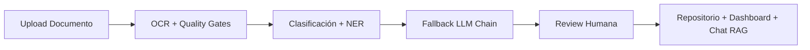

<div align="center">

# SIPAc

[](./package.json)
[](https://nuxt.com)
[](https://vuejs.org)
[](https://www.typescriptlang.org)
[](https://mongodb.com)

<p align="center"><strong>Sistema Inteligente de Productividad Académica</strong></p>

<p align="center">Automatización inteligente para la gestión, extracción y análisis de la producción intelectual de docentes.</p>

<p align="center"><em>Maestría en Innovación Educativa con Tecnología e IA — Universidad de Córdoba, Colombia</em></p>

</div>

---

## Visión General

SIPAc transforma un proceso que hoy es **completamente manual** en un flujo automatizado e inteligente. El docente sube un documento (PDF, imagen escaneada, Office o LibreOffice) y el sistema gestiona el resto: extracción de texto mediante OCR multimodal, clasificación automática del tipo de producto académico, extracción de entidades (NER) con múltiples modelos de lenguaje en cadena de fallback, revisión humana de los metadatos extraídos y almacenamiento estructurado en un repositorio consultable.



| Etapa             | Tecnología                                                                       | Descripción                                                                             |
| ----------------- | -------------------------------------------------------------------------------- | --------------------------------------------------------------------------------------- |
| **Ingesta**       | `pdfjs-dist`, Gemini Vision, Mistral OCR                                         | Extracción de texto nativo o multimodal desde PDFs, imágenes y documentos Office/ODF    |
| **Quality Gates** | Reglas semánticas y heurísticas                                                  | Detección de calidad de OCR y reintento automático con proveedor alternativo            |
| **Clasificación** | `generateText` + Zod schema                                                      | Determinación del tipo de producto académico entre 10 categorías                        |
| **NER**           | Vercel AI SDK, `Output.object`, Zod                                              | Extracción estructurada de autores, título, DOI, revista, fecha, institución y keywords |
| **Fallback LLM**  | Gemini Flash/Pro → NVIDIA (GLM, DeepSeek, Mistral) → OpenRouter → Groq (GPT-OSS) | Cadena de resiliencia conmutada automáticamente ante fallos                             |
| **Review Humana** | Workspace interactivo con highlights                                             | Corrección y confirmación de metadatos antes del almacenamiento definitivo              |
| **Repositorio**   | MongoDB + GridFS                                                                 | Persistencia estructurada con búsqueda full-text, facetas y control por roles           |

---

## Características Principales

### Workspace de Documentos

- Soporte para **10 tipos de productos**: artículos científicos, ponencias de congreso, tesis, certificados, proyectos de investigación, libros, capítulos de libro, reportes técnicos, software y patentes.
- **Preview con highlights**: visualización del documento original con anclajes de evidencia vinculados a cada campo extraído.
- **Detección de duplicados**: prevención de subidas redundantes mediante análisis por hash de contenido (SHA-256).
- **Formatos admitidos**: PDF nativo, imágenes (JPG, PNG), Office heredado (DOC, XLS, PPT), Office moderno (DOCX, XLSX, PPTX) y formatos ODF.

### Asistente Conversacional (RAG)

- Chat contextual con memoria persistente por conversación.
- **Retrieval Grounded**: el asistente consulta el repositorio académico confirmado antes de generar cada respuesta.
- Múltiples proveedores con fallback: NVIDIA (GLM, DeepSeek, Kimi, Mistral) → OpenRouter → Cerebras (Qwen-3) → Gemini Flash Lite / Gemma.
- Rate limiting adaptativo con buckets por usuario.
- Citación de fuentes reales del repositorio en cada respuesta.

### Dashboard Analítico

- Indicadores de productividad segmentados por tipo, estado y temporalidad.
- Insights automáticos generados mediante heurísticas que detectan patrones y sugieren acciones.
- Timeline de actividad reciente con trazabilidad completa.
- Exportación del perfil académico del usuario.

### Autenticación y Seguridad

- JWT firmado almacenado en cookies `httpOnly`, con flag `secure` en producción.
- Autenticación de dos factores (2FA/TOTP) con configuración mediante QR.
- Login social OAuth 2.0 con Google (flujo PKCE).
- Gestión de sesiones activas con revocación individual o masiva.
- Flujo de verificación de email con reenvío.
- Rate limiting por IP y por usuario en rutas de autenticación y chat.

### Admin y Observabilidad

- Panel administrativo con overview del sistema, gestión de usuarios, contenido y logs de auditoría.
- Audit logs con trazabilidad completa de quién hizo qué y cuándo.
- Métricas de telemetría del pipeline NER (intentos, fallbacks, confianza por campo).
- Integración con Sentry para error tracking en producción.
- Cleanup automatizado de drafts huérfanos mediante cron jobs.

---

## Stack Tecnológico

### Frontend

| Tecnología                                   | Versión | Propósito                           |
| -------------------------------------------- | ------- | ----------------------------------- |
| [Nuxt](https://nuxt.com)                     | 4.4.2   | Framework full-stack sobre Vue      |
| [Vue](https://vuejs.org)                     | 3.5.28  | UI reactiva y composable            |
| [TypeScript](https://www.typescriptlang.org) | 5.9.3   | Tipado estático                     |
| [@nuxt/ui](https://ui.nuxt.com)              | 4.6.1   | Componentes accesibles con Tailwind |
| [Tailwind CSS](https://tailwindcss.com)      | 4.2.1   | Utilidades de estilo                |
| [motion-v](https://motion.dev)               | 2.2.0   | Animaciones declarativas            |
| [Pinia](https://pinia.vuejs.org)             | 0.11.3  | Estado global                       |
| [VueUse](https://vueuse.org)                 | 14.2.1  | Composables utilitarios             |
| [Chart.js](https://www.chartjs.org)          | 4.5.1   | Visualizaciones de datos            |

### Backend

| Tecnología                                                 | Versión        | Propósito                           |
| ---------------------------------------------------------- | -------------- | ----------------------------------- |
| [Nitro](https://nitro.unjs.io)                             | via Nuxt       | Motor de servidor                   |
| [MongoDB](https://mongodb.com)                             | 9.2.3 (driver) | Base de datos documental            |
| [Mongoose](https://mongoosejs.com)                         | 9.2.3          | ODM y modelado de esquemas          |
| [GridFS](https://www.mongodb.com/docs/manual/core/gridfs/) | Nativo         | Almacenamiento de archivos binarios |
| [jose](https://github.com/panva/jose)                      | 6.1.3          | JWT signing y verification          |
| [bcrypt](https://github.com/kelektiv/node.bcrypt.js)       | 6.0.0          | Hash de contraseñas                 |
| [Zod](https://zod.dev)                                     | 4.3.6          | Validación y parsing de esquemas    |
| [arctic](https://arcticjs.com)                             | 3.7.0          | Clientes OAuth 2.0 / OIDC           |

### Inteligencia Artificial

| Tecnología                                             | Propósito                                     |
| ------------------------------------------------------ | --------------------------------------------- |
| [Vercel AI SDK](https://sdk.vercel.ai)                 | `generateText`, `streamText`, `Output.object` |
| [Gemini](https://deepmind.google/technologies/gemini/) | OCR multimodal y NER principal (Flash, Pro)   |
| [Mistral OCR](https://mistral.ai)                      | Proveedor OCR alternativo                     |
| [NVIDIA NIM](https://nvidia.com)                       | Inferencia para GLM, DeepSeek, Mistral, Kimi  |
| [Groq](https://groq.com)                               | Inferencia ultrarrápida para GPT-OSS          |
| [OpenRouter](https://openrouter.ai)                    | Gateway unificado para múltiples modelos      |
| [Cerebras](https://cerebras.ai)                        | Inferencia para Qwen-3                        |
| [pdfjs-dist](https://github.com/mozilla/pdf.js)        | Extracción de texto nativo de PDF             |
| [mammoth](https://github.com/mwilliamson/mammoth.js)   | Extracción de DOCX                            |
| [xlsx](https://sheetjs.com)                            | Extracción de XLSX                            |

### Calidad y Testing

| Tecnología                                           | Propósito                            |
| ---------------------------------------------------- | ------------------------------------ |
| [Vitest](https://vitest.dev)                         | Tests unitarios e integración        |
| [Playwright](https://playwright.dev)                 | Tests end-to-end con cobertura de UI |
| [ESLint](https://eslint.org)                         | Linting con configuración de Nuxt    |
| [Prettier](https://prettier.io)                      | Formateo consistente                 |
| [Husky](https://typicode.github.io/husky)            | Git hooks                            |
| [commitlint](https://commitlint.js.org)              | Convención de commits                |
| [lint-staged](https://github.com/okonet/lint-staged) | Lint y format en archivos staged     |

---

## Arquitectura del Proyecto

```
sipac/
├── app/                          # Aplicación cliente (Nuxt App Directory)
│   ├── components/
│   │   ├── auth/                 # Login, registro, OAuth Google, 2FA
│   │   ├── brand/                # Assets de marca SIPAc
│   │   ├── chat/                 # Compositor, thread de mensajes, renderer Markdown, tool blocks
│   │   ├── dashboard/            # Gráficos, insights, alertas de calidad, inbox de notificaciones
│   │   ├── experience/           # Empty states, heroes, stat cards, context panels
│   │   ├── forms/                # Inputs validados, secciones de formulario
│   │   ├── home/                 # Launcher del workspace, feed de actividad, métricas dinámicas
│   │   ├── layout/               # Header, sidebar, navegación, recientes de chat
│   │   ├── profile/              # Avatar, tabs, gestión de sesiones, exportación
│   │   ├── repository/           # Búsquedas guardadas, lista de resultados, filtros, preview
│   │   ├── sipac/                # Design system: badge, button, card, password input
│   │   ├── ui/                   # Overrides y extensiones de @nuxt/ui
│   │   └── workspace/            # Upload, review de metadatos, formulario de producto, actions
│   ├── composables/              # useAuth, useResponsive, useRepositoryQueryState, useChatPageSession
│   ├── config/                   # workspace-stage-copy, product-type-options
│   ├── layouts/                  # default (sidebar + header)
│   ├── middleware/               # auth.global, admin
│   ├── pages/                    # 18 páginas: index, login, register, profile,
│   │                             #   workspace-documents, repository, dashboard, chat,
│   │                             #   admin/users, admin/system, admin/content, admin/audit-logs,
│   │                             #   help/*, verify-email, confirm-email-change
│   ├── stores/                   # Pinia: auth, users, chat, documents, notifications
│   ├── types/                    # Tipos del dominio: User, Product, Chat, API
│   └── utils/                    # Utilidades cliente: format-display, highlight-groups
│
├── server/                       # Backend Nitro
│   ├── api/                      # 50+ rutas REST organizadas por dominio
│   │   ├── auth/                 # login, logout, register, me, 2fa, google-oauth
│   │   ├── profile/              # CRUD perfil, cambio email/password, 2FA, sesiones
│   │   ├── users/                # CRUD usuarios (admin)
│   │   ├── products/             # CRUD productos, re-extracción NER, drafts
│   │   ├── upload/               # Procesamiento de archivos, status, descarga
│   │   ├── chat/                 # Streaming chat, conversaciones, proveedores
│   │   ├── dashboard/            # Métricas, insights, NER telemetry
│   │   ├── notifications/        # CRUD notificaciones, marcar leídas
│   │   ├── audit-logs/           # Logs de auditoría
│   │   ├── admin/                # Overview, stats de usuarios/contenido
│   │   └── system/               # Cleanup cron jobs
│   ├── middleware/               # Auth JWT en cookie httpOnly
│   ├── models/                   # 8 modelos Mongoose con schemas estrictos
│   │   ├── User.ts               # Auth, roles, preferencias, 2FA
│   │   ├── Session.ts            # Gestión de sesiones activas
│   │   ├── AcademicProduct.ts    # Producto con entidades NER + metadatos manuales
│   │   ├── UploadedFile.ts       # Metadata de archivos en GridFS + telemetría NER
│   │   ├── ChatConversation.ts   # Historial de conversaciones
│   │   ├── ChatRateLimitBucket.ts# Rate limiting por usuario
│   │   ├── Notification.ts       # Notificaciones del sistema
│   │   └── AuditLog.ts           # Trazabilidad completa
│   ├── services/                 # Lógica de negocio modular
│   │   ├── ocr/                  # extract-document-text, quality-gates, office-structured
│   │   ├── ner/                  # extract-academic-entities, merge-outputs, semantic-validation
│   │   ├── chat/                 # incoming-message, stream-probe, grounded-retrieval, conversations
│   │   ├── dashboard/            # compute-insights, insight-heuristics
│   │   ├── products/             # reextract-ner, confirmed-repository-search
│   │   ├── upload/               # process-uploaded-file, find-blocking-duplicate
│   │   ├── storage/              # gridfs.ts
│   │   ├── llm/                  # provider.ts (candidates, fallback chain)
│   │   ├── email/                # send-email.ts, templates.ts (Brevo)
│   │   └── notifications/        # notify-document-processing
│   ├── plugins/                  # 01.mongodb.ts, 02.admin-seed.ts
│   └── utils/                    # JWT, authorize, audit, rate-limit, schemas Zod
│
├── tests/                        # Tests unitarios e integración (Vitest)
│   ├── e2e/                      # Playwright: workspace, dashboard, chat, auth
│   └── evals/                    # Evaluación de calidad de campos NER
├── e2e/                          # Configuración y specs de Playwright
├── docs/                         # Documentación de análisis y diseño
│   ├── analisis-diseno/          # SRS IEEE 29148, ADRs, modelo de datos, API routes
│   └── evidencias/               # Evidencias de pasantía
├── scripts/                      # Seed de carga, comparación de modelos, cleanup
├── public/                       # Assets estáticos
├── nuxt.config.ts                # Configuración con chunks manuales y CSP
├── package.json                  # 28 scripts de desarrollo, testing y calidad
└── vitest.config.ts              # Configuración de tests con happy-dom
```

---

## Documentación del Proyecto

La documentación técnica completa se encuentra en `docs/analisis-diseno/`:

- [Descripción del sistema](docs/analisis-diseno/documentacion/01-descripcion-sistema.md)
- [Requisitos funcionales (SRS IEEE 29148)](docs/analisis-diseno/documentacion/02-requisitos-funcionales.md)
- [Arquitectura técnica y ADRs](docs/analisis-diseno/documentacion/03-arquitectura-tecnica.md)
- [Modelo de datos MongoDB](docs/analisis-diseno/documentacion/04-modelo-datos.md)
- [Mapa de API Routes](docs/analisis-diseno/documentacion/05-api-routes.md)
- [Diagramas UML (PlantUML)](docs/analisis-diseno/diagramas/puml/)

---

## Seguridad y Cumplimiento

- **CSP Headers**: configurados vía `nuxt-security` en producción.
- **Sanitización**: todas las entradas validadas con Zod antes de procesar.
- **Auth segura**: cookies `httpOnly`, `secure`, `sameSite=lax`.
- **Rate limiting**: protección contra fuerza bruta en login y abuso de chat.
- **Audit trail**: cada acción crítica se registra en `AuditLog`.
- **Dependencias**: auditoría continua con `pnpm audit` y overrides de seguridad.

---

## Autor

**Carlos Alberto Canabal Cordero**  
Ingeniería de Sistemas — Universidad de Córdoba, Colombia  
Pasantía profesional 2026-I

**Tutores:**

- Daniel José Salas Álvarez (tutor académico)
- Martha Cecilia Pacheco Lora y Raúl Emiro Toscano Miranda (tutores empresariales)

---

<p align="center">
  <sub>Construido con Nuxt 4 · Vue 3 · TypeScript · MongoDB · Vercel AI SDK</sub>
  <br>
  <sub>Última actualización: 2026-05-10</sub>
</p>
