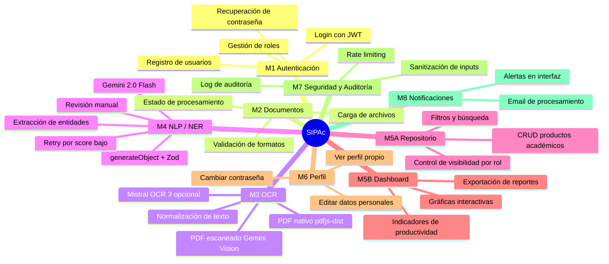
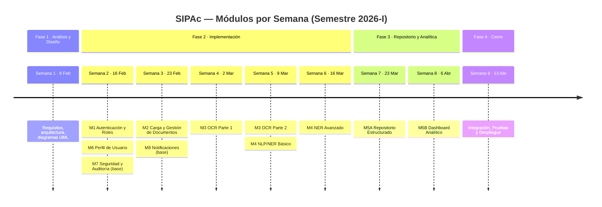
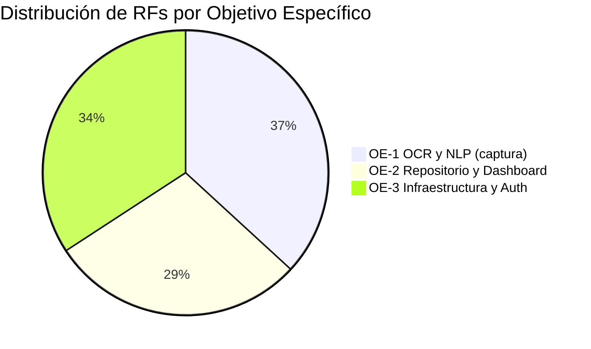

# SIPAc — Especificación de Requisitos del Software (SRS)

## Sistema Inteligente de Productividad Académica

> Documento elaborado siguiendo las directrices del estándar **IEEE 29148-2018**
> _(Systems and software engineering — Life cycle processes — Requirements engineering)_

---

## Control de Versiones

| Versión | Fecha      | Autor                     | Descripción del cambio                                                                                                                                                                                                |
| ------- | ---------- | ------------------------- | --------------------------------------------------------------------------------------------------------------------------------------------------------------------------------------------------------------------- |
| 1.0     | 2026-02-09 | Carlos A. Canabal Cordero | Versión inicial — borrador fase de análisis                                                                                                                                                                           |
| 1.1     | 2026-02-27 | Carlos A. Canabal Cordero | Revisión completa: adición de módulos M6-M8, RNF extendidos, matriz de trazabilidad                                                                                                                                   |
| 1.2     | 2026-02-27 | Carlos A. Canabal Cordero | Actualización de stack tecnológico: eliminación de Tesseract/PyMuPDF/spaCy/Google NL API; adopción de `pdfjs-dist`, Vercel AI SDK, `generateObject` + Zod con Gemini 2.0 Flash; Mistral OCR 3 como proveedor opcional |

---

## 1. Propósito y Alcance

Este documento especifica los requisitos funcionales y no funcionales del **Sistema Inteligente de Productividad Académica (SIPAc)**, desarrollado como parte del Plan de Pasantía del Programa de Ingeniería de Sistemas de la Universidad de Córdoba (Semestre 2026-I).

El sistema está orientado a la **Maestría en Innovación Educativa con Tecnología e Inteligencia Artificial**, y tiene como propósito automatizar la gestión, extracción y análisis de la producción académica de sus docentes y estudiantes, aplicando técnicas de OCR y Procesamiento de Lenguaje Natural.

---

## 2. Glosario de Términos

| Término                  | Definición                                                                                                                                         |
| ------------------------ | -------------------------------------------------------------------------------------------------------------------------------------------------- |
| **RF**                   | Requisito Funcional — comportamiento concreto que el sistema debe exhibir                                                                          |
| **RNF**                  | Requisito No Funcional — atributo de calidad del sistema (rendimiento, seguridad, etc.)                                                            |
| **OCR**                  | Optical Character Recognition — extracción de texto desde imágenes y PDFs escaneados                                                               |
| **NLP**                  | Natural Language Processing — procesamiento de lenguaje natural                                                                                    |
| **NER**                  | Named Entity Recognition — identificación de entidades en texto (personas, lugares, fechas)                                                        |
| **Producto Académico**   | Cualquier output intelectual verificable: artículo, ponencia, tesis, certificado, etc.                                                             |
| **Documento Probatorio** | Archivo (PDF/imagen) que certifica la existencia de un producto académico                                                                          |
| **Pipeline**             | Secuencia automatizada de pasos de procesamiento: carga → OCR → NER → almacenamiento                                                               |
| **JWT**                  | JSON Web Token — mecanismo de autenticación sin estado                                                                                             |
| **Rol**                  | Nivel de acceso y permisos asignado a un usuario del sistema                                                                                       |
| **Vercel AI SDK**        | Librería TypeScript oficial de Vercel para integrar LLMs; provee `generateObject` para retornar objetos tipados desde un LLM                       |
| **generateObject**       | Función del Vercel AI SDK que invoca un LLM y garantiza que la respuesta cumpla un esquema Zod, retornando un objeto TypeScript estructurado       |
| **Zod**                  | Librería TypeScript de validación de esquemas; define la forma exacta de los datos que `generateObject` debe retornar                              |
| **pdfjs-dist**           | Librería npm oficial de Mozilla para extraer texto de PDFs nativos (con texto seleccionable) sin necesidad de OCR ni LLM                           |
| **Gemini 2.0 Flash**     | Modelo multimodal de Google (DeepMind); proveedor LLM principal del sistema — procesa texto e imágenes; plan gratuito: 1.500 solicitudes/día       |
| **Mistral OCR 3**        | Motor OCR de alta precisión de Mistral AI (99,54 % en español); proveedor opcional activable vía variable de entorno; plan de pago ($0,002/página) |

---

## 3. Supuestos y Restricciones

- El sistema se desarrolla exclusivamente para la Maestría en Innovación Educativa con Tecnología e IA.
- El idioma principal de los documentos procesados es el **español**.
- El framework frontend/backend es **Nuxt 4** (SSR + API Routes).
- La base de datos es **MongoDB con Mongoose ODM**.
- El gestor de paquetes del proyecto es **pnpm**.
- Los PDFs nativos (con texto seleccionable) se procesan con **`pdfjs-dist`** para extracción directa de texto, sin necesidad de LLM.
- Los PDFs escaneados e imágenes se procesan enviándolos como entrada multimodal a **Gemini 2.0 Flash Vision** a través del **Vercel AI SDK**.
- La extracción de entidades (NER) se realiza mediante **`generateObject`** del Vercel AI SDK con esquemas **Zod**, invocando **Gemini 2.0 Flash** como proveedor LLM principal (plan gratuito de Google AI Studio: 1.500 solicitudes/día).
- El proveedor **Mistral OCR 3** puede activarse mediante la variable de entorno `OCR_PROVIDER=mistral` para casos que requieran mayor precisión.

---

## 4. Convenciones de Escritura

- **Prioridad:**
  - `Alta` — el sistema no cumple su propósito sin este requisito; es parte del MVP.
  - `Media` — añade valor significativo pero puede diferirse al siguiente sprint.
  - `Baja` — deseable; se implementa si el tiempo lo permite.
- **Estado:** `Pendiente` → `En desarrollo` → `Completado` → `Verificado`

---

## 5. Mapa de Módulos

---

## 6. Alineación con Objetivos Específicos del Plan

| Código   | Objetivo Específico (del Plan de Pasantía)                                                    |
| -------- | --------------------------------------------------------------------------------------------- |
| **OE-1** | Desarrollar un sistema de captura de productividad con OCR y NLP para extracción de metadatos |
| **OE-2** | Implementar un repositorio estructurado y dashboard analítico de indicadores                  |
| **OE-3** | Garantizar infraestructura funcional del sistema (autenticación, seguridad, despliegue)       |

---

## 7. Requisitos Funcionales

### Módulo M1 — Autenticación y Gestión de Usuarios

> Semana 2 del cronograma · 16 Feb 2026

| ID     | Descripción                                                                                                                         | Prioridad | Estado    |
| ------ | ----------------------------------------------------------------------------------------------------------------------------------- | --------- | --------- |
| RF-001 | El sistema debe permitir el registro de nuevos usuarios con nombre completo, correo electrónico institucional y contraseña          | Alta      | Pendiente |
| RF-002 | El sistema debe validar que el correo ingresado en el registro tenga formato válido de dirección de correo electrónico              | Alta      | Pendiente |
| RF-003 | El sistema debe impedir el registro de un correo electrónico que ya exista en la base de datos                                      | Alta      | Pendiente |
| RF-004 | El sistema debe permitir el inicio de sesión mediante correo y contraseña, emitiendo un token JWT firmado                           | Alta      | Pendiente |
| RF-005 | El sistema debe gestionar cuatro roles de usuario: `admin`, `coordinador`, `docente` y `estudiante`                                 | Alta      | Pendiente |
| RF-006 | El sistema debe restringir el acceso a rutas y funcionalidades según el rol del usuario autenticado                                 | Alta      | Pendiente |
| RF-007 | El sistema debe permitir al administrador crear nuevas cuentas de usuario                                                           | Alta      | Pendiente |
| RF-008 | El sistema debe permitir al administrador editar los datos de cualquier cuenta de usuario                                           | Alta      | Pendiente |
| RF-009 | El sistema debe permitir al administrador activar o desactivar cuentas de usuario sin eliminarlas                                   | Alta      | Pendiente |
| RF-010 | El sistema debe permitir al administrador asignar y modificar el rol de cualquier usuario                                           | Alta      | Pendiente |
| RF-011 | El sistema debe implementar cierre de sesión que elimine el token del lado del cliente e invalide la sesión                         | Media     | Pendiente |
| RF-012 | El sistema debe bloquear temporalmente una cuenta tras 5 intentos fallidos consecutivos de inicio de sesión (bloqueo de 15 minutos) | Alta      | Pendiente |
| RF-013 | El sistema debe permitir la recuperación de contraseña mediante envío de un enlace temporal al correo del usuario                   | Media     | Pendiente |

---

### Módulo M2 — Carga y Gestión de Documentos

> Semana 3 del cronograma · 23 Feb 2026

| ID     | Descripción                                                                                                                                    | Prioridad | Estado    |
| ------ | ---------------------------------------------------------------------------------------------------------------------------------------------- | --------- | --------- |
| RF-020 | El sistema debe permitir a usuarios con rol `docente` y `estudiante` cargar archivos en formato PDF                                            | Alta      | Pendiente |
| RF-021 | El sistema debe permitir a usuarios con rol `docente` y `estudiante` cargar archivos en formato JPG, JPEG y PNG                                | Alta      | Pendiente |
| RF-022 | El sistema debe validar el tipo MIME real del archivo cargado (no solo la extensión) antes de aceptarlo                                        | Alta      | Pendiente |
| RF-023 | El sistema debe rechazar archivos cuyo tamaño supere los 20 MB, mostrando un mensaje de error descriptivo                                      | Alta      | Pendiente |
| RF-024 | El sistema debe asociar cada documento cargado al usuario que lo subió                                                                         | Alta      | Pendiente |
| RF-025 | El sistema debe registrar la fecha y hora exacta en que el documento fue cargado                                                               | Alta      | Pendiente |
| RF-026 | El sistema debe requerir que el usuario indique el tipo de producto académico al cargar un documento                                           | Alta      | Pendiente |
| RF-027 | El sistema debe permitir cargar múltiples documentos de forma simultánea en una misma sesión                                                   | Media     | Pendiente |
| RF-028 | El sistema debe mostrar en tiempo real el estado de procesamiento de cada documento cargado (`pendiente`, `procesando`, `completado`, `error`) | Alta      | Pendiente |
| RF-029 | El sistema debe permitir al usuario eliminar documentos propios que aún no hayan sido verificados por un coordinador                           | Media     | Pendiente |
| RF-030 | El sistema debe almacenar los archivos cargados en un directorio seguro no accesible públicamente desde el navegador                           | Alta      | Pendiente |

---

### Módulo M3 — Integración OCR

> Semanas 4–5 del cronograma · 2–9 Mar 2026

| ID     | Descripción                                                                                                                                                                                                                                                                                                   | Prioridad | Estado    |
| ------ | ------------------------------------------------------------------------------------------------------------------------------------------------------------------------------------------------------------------------------------------------------------------------------------------------------------- | --------- | --------- |
| RF-031 | El sistema debe extraer el texto de documentos PDF nativos (con texto seleccionable) usando la librería `pdfjs-dist`, sin aplicar OCR ni invocar ningún LLM                                                                                                                                                   | Alta      | Pendiente |
| RF-032 | El sistema debe detectar automáticamente si un PDF es escaneado o nativo antes de decidir el método de extracción                                                                                                                                                                                             | Alta      | Pendiente |
| RF-033 | El sistema debe extraer el texto de documentos PDF escaneados e imágenes enviando el archivo como entrada multimodal a **Gemini 2.0 Flash Vision** a través del Vercel AI SDK; como alternativa opcional, si la variable de entorno `OCR_PROVIDER=mistral` está activa, debe usar la API de **Mistral OCR 3** | Alta      | Pendiente |
| RF-034 | El sistema debe procesar documentos en idioma español como idioma principal del OCR                                                                                                                                                                                                                           | Alta      | Pendiente |
| RF-035 | El sistema debe limpiar el texto extraído: eliminar saltos de línea irregulares, caracteres basura y espacios múltiples                                                                                                                                                                                       | Media     | Pendiente |
| RF-036 | El sistema debe almacenar el texto crudo extraído, asociado al documento original, en la base de datos                                                                                                                                                                                                        | Alta      | Pendiente |
| RF-037 | El sistema debe registrar el nivel de confianza del OCR por documento cuando el motor lo provea                                                                                                                                                                                                               | Baja      | Pendiente |
| RF-038 | El sistema debe exponer el resultado del OCR al usuario en la interfaz de revisión antes de continuar con NER                                                                                                                                                                                                 | Media     | Pendiente |

---

### Módulo M4 — Extracción de Entidades (NLP / NER)

> Semanas 5–6 del cronograma · 9–16 Mar 2026

| ID     | Descripción                                                                                                                                                                                                                                                                                                                                                                    | Prioridad | Estado    |
| ------ | ------------------------------------------------------------------------------------------------------------------------------------------------------------------------------------------------------------------------------------------------------------------------------------------------------------------------------------------------------------------------------ | --------- | --------- |
| RF-040 | El sistema debe identificar automáticamente los nombres de autores del documento                                                                                                                                                                                                                                                                                               | Alta      | Pendiente |
| RF-041 | El sistema debe identificar automáticamente el título del trabajo o publicación                                                                                                                                                                                                                                                                                                | Alta      | Pendiente |
| RF-042 | El sistema debe identificar automáticamente el nombre de la institución o universidad                                                                                                                                                                                                                                                                                          | Alta      | Pendiente |
| RF-043 | El sistema debe identificar automáticamente las fechas relevantes del documento (publicación, presentación, expedición)                                                                                                                                                                                                                                                        | Alta      | Pendiente |
| RF-044 | El sistema debe identificar automáticamente el código DOI cuando esté presente en el texto                                                                                                                                                                                                                                                                                     | Alta      | Pendiente |
| RF-045 | El sistema debe identificar automáticamente palabras clave temáticas del documento                                                                                                                                                                                                                                                                                             | Media     | Pendiente |
| RF-046 | El sistema debe identificar automáticamente el nombre del evento o la revista (para ponencias y artículos)                                                                                                                                                                                                                                                                     | Media     | Pendiente |
| RF-047 | El sistema debe calcular y almacenar un score de confianza por cada entidad extraída                                                                                                                                                                                                                                                                                           | Alta      | Pendiente |
| RF-048 | Cuando el score de confianza promedio de las entidades extraídas sea inferior al umbral configurado (por defecto 0,70), el sistema debe reintentar la extracción NER invocando `generateObject` con un prompt enriquecido y mayor temperatura; si `OCR_PROVIDER=mistral` está activo y el origen fue escaneado, debe re-extraer el texto con Mistral OCR 3 antes de reintentar | Media     | Pendiente |
| RF-049 | El sistema debe presentar al usuario una interfaz de revisión donde pueda confirmar, corregir o eliminar cada entidad extraída antes de guardar                                                                                                                                                                                                                                | Alta      | Pendiente |
| RF-050 | El sistema debe almacenar las entidades extraídas (originales y corregidas) de forma estructurada en la base de datos, diferenciando la fuente de extracción: `pdfjs_native`, `gemini_vision` o `mistral_ocr_3`                                                                                                                                                                | Alta      | Pendiente |

---

### Módulo M5A — Repositorio Estructurado

> Semana 7 del cronograma · 23 Mar 2026

| ID     | Descripción                                                                                                                                   | Prioridad | Estado    |
| ------ | --------------------------------------------------------------------------------------------------------------------------------------------- | --------- | --------- |
| RF-051 | El sistema debe almacenar cada producto académico con sus metadatos completos en la colección `academic_products` de MongoDB                  | Alta      | Pendiente |
| RF-052 | El sistema debe permitir consultar productos académicos filtrando por tipo de producto                                                        | Alta      | Pendiente |
| RF-053 | El sistema debe permitir consultar productos académicos filtrando por año de producción                                                       | Alta      | Pendiente |
| RF-054 | El sistema debe permitir consultar productos académicos filtrando por usuario propietario                                                     | Alta      | Pendiente |
| RF-055 | El sistema debe permitir consultar productos académicos filtrando por institución                                                             | Media     | Pendiente |
| RF-056 | El sistema debe permitir al usuario editar manualmente los metadatos de sus propios productos académicos                                      | Alta      | Pendiente |
| RF-057 | El sistema debe permitir al usuario eliminar sus propios productos académicos, solicitando confirmación explícita antes de ejecutar la acción | Media     | Pendiente |
| RF-058 | El sistema debe implementar búsqueda de texto completo sobre títulos, autores y palabras clave                                                | Media     | Pendiente |
| RF-059 | El sistema debe paginar los resultados de consultas con un mínimo de 10 y máximo de 50 registros por página                                   | Media     | Pendiente |
| RF-060 | Los roles `coordinador` y `admin` deben poder consultar y visualizar los productos académicos de todos los usuarios                           | Alta      | Pendiente |
| RF-061 | Los roles `docente` y `estudiante` deben solo poder visualizar y gestionar sus propios productos académicos                                   | Alta      | Pendiente |

---

### Módulo M5B — Dashboard Analítico y Reportes

> Semana 8 del cronograma · 6 Abr 2026

| ID     | Descripción                                                                                                       | Prioridad | Estado    |
| ------ | ----------------------------------------------------------------------------------------------------------------- | --------- | --------- |
| RF-062 | El dashboard debe mostrar el número total de productos académicos registrados en el sistema                       | Alta      | Pendiente |
| RF-063 | El dashboard debe mostrar el número de productos por tipo (artículo, ponencia, tesis, certificado, etc.)          | Alta      | Pendiente |
| RF-064 | El dashboard debe mostrar el número de productos registrados por cada usuario activo                              | Alta      | Pendiente |
| RF-065 | El dashboard debe mostrar la distribución temporal de publicaciones agrupadas por año                             | Alta      | Pendiente |
| RF-066 | El dashboard debe permitir filtrar todos sus indicadores por rango de fechas                                      | Media     | Pendiente |
| RF-067 | El dashboard debe permitir filtrar todos sus indicadores por tipo de producto                                     | Media     | Pendiente |
| RF-068 | El dashboard debe permitir filtrar todos sus indicadores por usuario                                              | Media     | Pendiente |
| RF-069 | El dashboard debe mostrar gráficas de barras, líneas y torta de los principales indicadores de productividad      | Alta      | Pendiente |
| RF-070 | El sistema debe permitir exportar un reporte consolidado de indicadores en formato PDF                            | Media     | Pendiente |
| RF-071 | El sistema debe permitir exportar los datos del repositorio en formato Excel/CSV                                  | Media     | Pendiente |
| RF-072 | El acceso al dashboard con datos de todos los usuarios debe estar restringido a los roles `coordinador` y `admin` | Alta      | Pendiente |

---

### Módulo M6 — Perfil de Usuario

> Implementado junto al Módulo M1

| ID     | Descripción                                                                                                                                  | Prioridad | Estado    |
| ------ | -------------------------------------------------------------------------------------------------------------------------------------------- | --------- | --------- |
| RF-073 | El sistema debe permitir a cualquier usuario autenticado consultar su propio perfil (nombre, correo, rol, fecha de registro)                 | Alta      | Pendiente |
| RF-074 | El sistema debe permitir a cualquier usuario autenticado editar su nombre completo                                                           | Media     | Pendiente |
| RF-075 | El sistema debe permitir a cualquier usuario autenticado cambiar su contraseña, requiriendo la contraseña actual para confirmar la operación | Alta      | Pendiente |
| RF-076 | El sistema debe mostrar en el perfil un resumen de la cantidad de productos académicos propios registrados por tipo                          | Media     | Pendiente |

---

### Módulo M7 — Seguridad y Auditoría

> Transversal a todos los módulos

| ID     | Descripción                                                                                                                      | Prioridad | Estado    |
| ------ | -------------------------------------------------------------------------------------------------------------------------------- | --------- | --------- |
| RF-077 | El sistema debe sanitizar todas las entradas de usuario para prevenir ataques de tipo XSS (Cross-Site Scripting)                 | Alta      | Pendiente |
| RF-078 | El sistema debe sanitizar todas las entradas de usuario para prevenir ataques de inyección de código                             | Alta      | Pendiente |
| RF-079 | El sistema debe registrar en un log de auditoría cada operación crítica: creación, edición y eliminación de productos académicos | Alta      | Pendiente |
| RF-080 | El log de auditoría debe registrar para cada evento: usuario que lo ejecutó, tipo de acción, timestamp y dirección IP            | Alta      | Pendiente |
| RF-081 | El log de auditoría debe ser de solo lectura para todos los usuarios; solo el `admin` puede consultarlo                          | Alta      | Pendiente |
| RF-082 | El sistema debe implementar rate limiting en los endpoints de autenticación: máximo 10 peticiones por minuto por IP              | Alta      | Pendiente |
| RF-083 | El sistema debe rechazar cualquier archivo cuya extensión real no corresponda a los formatos permitidos (PDF, JPG, JPEG, PNG)    | Alta      | Pendiente |

---

### Módulo M8 — Notificaciones

> Implementado a partir del Módulo M2

| ID     | Descripción                                                                                                                                            | Prioridad | Estado    |
| ------ | ------------------------------------------------------------------------------------------------------------------------------------------------------ | --------- | --------- |
| RF-084 | El sistema debe enviar una notificación por correo electrónico al usuario cuando el procesamiento de un documento se complete exitosamente             | Media     | Pendiente |
| RF-085 | El sistema debe enviar una notificación por correo electrónico al usuario cuando el procesamiento de un documento falle, indicando el motivo del error | Media     | Pendiente |
| RF-086 | El sistema debe mostrar en la interfaz notificaciones en tiempo real sobre el cambio de estado de procesamiento de cada documento                      | Alta      | Pendiente |

---

## 8. Requisitos No Funcionales

| ID      | Descripción                                                                                                                                          | Categoría      | Criterio de Aceptación                                                                           |
| ------- | ---------------------------------------------------------------------------------------------------------------------------------------------------- | -------------- | ------------------------------------------------------------------------------------------------ |
| RNF-001 | La interfaz debe ser completamente responsiva y funcional en dispositivos móviles, tabletas y escritorio                                             | Usabilidad     | Verificado en viewport 375px, 768px y 1280px                                                     |
| RNF-002 | El tiempo de respuesta del pipeline completo (OCR → NER) no debe superar los 30 segundos por documento bajo condiciones normales de uso              | Rendimiento    | Medido con documentos PDF de hasta 20 MB en entorno de desarrollo                                |
| RNF-003 | Las contraseñas deben almacenarse cifradas con bcrypt usando un mínimo de 10 salt rounds                                                             | Seguridad      | Inspección directa de la BD: ningún campo de contraseña debe estar en texto plano                |
| RNF-004 | Los tokens JWT deben tener un tiempo de expiración máximo de 8 horas                                                                                 | Seguridad      | Verificado en la configuración del módulo de autenticación                                       |
| RNF-005 | El sistema debe operar correctamente en los navegadores Chrome, Firefox y Edge en sus versiones actuales                                             | Compatibilidad | Pruebas manuales en los tres navegadores                                                         |
| RNF-006 | El código fuente debe gestionarse en un repositorio Git con commits organizados por módulo y mensajes descriptivos                                   | Mantenibilidad | Inspección del historial de Git                                                                  |
| RNF-007 | El sistema debe operar exclusivamente bajo HTTPS en el ambiente de producción                                                                        | Seguridad      | Verificado mediante inspección del certificado SSL en el ambiente de despliegue                  |
| RNF-008 | El servidor debe configurar CORS para aceptar peticiones únicamente desde el dominio autorizado de la aplicación                                     | Seguridad      | Verificado mediante petición cross-origin desde un origen no autorizado: debe retornar error 403 |
| RNF-009 | El sistema debe implementar rate limiting global de máximo 100 peticiones por minuto por IP en todos los endpoints                                   | Seguridad      | Verificado mediante prueba de carga: petición 101 debe retornar código HTTP 429                  |
| RNF-010 | La interfaz debe cumplir con el nivel A de las pautas de accesibilidad WCAG 2.1 (contraste mínimo, etiquetas en formularios, navegación por teclado) | Accesibilidad  | Verificado con herramienta axe o Lighthouse Accessibility                                        |
| RNF-011 | El sistema debe estar disponible un mínimo del 95% del tiempo durante el horario laboral (7:00–19:00, lunes a viernes)                               | Disponibilidad | Medido durante el período de pruebas de la semana 9                                              |
| RNF-012 | La base de datos debe contar con un mecanismo de respaldo (backup) al menos cada 24 horas                                                            | Confiabilidad  | Verificado mediante la existencia y ejecución del script de backup                               |
| RNF-013 | Los módulos de autenticación y procesamiento de documentos deben contar con pruebas de integración que cubran los flujos principales                 | Mantenibilidad | Evidenciado por la existencia de archivos de prueba y su ejecución exitosa                       |

---

## 9. Cronograma de Implementación

---

## 10. Matriz de Trazabilidad

> Relaciona cada módulo con el objetivo específico del Plan de Pasantía que satisface.

| Módulo              | RFs asociados   | OE-1 (OCR/NLP) | OE-2 (Repositorio/Dashboard) | OE-3 (Infraestructura/Auth) |
| ------------------- | --------------- | :------------: | :--------------------------: | :-------------------------: |
| M1 — Autenticación  | RF-001 a RF-013 |                |                              |              ✓              |
| M2 — Documentos     | RF-020 a RF-030 |       ✓        |                              |              ✓              |
| M3 — OCR            | RF-031 a RF-038 |       ✓        |                              |                             |
| M4 — NLP / NER      | RF-040 a RF-050 |       ✓        |                              |                             |
| M5A — Repositorio   | RF-051 a RF-061 |                |              ✓               |                             |
| M5B — Dashboard     | RF-062 a RF-072 |                |              ✓               |                             |
| M6 — Perfil         | RF-073 a RF-076 |                |                              |              ✓              |
| M7 — Seguridad      | RF-077 a RF-083 |                |                              |              ✓              |
| M8 — Notificaciones | RF-084 a RF-086 |       ✓        |              ✓               |                             |

**Totales por objetivo:**

