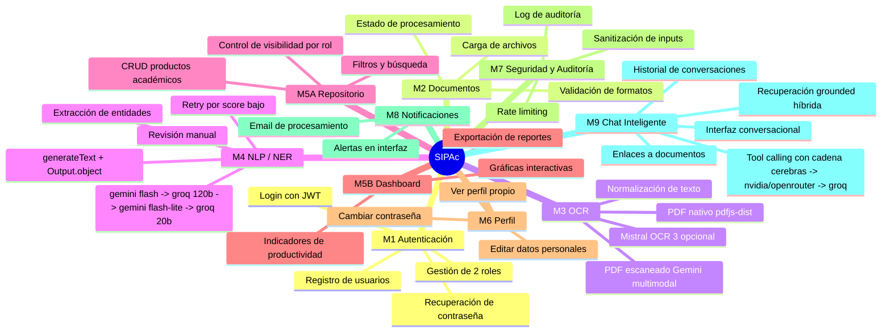
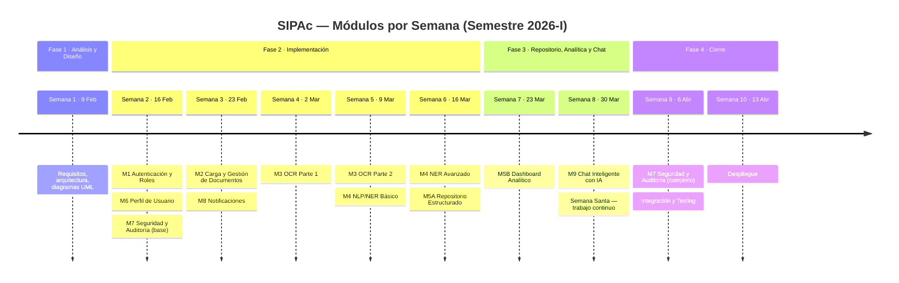
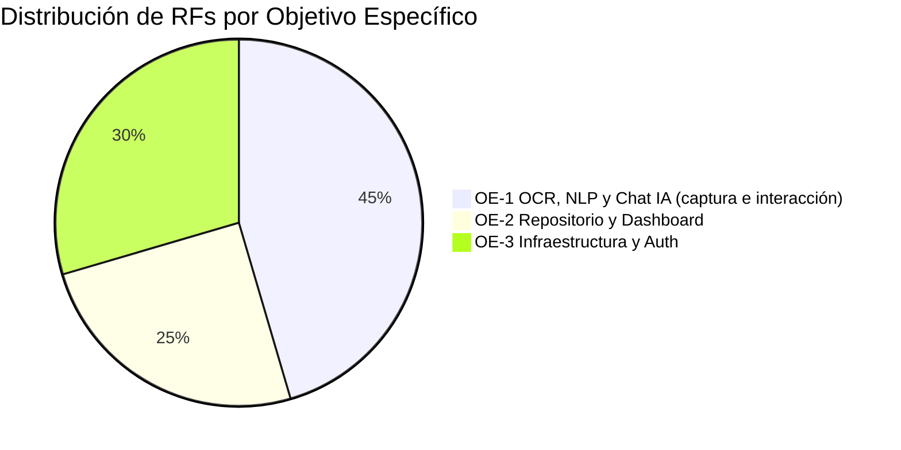

# SIPAc — Especificación de Requisitos del Software (SRS)

## Sistema Inteligente de Productividad Académica

> Documento elaborado siguiendo las directrices del estándar **IEEE 29148-2018**
> _(Systems and software engineering — Life cycle processes — Requirements engineering)_

---

## Control de Versiones

| Versión | Fecha      | Autor                     | Descripción del cambio                                                                                                                                                                                                                                                                                         |
| ------- | ---------- | ------------------------- | -------------------------------------------------------------------------------------------------------------------------------------------------------------------------------------------------------------------------------------------------------------------------------------------------------------- |
| 1.0     | 2026-02-09 | Carlos A. Canabal Cordero | Versión inicial — borrador fase de análisis                                                                                                                                                                                                                                                                    |
| 1.1     | 2026-02-27 | Carlos A. Canabal Cordero | Revisión completa: adición de módulos M6-M8, RNF extendidos, matriz de trazabilidad                                                                                                                                                                                                                            |
| 1.2     | 2026-02-27 | Carlos A. Canabal Cordero | Actualización de stack tecnológico: eliminación de Tesseract/PyMuPDF/spaCy/Google NL API; adopción de `pdfjs-dist`, Vercel AI SDK, `generateObject` + Zod con Gemini 2.0 Flash; Mistral OCR 3 como proveedor opcional                                                                                          |
| 1.3     | 2026-03-04 | Carlos A. Canabal Cordero | Simplificación a 2 roles (`admin`, `docente`), eliminación de roles `coordinador` y `estudiante`, nuevo módulo M9 — Chat Inteligente con IA (Prioridad Alta), almacenamiento en MongoDB GridFS, eliminación del flujo de verificación/aprobación, actualización de 8 RFs existentes y adición de 12 nuevos RFs |
| 1.4     | 2026-03-05 | Carlos A. Canabal Cordero | Reorganización del cronograma de implementación: M5A adelantado a semana 6 junto con M4 NER Avanzado, M5B separado a semana 7, M9 Chat aislado en semana 8, M7 continuación completa en semana 9 junto con integración y testing, despliegue separado a semana 10                                              |
| 1.5     | 2026-03-06 | Carlos A. Canabal Cordero | Alineación a los cambios de la arquitectura: RF-082 ajustado a estado Parcial (rate limiting global `nuxt-security` 150 tokens/5 min, no per-endpoint 10/min)                                                                                                                                                  |
| 1.6     | 2026-03-11 | Carlos A. Canabal Cordero | Actualización de estados RF tras la implementación base del pipeline documental y notificaciones: carga, almacenamiento en GridFS, OCR, NER estructurado, creación automática de productos académicos y notificaciones M8                                                                                      |
| 1.7     | 2026-03-13 | Carlos A. Canabal Cordero | Actualización de fallback LLM por tarea: NER con cadena `qwen -> gpt-oss -> gemini -> llama3.1`, y Chat planificado con cadena `gpt-oss -> gemini -> qwen`                                                                                                                                                     |
| 1.8     | 2026-03-13 | Carlos A. Canabal Cordero | Alineación de requisitos al hardening operativo del pipeline: timeouts OCR/NER, límite de intentos por candidato NER y trazabilidad por etapa para diagnóstico                                                                                                                                                 |
| 1.9     | 2026-03-13 | Carlos A. Canabal Cordero | Alineación al fallback NER vigente con Groq y Gemini, y compatibilidad de structured outputs con esquema estricto (campos requeridos y valores nulos explícitos cuando aplique)                                                                                                                                |
| 2.0     | 2026-03-14 | Carlos A. Canabal Cordero | Alineación de estados RF con implementación real: carga sin `productType` obligatorio, M5A parcial con flujo de borrador/revisión, y actualización de notas de rate limiting y dependencias                                                                                                                    |
| 2.1     | 2026-03-23 | Carlos A. Canabal Cordero | Alineación al estado implementado en sesión: cierre de M2, M5A, M6, M7 y M8; activación de M5B base con dashboard operativo; perfil con agregados; auditoría admin-only; rate limiting específico en `/api/auth/*`; notificaciones por polling con conteo no leído                                             |
| 2.2     | 2026-03-23 | Carlos A. Canabal Cordero | Alineación al estado implementado de M9: chat grounded en `/chat`, recuperación híbrida (filtros + diagnóstico + OCR/nativo), historial persistido, enlaces autenticados a documentos, selector manual temporal para docentes y rate limiting específico en `/api/chat`                                         |

---

## 1. Propósito y Alcance

Este documento especifica los requisitos funcionales y no funcionales del **Sistema Inteligente de Productividad Académica (SIPAc)**, desarrollado como parte del Plan de Pasantía del Programa de Ingeniería de Sistemas de la Universidad de Córdoba (Semestre 2026-I).

El sistema está orientado a la **Maestría en Innovación Educativa con Tecnología e Inteligencia Artificial**, y tiene como propósito automatizar la gestión, extracción y análisis de la producción académica de sus docentes, aplicando técnicas de OCR y Procesamiento de Lenguaje Natural.

---

## 2. Glosario de Términos

| Término                  | Definición                                                                                                                                                                                            |
| ------------------------ | ----------------------------------------------------------------------------------------------------------------------------------------------------------------------------------------------------- |
| **RF**                   | Requisito Funcional — comportamiento concreto que el sistema debe exhibir                                                                                                                             |
| **RNF**                  | Requisito No Funcional — atributo de calidad del sistema (rendimiento, seguridad, etc.)                                                                                                               |
| **OCR**                  | Optical Character Recognition — extracción de texto desde imágenes y PDFs escaneados                                                                                                                  |
| **NLP**                  | Natural Language Processing — procesamiento de lenguaje natural                                                                                                                                       |
| **NER**                  | Named Entity Recognition — identificación de entidades en texto (personas, lugares, fechas)                                                                                                           |
| **Producto Académico**   | Cualquier output intelectual verificable: artículo, ponencia, tesis, certificado, etc.                                                                                                                |
| **Documento Probatorio** | Archivo (PDF/imagen) que certifica la existencia de un producto académico                                                                                                                             |
| **Pipeline**             | Secuencia automatizada de pasos de procesamiento: carga → OCR → NER → almacenamiento                                                                                                                  |
| **JWT**                  | JSON Web Token — mecanismo de autenticación sin estado                                                                                                                                                |
| **Rol**                  | Nivel de acceso y permisos asignado a un usuario del sistema                                                                                                                                          |
| **Vercel AI SDK**        | Librería TypeScript oficial de Vercel para integrar LLMs y modelos multimodales; en el estado actual usa `generateText` con `Output.object` para structured outputs                                   |
| **Structured outputs**   | Estrategia del Vercel AI SDK para obtener salidas validadas contra un esquema Zod mediante `generateText` + `Output.object`                                                                           |
| **Zod**                  | Librería TypeScript de validación de esquemas; define la forma exacta de los datos estructurados que el pipeline debe retornar                                                                        |
| **pdfjs-dist**           | Librería npm oficial de Mozilla para extraer texto de PDFs nativos (con texto seleccionable) sin necesidad de OCR ni LLM                                                                              |
| **Gemini 2.5 Flash**     | Modelo de Google usado actualmente como proveedor multimodal OCR y como candidato del pipeline NER; en Chat queda fuera de la cadena automática normal y solo se conserva como referencia deshabilitada |
| **Mistral OCR 3**        | Motor OCR de alta precisión de Mistral AI (99,54 % en español); proveedor opcional activable vía variable de entorno; plan de pago ($0,002/página)                                                    |
| **MVP**                  | Minimum Viable Product (Producto Mínimo Viable) — versión más básica pero funcional del sistema que ya cumple su propósito principal y puede ser entregada; agrupa los requisitos de prioridad `Alta` |

---

## 3. Supuestos y Restricciones

- El sistema se desarrolla exclusivamente para la Maestría en Innovación Educativa con Tecnología e IA.
- El idioma principal de los documentos procesados es el **español**.
- El framework frontend/backend es **Nuxt 4** (SSR + API Routes).
- La base de datos es **MongoDB con Mongoose ODM**.
- El gestor de paquetes del proyecto es **pnpm**.
- Los PDFs nativos (con texto seleccionable) se procesan con **`pdfjs-dist`** para extracción directa de texto, sin necesidad de LLM.
- Los PDFs escaneados e imágenes se procesan enviándolos como entrada multimodal al modelo **Gemini** configurado en el pipeline OCR a través del **Vercel AI SDK**.
- La extracción de entidades (NER) se realiza mediante **structured outputs** del Vercel AI SDK con esquemas **Zod**, usando la cadena de fallback implementada: `gemini-2.5-flash` → `openai/gpt-oss-120b` (Groq) → `gemini-2.5-flash-lite` → `openai/gpt-oss-20b` (Groq).
- El esquema estructurado de NER usa campos requeridos y nulos explícitos para mantener compatibilidad entre proveedores OpenAI-compatible y evitar rechazos de `response_format`.
- El pipeline usa controles operativos por entorno (`OCR_REQUEST_TIMEOUT_MS`, `NER_REQUEST_TIMEOUT_MS`, `NER_MAX_CANDIDATE_ATTEMPTS`, `NER_CONFIDENCE_THRESHOLD`) para balancear robustez, latencia y costo.
- El procesamiento registra telemetría por etapa (`ocr`, `ner`, `processing`) para diagnóstico de fallos y trazabilidad de fallback.
- El proveedor **Mistral OCR 3** puede activarse mediante la variable de entorno `OCR_PROVIDER=mistral` para casos que requieran mayor precisión.

---

## 4. Convenciones de Escritura

- **Prioridad:**
  - `Alta` — el sistema no cumple su propósito sin este requisito; es parte del MVP.
  - `Media` — añade valor significativo pero puede diferirse al siguiente sprint.
  - `Baja` — deseable; se implementa si el tiempo lo permite.
- **Estado:** `Pendiente` → `En desarrollo` → `Completado` → `Verificado`

---

## 5. Mapa de Módulos

---

## 6. Alineación con Objetivos Específicos del Plan

| Código   | Objetivo Específico (del Plan de Pasantía)                                                    |
| -------- | --------------------------------------------------------------------------------------------- |
| **OE-1** | Desarrollar un sistema de captura de productividad con OCR y NLP para extracción de metadatos |
| **OE-2** | Implementar un repositorio estructurado y dashboard analítico de indicadores                  |
| **OE-3** | Garantizar infraestructura funcional del sistema (autenticación, seguridad, despliegue)       |

---

## 7. Requisitos Funcionales

### Módulo M1 — Autenticación y Gestión de Usuarios

> Semana 2 del cronograma · 16 Feb 2026

| ID     | Descripción                                                                                                                         | Prioridad | Estado     |
| ------ | ----------------------------------------------------------------------------------------------------------------------------------- | --------- | ---------- |
| RF-001 | El sistema debe permitir el registro de nuevos usuarios con nombre completo, correo electrónico institucional y contraseña          | Alta      | Completado |
| RF-002 | El sistema debe validar que el correo ingresado en el registro tenga formato válido de dirección de correo electrónico              | Alta      | Completado |
| RF-003 | El sistema debe impedir el registro de un correo electrónico que ya exista en la base de datos                                      | Alta      | Completado |
| RF-004 | El sistema debe permitir el inicio de sesión mediante correo y contraseña, emitiendo un token JWT firmado                           | Alta      | Completado |
| RF-005 | El sistema debe gestionar dos roles de usuario: `admin` y `docente`                                                                 | Alta      | Completado |
| RF-006 | El sistema debe restringir el acceso a rutas y funcionalidades según el rol del usuario autenticado                                 | Alta      | Completado |
| RF-007 | El sistema debe permitir al administrador crear nuevas cuentas de usuario                                                           | Alta      | Completado |
| RF-008 | El sistema debe permitir al administrador editar los datos de cualquier cuenta de usuario                                           | Alta      | Completado |
| RF-009 | El sistema debe permitir al administrador activar o desactivar cuentas de usuario sin eliminarlas                                   | Alta      | Completado |
| RF-010 | El sistema debe permitir al administrador asignar y modificar el rol de cualquier usuario                                           | Alta      | Completado |
| RF-011 | El sistema debe implementar cierre de sesión que elimine el token del lado del cliente e invalide la sesión                         | Media     | Completado |
| RF-012 | El sistema debe bloquear temporalmente una cuenta tras 5 intentos fallidos consecutivos de inicio de sesión (bloqueo de 15 minutos) | Alta      | Completado |
| RF-013 | El sistema debe permitir la recuperación de contraseña mediante envío de un enlace temporal al correo del usuario                   | Media     | Pendiente  |

---

### Módulo M2 — Carga y Gestión de Documentos

> Semana 3 del cronograma · 23 Feb 2026

| ID     | Descripción                                                                                                                                                                  | Prioridad | Estado     |
| ------ | ---------------------------------------------------------------------------------------------------------------------------------------------------------------------------- | --------- | ---------- |
| RF-020 | El sistema debe permitir a usuarios con rol `docente` cargar archivos en formato PDF                                                                                         | Alta      | Completado |
| RF-021 | El sistema debe permitir a usuarios con rol `docente` cargar archivos en formato JPG, JPEG y PNG                                                                             | Alta      | Completado |
| RF-022 | El sistema debe validar el tipo MIME real del archivo cargado (no solo la extensión) antes de aceptarlo                                                                      | Alta      | Completado |
| RF-023 | El sistema debe rechazar archivos cuyo tamaño supere los 20 MB, mostrando un mensaje de error descriptivo                                                                    | Alta      | Completado |
| RF-024 | El sistema debe asociar cada documento cargado al usuario que lo subió                                                                                                       | Alta      | Completado |
| RF-025 | El sistema debe registrar la fecha y hora exacta en que el documento fue cargado                                                                                             | Alta      | Completado |
| RF-026 | El sistema debe permitir definir el tipo de producto académico en el flujo de revisión del documento (manual o detectado por el pipeline)                                    | Alta      | Completado |
| RF-027 | El sistema debe permitir cargar múltiples documentos de forma simultánea en una misma sesión                                                                                 | Media     | Pendiente  |
| RF-028 | El sistema debe mostrar en tiempo real el estado de procesamiento de cada documento cargado (`pendiente`, `procesando`, `completado`, `error`)                               | Alta      | Completado |
| RF-029 | El sistema debe permitir al usuario eliminar sus documentos propios, solicitando confirmación explícita antes de ejecutar la acción                                          | Media     | Completado |
| RF-030 | El sistema debe almacenar los archivos cargados directamente en la base de datos mediante MongoDB GridFS, garantizando que no sean accesibles públicamente sin autenticación | Alta      | Completado |

> **Nota M2 (actualizado al 23/03/2026):** El workspace documental ya permite seleccionar o ajustar explícitamente `productType` durante la revisión, refleja de forma consistente el estado del documento en store y vista, y exige confirmación UI antes de cancelar o eliminar. El seguimiento visible del procesamiento se resuelve mediante polling periódico endurecido; la carga múltiple en una sola operación sigue pendiente.

---

### Módulo M3 — Integración OCR

> Semanas 4–5 del cronograma · 2–9 Mar 2026

| ID     | Descripción                                                                                                                                                                                                                                                                                                      | Prioridad | Estado     |
| ------ | ---------------------------------------------------------------------------------------------------------------------------------------------------------------------------------------------------------------------------------------------------------------------------------------------------------------- | --------- | ---------- |
| RF-031 | El sistema debe extraer el texto de documentos PDF nativos (con texto seleccionable) usando la librería `pdfjs-dist`, sin aplicar OCR ni invocar ningún LLM                                                                                                                                                      | Alta      | Completado |
| RF-032 | El sistema debe detectar automáticamente si un PDF es escaneado o nativo antes de decidir el método de extracción                                                                                                                                                                                                | Alta      | Completado |
| RF-033 | El sistema debe extraer el texto de documentos PDF escaneados e imágenes enviando el archivo como entrada multimodal al modelo **Gemini** configurado a través del Vercel AI SDK; como alternativa opcional, si la variable de entorno `OCR_PROVIDER=mistral` está activa, debe usar la API de **Mistral OCR 3** | Alta      | Parcial    |
| RF-034 | El sistema debe procesar documentos en idioma español como idioma principal del OCR                                                                                                                                                                                                                              | Alta      | Completado |
| RF-035 | El sistema debe limpiar el texto extraído: eliminar saltos de línea irregulares, caracteres basura y espacios múltiples                                                                                                                                                                                          | Media     | Completado |
| RF-036 | El sistema debe almacenar el texto crudo extraído, asociado al documento original, en la base de datos                                                                                                                                                                                                           | Alta      | Completado |
| RF-037 | El sistema debe registrar el nivel de confianza del OCR por documento cuando el motor lo provea                                                                                                                                                                                                                  | Baja      | Parcial    |
| RF-038 | El sistema debe exponer el resultado del OCR al usuario en la interfaz de revisión antes de continuar con NER                                                                                                                                                                                                    | Media     | Pendiente  |

> **Nota M3:** La extracción actual usa `pdfjs-dist` para PDF nativo y Gemini Vision para escaneados/imágenes. El selector `OCR_PROVIDER` ya está previsto en configuración, pero la rama efectiva con Mistral OCR aún no está conectada en la implementación.

---

### Módulo M4 — Extracción de Entidades (NLP / NER)

> Semanas 5–6 del cronograma · 9–16 Mar 2026

| ID     | Descripción                                                                                                                                                                                                                                                                                                                                                                   | Prioridad | Estado     |
| ------ | ----------------------------------------------------------------------------------------------------------------------------------------------------------------------------------------------------------------------------------------------------------------------------------------------------------------------------------------------------------------------------- | --------- | ---------- |
| RF-040 | El sistema debe identificar automáticamente los nombres de autores del documento                                                                                                                                                                                                                                                                                              | Alta      | Completado |
| RF-041 | El sistema debe identificar automáticamente el título del trabajo o publicación                                                                                                                                                                                                                                                                                               | Alta      | Completado |
| RF-042 | El sistema debe identificar automáticamente el nombre de la institución o universidad                                                                                                                                                                                                                                                                                         | Alta      | Completado |
| RF-043 | El sistema debe identificar automáticamente las fechas relevantes del documento (publicación, presentación, expedición)                                                                                                                                                                                                                                                       | Alta      | Completado |
| RF-044 | El sistema debe identificar automáticamente el código DOI cuando esté presente en el texto                                                                                                                                                                                                                                                                                    | Alta      | Completado |
| RF-045 | El sistema debe identificar automáticamente palabras clave temáticas del documento                                                                                                                                                                                                                                                                                            | Media     | Completado |
| RF-046 | El sistema debe identificar automáticamente el nombre del evento o la revista (para ponencias y artículos)                                                                                                                                                                                                                                                                    | Media     | Completado |
| RF-047 | El sistema debe calcular y almacenar un score de confianza por cada entidad extraída                                                                                                                                                                                                                                                                                          | Alta      | Completado |
| RF-048 | Cuando el score de confianza promedio de las entidades extraídas sea inferior al umbral configurado (por defecto 0,70), el sistema debe reintentar la extracción NER usando structured outputs con un prompt enriquecido y mayor temperatura; si `OCR_PROVIDER=mistral` está activo y el origen fue escaneado, debe re-extraer el texto con Mistral OCR 3 antes de reintentar | Media     | Parcial    |
| RF-049 | El sistema debe presentar al usuario una interfaz de revisión donde pueda confirmar, corregir o eliminar cada entidad extraída antes de guardar                                                                                                                                                                                                                               | Alta      | Parcial    |
| RF-050 | El sistema debe almacenar las entidades extraídas (originales y corregidas) de forma estructurada en la base de datos, diferenciando la fuente de extracción: `pdfjs_native`, `gemini_vision` o `mistral_ocr_3`                                                                                                                                                               | Alta      | Completado |

> **Nota M4:** La extracción estructurada y el reintento por bajo score ya están implementados. La parte pendiente en RF-048 es la re-extracción específica con Mistral OCR y en RF-049 la revisión/corrección manual antes del guardado definitivo.

---

### Módulo M5A — Repositorio Estructurado

> Semana 6 del cronograma · 16 Mar 2026 (adelantado — implementado junto con M4 NER Avanzado)

| ID     | Descripción                                                                                                                                                                                                                         | Prioridad | Estado     |
| ------ | ----------------------------------------------------------------------------------------------------------------------------------------------------------------------------------------------------------------------------------- | --------- | ---------- |
| RF-051 | El sistema debe almacenar cada producto académico con sus metadatos completos en la colección `academic_products` de MongoDB                                                                                                        | Alta      | Completado |
| RF-052 | El sistema debe permitir consultar productos académicos filtrando por tipo de producto                                                                                                                                              | Alta      | Completado |
| RF-053 | El sistema debe permitir consultar productos académicos filtrando por año de producción                                                                                                                                             | Alta      | Completado |
| RF-054 | El sistema debe permitir consultar productos académicos filtrando por usuario propietario                                                                                                                                           | Alta      | Completado |
| RF-055 | El sistema debe permitir consultar productos académicos filtrando por institución                                                                                                                                                   | Media     | Completado |
| RF-056 | El sistema debe permitir al usuario editar manualmente los metadatos de sus propios productos académicos                                                                                                                            | Alta      | Completado |
| RF-057 | El sistema debe permitir al usuario eliminar sus propios productos académicos, solicitando confirmación explícita antes de ejecutar la acción                                                                                       | Media     | Completado |
| RF-058 | El sistema debe implementar búsqueda de texto completo sobre títulos, autores y palabras clave                                                                                                                                      | Media     | Completado |
| RF-059 | El sistema debe paginar los resultados de consultas con un mínimo de 10 y máximo de 50 registros por página                                                                                                                         | Media     | Completado |
| RF-060 | Cualquier usuario autenticado debe poder consultar y visualizar los productos académicos de todos los usuarios del sistema                                                                                                          | Alta      | Completado |
| RF-061 | Los usuarios solo pueden editar y eliminar sus propios productos académicos, excepto el `admin`, que conserva capacidad administrativa; la visualización del repositorio completo es irrestricta para cualquier usuario autenticado | Alta      | Completado |

> **Nota M5A (actualizado al 23/03/2026):** El repositorio opera sobre productos `confirmed` y no eliminados lógicamente. `GET /api/products` expone filtros por tipo, año, institución, propietario, búsqueda de texto completo y paginación; `GET /api/products/:id` permite ver confirmados a cualquier autenticado y borradores a propietario o `admin`; `PATCH` y `DELETE` permiten edición/eliminación a propietario o `admin`. La interfaz `/repository` ya refleja estas reglas y oculta acciones destructivas cuando el usuario no tiene permiso.

---

### Módulo M5B — Dashboard Analítico y Reportes

> Semana 7 del cronograma · 23 Mar 2026

| ID     | Descripción                                                                                                          | Prioridad | Estado     |
| ------ | -------------------------------------------------------------------------------------------------------------------- | --------- | ---------- |
| RF-062 | El dashboard debe mostrar el número total de productos académicos registrados en el sistema                          | Alta      | Completado |
| RF-063 | El dashboard debe mostrar el número de productos por tipo (artículo, ponencia, tesis, certificado, etc.)             | Alta      | Completado |
| RF-064 | El dashboard debe mostrar el número de productos registrados por cada usuario activo                                 | Alta      | Completado |
| RF-065 | El dashboard debe mostrar la distribución temporal de publicaciones agrupadas por año                                | Alta      | Completado |
| RF-066 | El dashboard debe permitir filtrar todos sus indicadores por rango de fechas                                         | Media     | Completado |
| RF-067 | El dashboard debe permitir filtrar todos sus indicadores por tipo de producto                                        | Media     | Completado |
| RF-068 | El dashboard debe permitir filtrar todos sus indicadores por usuario                                                 | Media     | Completado |
| RF-069 | El dashboard debe mostrar gráficas de barras, líneas y torta de los principales indicadores de productividad         | Alta      | Completado |
| RF-070 | El sistema debe permitir exportar un reporte consolidado de indicadores en formato PDF                               | Media     | Pendiente  |
| RF-071 | El sistema debe permitir exportar los datos del repositorio en formato Excel/CSV                                     | Media     | Pendiente  |
| RF-072 | El dashboard con indicadores de todos los usuarios debe ser accesible para cualquier usuario autenticado del sistema | Alta      | Completado |

> **Nota M5B (actualizado al 23/03/2026):** El dashboard base ya está implementado con KPIs y visualizaciones alimentadas por agregaciones MongoDB sobre productos `confirmed` y no eliminados. Los filtros por rango, tipo y propietario están activos. Las exportaciones PDF y CSV/Excel siguen pendientes.

---

### Módulo M6 — Perfil de Usuario

> Implementado junto al Módulo M1

| ID     | Descripción                                                                                                                                  | Prioridad | Estado     |
| ------ | -------------------------------------------------------------------------------------------------------------------------------------------- | --------- | ---------- |
| RF-073 | El sistema debe permitir a cualquier usuario autenticado consultar su propio perfil (nombre, correo, rol, fecha de registro)                 | Alta      | Completado |
| RF-074 | El sistema debe permitir a cualquier usuario autenticado editar su nombre completo                                                           | Media     | Completado |
| RF-075 | El sistema debe permitir a cualquier usuario autenticado cambiar su contraseña, requiriendo la contraseña actual para confirmar la operación | Alta      | Completado |
| RF-076 | El sistema debe mostrar en el perfil un resumen de la cantidad de productos académicos propios registrados por tipo                          | Media     | Completado |

---

### Módulo M7 — Seguridad y Auditoría

> Transversal a todos los módulos · Base: Semana 2 (sanitización y log inicial junto a M1) · Continuación completa: Semana 9 (hardening global, auditoría integral y rate limiting en todos los endpoints)

| ID     | Descripción                                                                                                                      | Prioridad | Estado     |
| ------ | -------------------------------------------------------------------------------------------------------------------------------- | --------- | ---------- |
| RF-077 | El sistema debe sanitizar todas las entradas de usuario para prevenir ataques de tipo XSS (Cross-Site Scripting)                 | Alta      | Completado |
| RF-078 | El sistema debe sanitizar todas las entradas de usuario para prevenir ataques de inyección de código                             | Alta      | Completado |
| RF-079 | El sistema debe registrar en un log de auditoría cada operación crítica: creación, edición y eliminación de productos académicos | Alta      | Completado |
| RF-080 | El log de auditoría debe registrar para cada evento: usuario que lo ejecutó, tipo de acción, timestamp y dirección IP            | Alta      | Completado |
| RF-081 | El log de auditoría debe ser de solo lectura para todos los usuarios; solo el `admin` puede consultarlo                          | Alta      | Completado |
| RF-082 | El sistema debe implementar rate limiting en los endpoints de autenticación: máximo 10 peticiones por minuto por IP              | Alta      | Completado |
| RF-083 | El sistema debe rechazar cualquier archivo cuya extensión real no corresponda a los formatos permitidos (PDF, JPG, JPEG, PNG)    | Alta      | Completado |

> **Nota RF-082 (actualizado al 23/03/2026):** La protección actual combina el rate limiting global de `nuxt-security` (150 tokens por 5 minutos) con un rate limiting específico en `server/api/auth/*` de **10 solicitudes por minuto por IP**, incluyendo encabezados `X-RateLimit-Limit`, `X-RateLimit-Remaining` y `Retry-After` cuando aplica.

---

### Módulo M8 — Notificaciones

> Implementado a partir del Módulo M2

| ID     | Descripción                                                                                                                                            | Prioridad | Estado     |
| ------ | ------------------------------------------------------------------------------------------------------------------------------------------------------ | --------- | ---------- |
| RF-084 | El sistema debe enviar una notificación por correo electrónico al usuario cuando el procesamiento de un documento se complete exitosamente             | Media     | Completado |
| RF-085 | El sistema debe enviar una notificación por correo electrónico al usuario cuando el procesamiento de un documento falle, indicando el motivo del error | Media     | Completado |
| RF-086 | El sistema debe mostrar en la interfaz notificaciones en tiempo real sobre el cambio de estado de procesamiento de cada documento                      | Alta      | Completado |

> **Nota M8 (actualizado al 23/03/2026):** La persistencia de notificaciones, la bandeja en interfaz, el conteo de no leídas y el marcado como leído están implementados. El correo usa Resend en modo best-effort cuando `RESEND_API_KEY` y `RESEND_FROM_EMAIL` están configuradas, y la actualización visible en UI se resuelve mediante polling periódico endurecido en lugar de SSE/WebSocket.

---

### Módulo M9 — Chat Inteligente con IA

> Semana 8 del cronograma · 30 Mar 2026 (Módulo aislado, trabajo continuo)

| ID     | Descripción                                                                                                                                                                           | Prioridad | Estado    |
| ------ | ------------------------------------------------------------------------------------------------------------------------------------------------------------------------------------- | --------- | --------- |
| RF-090 | El sistema debe proveer una interfaz de chat conversacional donde el usuario pueda formular consultas en lenguaje natural sobre los documentos académicos almacenados en el sistema   | Alta      | Completado |
| RF-091 | El sistema debe permitir, a través del chat, buscar documentos académicos por rango de fechas de publicación                                                                          | Alta      | Completado |
| RF-092 | El sistema debe permitir, a través del chat, buscar documentos académicos por autor o autores                                                                                         | Alta      | Completado |
| RF-093 | El sistema debe permitir, a través del chat, buscar documentos académicos por tema o palabras clave                                                                                   | Alta      | Completado |
| RF-094 | El sistema debe permitir, a través del chat, buscar documentos académicos por título (coincidencia parcial o completa)                                                                | Alta      | Completado |
| RF-095 | El sistema debe permitir, a través del chat, buscar documentos académicos por tipo de producto académico (`article`, `conference_paper`, `thesis`, `certificate`, `research_project`) | Alta      | Completado |
| RF-096 | El sistema debe permitir, a través del chat, buscar documentos académicos por institución                                                                                             | Alta      | Completado |
| RF-097 | El sistema debe permitir consultas combinadas a través del chat, aplicando múltiples criterios de búsqueda de forma simultánea en una sola pregunta                                   | Alta      | Completado |
| RF-098 | El sistema debe presentar los resultados de búsqueda del chat de forma organizada, incluyendo una explicación breve generada por IA para cada documento encontrado                    | Alta      | Completado |
| RF-099 | El sistema debe mantener contexto conversacional dentro de una sesión de chat, permitiendo preguntas de seguimiento relacionadas con consultas anteriores                             | Alta      | Completado |
| RF-100 | El sistema debe almacenar el historial de conversaciones del chat en la base de datos, permitiendo al usuario consultar y retomar conversaciones previas                              | Media     | Completado |
| RF-101 | Los resultados del chat deben incluir enlaces directos para visualizar (visor embebido) o descargar el documento original asociado a cada producto encontrado                         | Alta      | Completado |

> **Nota M9 (actualizado al 23/03/2026):** El módulo está operativo en `/chat` como repositorio conversacional grounded. La recuperación combina filtros estructurados, ampliación diagnóstica y búsqueda sobre texto OCR/nativo del archivo, siempre limitada a productos `confirmed` y no eliminados. El chat persiste conversaciones en base de datos, mantiene contexto por sesión, expone enlaces autenticados de visualización/descarga y permite selección manual temporal de proveedor/modelo para cuentas docentes. La cadena automática vigente excluye Gemini del flujo normal del chat.

---

## 8. Requisitos No Funcionales

| ID      | Descripción                                                                                                                                                        | Categoría      | Criterio de Aceptación                                                                                            |
| ------- | ------------------------------------------------------------------------------------------------------------------------------------------------------------------ | -------------- | ----------------------------------------------------------------------------------------------------------------- |
| RNF-001 | La interfaz debe ser completamente responsiva y funcional en dispositivos móviles, tabletas y escritorio                                                           | Usabilidad     | Verificado en viewport 375px, 768px y 1280px                                                                      |
| RNF-002 | El tiempo de respuesta del pipeline completo (OCR → NER) no debe superar los 30 segundos por documento bajo condiciones normales de uso                            | Rendimiento    | Medido con documentos PDF de hasta 20 MB en entorno de desarrollo                                                 |
| RNF-003 | Las contraseñas deben almacenarse cifradas con bcrypt usando un mínimo de 10 salt rounds                                                                           | Seguridad      | Inspección directa de la BD: ningún campo de contraseña debe estar en texto plano                                 |
| RNF-004 | Los tokens JWT deben tener un tiempo de expiración máximo de 8 horas                                                                                               | Seguridad      | Verificado en la configuración del módulo de autenticación                                                        |
| RNF-005 | El sistema debe operar correctamente en los navegadores Chrome, Firefox y Edge en sus versiones actuales                                                           | Compatibilidad | Pruebas manuales en los tres navegadores                                                                          |
| RNF-006 | El código fuente debe gestionarse en un repositorio Git con commits organizados por módulo y mensajes descriptivos                                                 | Mantenibilidad | Inspección del historial de Git                                                                                   |
| RNF-007 | El sistema debe operar exclusivamente bajo HTTPS en el ambiente de producción                                                                                      | Seguridad      | Verificado mediante inspección del certificado SSL en el ambiente de despliegue                                   |
| RNF-008 | El servidor debe configurar CORS para aceptar peticiones únicamente desde el dominio autorizado de la aplicación                                                   | Seguridad      | Verificado mediante petición cross-origin desde un origen no autorizado: debe retornar error 403                  |
| RNF-009 | El sistema debe implementar rate limiting global de máximo 100 peticiones por minuto por IP en todos los endpoints                                                 | Seguridad      | Verificado mediante prueba de carga: petición 101 debe retornar código HTTP 429                                   |
| RNF-010 | La interfaz debe cumplir con el nivel A de las pautas de accesibilidad WCAG 2.1 (contraste mínimo, etiquetas en formularios, navegación por teclado)               | Accesibilidad  | Verificado con herramienta axe o Lighthouse Accessibility                                                         |
| RNF-011 | El sistema debe estar disponible un mínimo del 95% del tiempo durante el horario laboral (7:00–19:00, lunes a viernes)                                             | Disponibilidad | Medido durante el período de pruebas de la semana 9                                                               |
| RNF-012 | La base de datos debe contar con un mecanismo de respaldo (backup) al menos cada 24 horas                                                                          | Confiabilidad  | Verificado mediante la existencia y ejecución del script de backup                                                |
| RNF-013 | Los módulos de autenticación y procesamiento de documentos deben contar con pruebas de integración que cubran los flujos principales                               | Mantenibilidad | Evidenciado por la existencia de archivos de prueba y su ejecución exitosa                                        |
| RNF-014 | El tiempo de respuesta del chat de IA no debe superar los 15 segundos por consulta bajo condiciones normales de uso                                                | Rendimiento    | Medido con consultas típicas grounded en entorno de desarrollo con un proveedor LLM habilitado y streaming estable |
| RNF-015 | El sistema debe soportar el almacenamiento de archivos de hasta 20 MB directamente en MongoDB GridFS sin degradación perceptible en los tiempos de carga de página | Rendimiento    | Medido con archivos de 20 MB: tiempo de upload < 10 s y tiempo de descarga/preview < 5 s en entorno de desarrollo |

---

## 9. Cronograma de Implementación

---

## 10. Matriz de Trazabilidad

> Relaciona cada módulo con el objetivo específico del Plan de Pasantía que satisface.

| Módulo              | RFs asociados   | OE-1 (OCR/NLP) | OE-2 (Repositorio/Dashboard) | OE-3 (Infraestructura/Auth) |
| ------------------- | --------------- | :------------: | :--------------------------: | :-------------------------: |
| M1 — Autenticación  | RF-001 a RF-013 |                |                              |              ✓              |
| M2 — Documentos     | RF-020 a RF-030 |       ✓        |                              |              ✓              |
| M3 — OCR            | RF-031 a RF-038 |       ✓        |                              |                             |
| M4 — NLP / NER      | RF-040 a RF-050 |       ✓        |                              |                             |
| M5A — Repositorio   | RF-051 a RF-061 |                |              ✓               |                             |
| M5B — Dashboard     | RF-062 a RF-072 |                |              ✓               |                             |
| M6 — Perfil         | RF-073 a RF-076 |                |                              |              ✓              |
| M7 — Seguridad      | RF-077 a RF-083 |                |                              |              ✓              |
| M8 — Notificaciones | RF-084 a RF-086 |       ✓        |              ✓               |                             |
| M9 — Chat IA        | RF-090 a RF-101 |       ✓        |              ✓               |                             |

**Totales por objetivo:**

