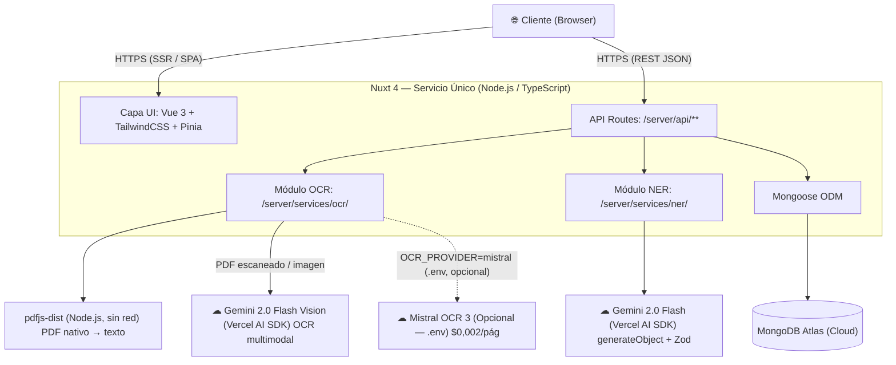
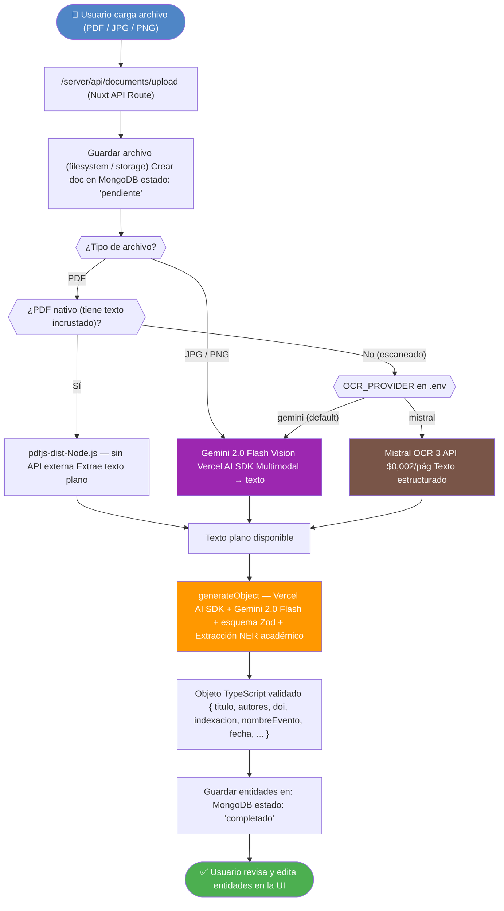

# SIPAc — Arquitectura Técnica

## Decisiones de Diseño y Stack Tecnológico

---

## Control de Versiones

| Versión | Fecha      | Autor                     | Descripción del cambio                                                                                               |
| ------- | ---------- | ------------------------- | -------------------------------------------------------------------------------------------------------------------- |
| 1.0     | 2026-02-09 | Carlos A. Canabal Cordero | Borrador inicial — arquitectura de dos servicios: Nuxt 4 + microservicio Python (FastAPI, spaCy, Tesseract)          |
| 1.1     | 2026-02-27 | Carlos A. Canabal Cordero | Reescritura completa — stack unificado TypeScript: Nuxt 4 monolito, Vercel AI SDK, Gemini 2.0 Flash, pdfjs-dist, Zod |

---

## 1. Visión General de la Arquitectura

SIPAc adopta una arquitectura de **servicio único** (monolito modular) implementada completamente en TypeScript sobre **Nuxt 4**. El procesamiento inteligente de documentos (OCR y NER) se ejecuta desde módulos internos del servidor Nuxt, eliminando la necesidad de un microservicio separado.



> **Principio guía:** Un solo lenguaje (TypeScript), un solo proceso (Node.js), un solo despliegue. El procesamiento con IA se delega a APIs externas de bajo costo (free tier en desarrollo), manteniendo la base de código simple y sin dependencias de entorno Python.

---

## 2. Stack Tecnológico

### 2.1 Capa de Interfaz de Usuario (UI)

| Tecnología      | Versión | Rol                         | Justificación                                                                                      |
| --------------- | ------- | --------------------------- | -------------------------------------------------------------------------------------------------- |
| **Nuxt 4**      | 4.x     | Framework principal SSR/SPA | SSR mejora el tiempo de primera carga y habilita API Routes                                        |
| **Vue 3**       | 3.x     | Framework UI reactivo       | Base oficial de Nuxt 4; Composition API facilita componentes complejos y reutilizables             |
| **TypeScript**  | 5.x     | Tipado estático end-to-end  | Compartir tipos entre servidor y cliente; reducción de errores en tiempo de edición                |
| **TailwindCSS** | 4.x     | Estilos utilitarios         | Desarrollo rápido de UI responsive profesional sin CSS personalizado extenso                       |
| **Pinia**       | 3.x     | Gestión de estado global    | Store oficial de Vue 3; manejo reactivo de sesión de usuario, documentos cargados y estado del NER |

### 2.2 Capa de Backend / API

| Tecnología                             | Versión   | Rol                                   | Justificación                                                                              |
| -------------------------------------- | --------- | ------------------------------------- | ------------------------------------------------------------------------------------------ |
| **Nuxt Server Routes** (`/server/api`) | 4.x       | Endpoints REST del sistema            | Evita un servidor Express separado; compilados junto con la app en el mismo bundle Node.js |
| **H3 Multipart**                       | integrado | Carga de archivos multipart/form-data | Integrado en el runtime H3 de Nuxt; sin dependencias adicionales                           |
| **Mongoose ODM**                       | 8.x       | Modelado de documentos MongoDB        | Esquemas tipados, discriminator pattern por tipo de producto, validaciones personalizadas  |
| **JWT (`jose`)**                       | latest    | Autenticación sin estado              | Estándar para APIs REST; `jose` opera en Edge Runtime (compatible con Nuxt middleware)     |
| **bcrypt**                             | 6.0       | Hash seguro de contraseñas            | Estándar de industria; mínimo 10 salt rounds para resistencia a fuerza bruta               |

### 2.3 Capa de Procesamiento Inteligente

| Tecnología                     | Versión            | Rol                                               | Justificación                                                                                                  |
| ------------------------------ | ------------------ | ------------------------------------------------- | -------------------------------------------------------------------------------------------------------------- |
| **pdfjs-dist**                 | latest             | Extracción de texto de PDFs nativos (digitales)   | Corre en Node.js sin API externa; extrae texto estructurado sin OCR cuando el PDF contiene texto incrustado    |
| **Vercel AI SDK** (`ai`)       | 6.x                | Capa unificada de acceso a modelos LLM/multimodal | Abstrae proveedores (Google, Mistral, Anthropic); API uniforme `generateObject` / `streamObject`               |
| **`@ai-sdk/google`**           | latest             | Proveedor Google Gemini para el AI SDK            | Acceso a Gemini 2.0 Flash (texto) y Gemini 2.0 Flash Vision (multimodal) desde el mismo SDK                    |
| **Gemini 2.0 Flash Vision**    | `gemini-2.0-flash` | OCR multimodal para PDFs escaneados e imágenes    | Free tier: 1.500 req/día; precisión superior a Tesseract en español; sin instalación local                     |
| **Gemini 2.0 Flash**           | `gemini-2.0-flash` | NER estructurado vía `generateObject`             | Extrae entidades académicas (DOI, indexación, ponencias, certificados) que no existen en modelos NER clásicos  |
| **Zod**                        | 4.x                | Esquemas de validación y contrato NER             | Tipado en tiempo de compilación y en tiempo de ejecución; `generateObject` garantiza JSON válido según esquema |
| **Mistral OCR 3** _(opcional)_ | `v25.12`           | OCR de alta precisión para documentos complejos   | 99,54% de precisión en español; activable vía `OCR_PROVIDER=mistral` en `.env`; costo: $0,002/pág              |

### 2.4 Capa de Base de Datos

| Tecnología       | Versión | Rol                                | Justificación                                                                                             |
| ---------------- | ------- | ---------------------------------- | --------------------------------------------------------------------------------------------------------- |
| **MongoDB**      | 8.x     | Base de datos documental principal | Esquemas heterogéneos por tipo de producto académico: cada documento puede tener campos distintos         |
| **Mongoose ODM** | 9.x     | Abstracción y validación ODM       | Discriminator pattern permite un único `ProductoAcademico` base con subtipos `Articulo`, `Ponencia`, etc. |

### 2.5 Capa de DevOps y Herramientas

| Tecnología / Herramienta | Versión | Rol                                        | Justificación                                                       |
| ------------------------ | ------- | ------------------------------------------ | ------------------------------------------------------------------- |
| **pnpm**                 | 10.x    | Gestor de paquetes                         | Más eficiente en espacio de disco que npm; requerido en el proyecto |
| **MongoDB Atlas**        | M0 Free | Base de datos en la nube                   | Cluster gratuito gestionado por MongoDB; sin instalación local      |
| **PlantUML**             | —       | Diagramas UML formales en archivos `.puml` | Generación de diagramas de clases, secuencia y componentes          |
| **Mermaid**              | —       | Diagramas inline en Markdown               | Extensión `mermaidchart.vscode-mermaid-chart` instalada en VS Code  |
| **VS Code**              | —       | IDE principal                              | Extensiones para Vue, TypeScript, Mermaid y PlantUML                |
| **Git + GitHub**         | —       | Control de versiones y colaboración        | Repositorio privado del proyecto de pasantía                        |
| **Postman / Hoppscotch** | —       | Pruebas manuales de API Routes             | Verificación de endpoints antes de integración con el frontend      |
| **MongoDB Compass**      | —       | Exploración visual de documentos           | Inspección de documentos con discriminators en desarrollo           |

---

## 3. Decisiones Arquitectónicas (ADRs simplificados)

### ADR-01 — MongoDB vs. PostgreSQL

**Decisión:** Base de datos documental MongoDB con discriminator pattern en Mongoose.

**Justificación técnica:** Los productos académicos registrados en SIPAc son estructuralmente heterogéneos. Un artículo científico requiere campos como `doi`, `issn`, `indexacion` (Scopus, WoS, Publindex) y `volumen`; una ponencia requiere `nombreEvento`, `ciudad`, `isbn`; un certificado de curso requiere `institucionEmisora` y `horas`. Un modelo relacional en PostgreSQL exigiría una tabla base con muchos campos nulos o un esquema EAV (Entity–Attribute–Value) difícil de mantener. MongoDB permite que cada documento tenga la forma exacta de su tipo, mientras que el discriminator de Mongoose mantiene un único punto de acceso y validación por tipo en el código TypeScript.

**Alternativa descartada:** PostgreSQL con JSONB. Aunque permitiría campos variables, pierde validación de esquema estricta en la capa de datos y requeriría queries SQL más complejas para filtrar por subtipo.

---

### ADR-02 — Monolito Nuxt 4 vs. microservicio Python

**Decisión:** Arquitectura de servicio único en Nuxt 4; eliminación total del microservicio Python.

**Justificación técnica:** El microservicio Python original (FastAPI + spaCy + Tesseract) introducía: (a) un segundo lenguaje y entorno de ejecución; (b) dependencias de sistema (Tesseract binario, modelos spaCy de ~600 MB); (c) comunicación HTTP interna con latencia y puntos de fallo adicionales; (d) complejidad de despliegue con múltiples servicios. Al delegar OCR y NER a APIs externas (Gemini), el procesamiento inteligente se reduce a llamadas HTTP desde el mismo proceso Node.js, eliminando todas esas fricciones.

**Alternativa descartada:** Mantener el microservicio Python como servicio separado. Se descartó por complejidad operativa, heterogeneidad de lenguajes y el incremento de esfuerzo de mantenimiento en el contexto de una pasantía.

---

### ADR-03 — `pdfjs-dist` vs. OCR para PDFs nativos

**Decisión:** PDFs que contienen texto incrustado (nativos/digitales) se procesan con `pdfjs-dist` en Node.js, sin invocar ninguna API externa.

**Justificación técnica:** La mayoría de artículos y documentos académicos de origen digital son PDFs con texto seleccionable. `pdfjs-dist` extrae ese texto con máxima fidelidad, sin costo de API, sin latencia de red y sin consumir el cupo gratuito de Gemini. El OCR se reserva únicamente para documentos realmente escaneados (imagen incrustada sin texto). Esta bifurcación reduce el costo operativo y mejora la velocidad de procesamiento para el caso común.

**Alternativa descartada:** Enviar todos los PDFs a Gemini Vision independientemente. Se descartó porque consumiría el free tier (1.500 req/día) innecesariamente y agregaría latencia para documentos que no la requieren.

---

### ADR-04 — Gemini 2.0 Flash Vision vs. Tesseract para OCR de escaneados

**Decisión:** Gemini 2.0 Flash Vision (vía Vercel AI SDK) como proveedor OCR primario para documentos escaneados e imágenes.

**Justificación técnica:** Tesseract requiere instalación de binarios en el servidor, modelos de idioma de ~100 MB y configuración de páginas por idioma. Su precisión en documentos académicos en español con columnas, tablas o marcas de agua es notoriamente baja. Gemini 2.0 Flash Vision es un modelo multimodal de última generación con 1.500 solicitudes gratuitas diarias, que corre completamente en la nube sin instalación local.

**Alternativa descartada:** Tesseract (open source, local). Se descartó por la dificultad de instalación en entornos sin acceso a binarios nativos, baja precisión en documentos complejos y la necesidad de configuración adicional para español.

**Proveedor opcional aprobado:** Mistral OCR 3 (ver ADR-06).

---

### ADR-05 — `generateObject` + Zod vs. spaCy NER para extracción de entidades

**Decisión:** Extracción de entidades académicas mediante `generateObject` del Vercel AI SDK con esquema Zod, usando Gemini 2.0 Flash como modelo de razonamiento.

**Justificación técnica:** spaCy con el modelo `es_core_news_lg` reconoce entidades genéricas (PER, ORG, DATE, LOC) pero no conoce entidades académicas específicas como `doi`, `issn`, `indexacion` (Scopus, WoS, Publindex), `nombreEvento` de una ponencia ni `acreditacion` de un certificado. Entrenar un modelo spaCy personalizado para estas entidades requeriría un corpus anotado que no existe. `generateObject` con un esquema Zod le provee al LLM una definición explícita de las entidades a extraer, y Gemini las infiere contextualmente con alta precisión directamente del texto. El resultado es un objeto TypeScript tipado y validado en tiempo de ejecución, sin código de parseo adicional.

**Alternativa descartada:** spaCy + `es_core_news_lg` con entrenamiento personalizado. Se descartó por la ausencia de corpus de entrenamiento, la fricción de mantener un modelo Python en un proyecto TypeScript y los 600+ MB de dependencias del modelo.

---

### ADR-06 — Mistral OCR 3 como proveedor OCR opcional

**Decisión:** Mistral OCR 3 (`v25.12`) se integra como proveedor OCR alternativo, activable mediante variable de entorno, pero no se usa por defecto.

**Justificación técnica:** Mistral OCR 3 reporta 99,54% de precisión en español y maneja correctamente tablas, fórmulas matemáticas y documentos con maquetación compleja. Sin embargo, tiene un costo de $0,002 por página. El proveedor primario es Gemini (free tier). Mistral OCR se reserva para casos donde la calidad del OCR sea crítica, activado explícitamente por el operador mediante `OCR_PROVIDER=mistral` en el archivo `.env`.

**Alternativa considerada:** Usar Mistral OCR por defecto y Gemini como fallback. Se descartó para evitar costos imprevistos en desarrollo cuando se carga un gran número de documentos.

---

## 4. Flujo de Procesamiento de Documentos

El siguiente diagrama describe el pipeline completo desde la carga del archivo hasta el almacenamiento de entidades estructuradas.



---

## 5. Estrategia de Proveedores OCR/LLM

### Abstracción `OCRProvider`

El módulo `server/services/ocr/` implementa una interfaz interna `OCRProvider` que desacopla el código de procesamiento del proveedor concreto. La selección del proveedor se realiza en tiempo de arranque leyendo la variable de entorno `OCR_PROVIDER`.

```typescript
// server/services/ocr/types.ts
export interface OCRProvider {
  extractText(file: Buffer, mimeType: string): Promise<string>
}
```

La fábrica de proveedores instancia la implementación correspondiente:

```typescript
// server/services/ocr/factory.ts
import { GeminiOCRProvider } from './gemini'
import { MistralOCRProvider } from './mistral'

export function createOCRProvider(): OCRProvider {
  const provider = process.env.OCR_PROVIDER ?? 'gemini'
  if (provider === 'mistral') return new MistralOCRProvider()
  return new GeminiOCRProvider()
}
```

### Tabla de proveedores

| Variable `OCR_PROVIDER` | Proveedor     | Modelo             | Costo              | Cuándo usar                                              |
| ----------------------- | ------------- | ------------------ | ------------------ | -------------------------------------------------------- |
| `gemini` _(default)_    | Google Gemini | `gemini-2.0-flash` | Gratis (1.500/día) | Desarrollo, producción inicial, uso académico            |
| `mistral`               | Mistral AI    | `v25.12`           | $0,002/pág         | Documentos complejos, tablas, fórmulas, máxima precisión |

### Plan de costos

- **Fase de desarrollo (pasantía):** `OCR_PROVIDER=gemini` siempre. El free tier de 1.500 req/día cubre con margen la carga esperada de una institución educativa durante la pasantía.
- **Producción institucional (futuro):** Si el volumen supera el free tier de Gemini, se puede activar `OCR_PROVIDER=mistral` para documentos específicos o implementar un proveedor con lógica de selección automática por tipo de documento.

---

## 6. Seguridad

| Aspecto                   | Implementación                                                                                           |
| ------------------------- | -------------------------------------------------------------------------------------------------------- |
| **Autenticación**         | JWT en header `Authorization: Bearer <token>`; tokens firmados con `jose` (compatible con Edge Runtime)  |
| **Autorización**          | Middleware de servidor Nuxt por rol — `admin`, `coordinador`, `docente`, `estudiante`                    |
| **Contraseñas**           | bcrypt con mínimo 10 salt rounds; nunca se almacena la contraseña en texto plano                         |
| **Archivos cargados**     | Validación de MIME type + extensión antes de procesar; archivos almacenados fuera del directorio público |
| **API keys (Gemini)**     | `GOOGLE_API_KEY` definida en `.env`; nunca expuesta al cliente; solo accesible en `server/` de Nuxt      |
| **API keys (Mistral)**    | `MISTRAL_API_KEY` definida en `.env`; idem anterior; solo se lee si `OCR_PROVIDER=mistral`               |
| **JWT secret**            | `JWT_SECRET` en `.env`; cadena de al menos 32 caracteres aleatorios; excluida de Git con `.gitignore`    |
| **Secretos en cliente**   | Nuxt 4 garantiza que las variables sin prefijo `NUXT_PUBLIC_` no se incluyen en el bundle del cliente    |
| **Cadena de conexión BD** | `MONGODB_URI` en `.env`; nunca hardcodeada; incluye usuario y contraseña de MongoDB en producción        |

---

## 7. Estructura de Directorios del Proyecto (Prevista)

```
sipac/
├── server/                         ← Código exclusivo del servidor Node.js (Nuxt)
│   ├── api/                        ← API Routes REST
│   │   ├── auth/
│   │   │   ├── login.post.ts
│   │   │   └── register.post.ts
│   │   ├── documents/
│   │   │   ├── upload.post.ts
│   │   │   ├── [id].get.ts
│   │   │   └── [id].patch.ts
│   │   └── users/
│   │       └── [id].get.ts
│   ├── middleware/                  ← Middleware de autenticación y autorización
│   │   └── auth.ts
│   ├── models/                     ← Modelos Mongoose con discriminator pattern
│   │   ├── User.ts
│   │   ├── ProductoAcademico.ts    ← Modelo base
│   │   ├── Articulo.ts             ← Discriminador: artículo científico
│   │   ├── Ponencia.ts             ← Discriminador: ponencia / conferencia
│   │   └── Certificado.ts          ← Discriminador: certificado de curso
│   ├── services/
│   │   ├── ocr/                    ← Módulo OCR interno (TypeScript)
│   │   │   ├── types.ts            ← Interfaz OCRProvider
│   │   │   ├── factory.ts          ← Fábrica según OCR_PROVIDER
│   │   │   ├── gemini.ts           ← Implementación Gemini 2.0 Flash Vision
│   │   │   ├── mistral.ts          ← Implementación Mistral OCR 3 (opcional)
│   │   │   └── pdf-native.ts       ← Extracción de texto con pdfjs-dist
│   │   └── ner/                    ← Módulo NER interno (TypeScript)
│   │       ├── schemas.ts          ← Esquemas Zod por tipo de producto
│   │       └── extractor.ts        ← generateObject con Vercel AI SDK
│   └── utils/
│       ├── db.ts                   ← Conexión Mongoose
│       └── jwt.ts                  ← Helpers JWT (jose)
├── components/                     ← Componentes Vue reutilizables
├── pages/                          ← Páginas Nuxt (SSR / SPA)
├── stores/                         ← Pinia stores (sesión, documentos, NER)
├── composables/                    ← Composables Vue 3
├── assets/                         ← Estilos globales TailwindCSS
├── public/                         ← Archivos estáticos públicos
├── docs/                           ← Documentación del proyecto
├── .env                            ← Variables de entorno (excluido de Git)
├── .env.example                    ← Plantilla de variables de entorno
├── nuxt.config.ts                  ← Configuración de Nuxt 4
└── package.json                    ← Gestionado con pnpm
```

---

## 8. Herramientas de Desarrollo

| Herramienta              | Propósito                                                             |
| ------------------------ | --------------------------------------------------------------------- |
| **pnpm**                 | Gestor de paquetes — más eficiente que npm; usado en todo el proyecto |
| **VS Code**              | IDE principal con extensiones Vue, TypeScript, Mermaid y PlantUML     |
| **Git + GitHub**         | Control de versiones y repositorio del proyecto de pasantía           |
| **MongoDB Atlas**        | Cluster cloud gratuito (M0); sin instalación local de MongoDB         |
| **Vercel AI SDK**        | Integración con Gemini y Mistral; `generateObject` con Zod            |
| **Zod**                  | Validación de esquemas en tiempo de ejecución y tipado TypeScript     |
| **PlantUML**             | Diagramas UML formales en archivos `.puml` de la carpeta `docs/`      |
| **Mermaid**              | Diagramas inline en Markdown (extensión VS Code instalada)            |
| **Postman / Hoppscotch** | Pruebas manuales de Nuxt API Routes                                   |
| **MongoDB Compass**      | Exploración visual de documentos con discriminators en desarrollo     |

---

## 9. Decisiones Resueltas (Temporales)

| Decisión                                         | Resolución                                                                                                                                                                                   |
| ------------------------------------------------ | -------------------------------------------------------------------------------------------------------------------------------------------------------------------------------------------- |
| **Almacenamiento de archivos cargados**          | Filesystem local (`./uploads/`) para desarrollo. Abstraído tras interfaz `StorageService` para intercambiar por cloud (S3, Cloudinary) en producción sin cambiar código de negocio           |
| **Estrategia de despliegue en producción**       | Vercel como plataforma principal (capa gratuita, CI/CD integrado con GitHub). Alternativa: Railway o VPS si se requiere filesystem persistente                                               |
| **Umbral de score para retry NER**               | Configurable vía `runtimeConfig.nerConfidenceThreshold` (default 0.70). Se ajustará durante pruebas con documentos reales sin necesidad de redespliegue                                      |
| **Gestión de rate limit en free tier de Gemini** | Rate limit por usuario: 15 documentos/hora (configurable vía `runtimeConfig`). Con ~30 usuarios activos × 15 docs/hora = 450 calls/hora máx, dentro del free tier de 1.500 req/día de Gemini |
