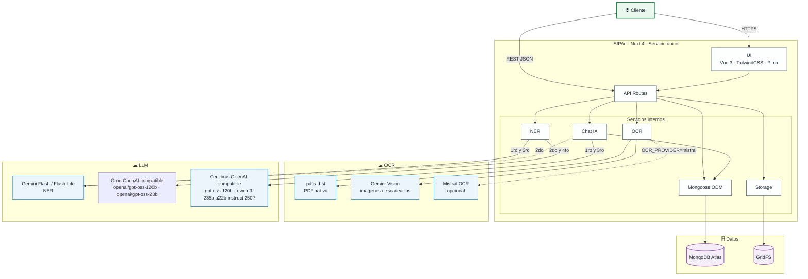
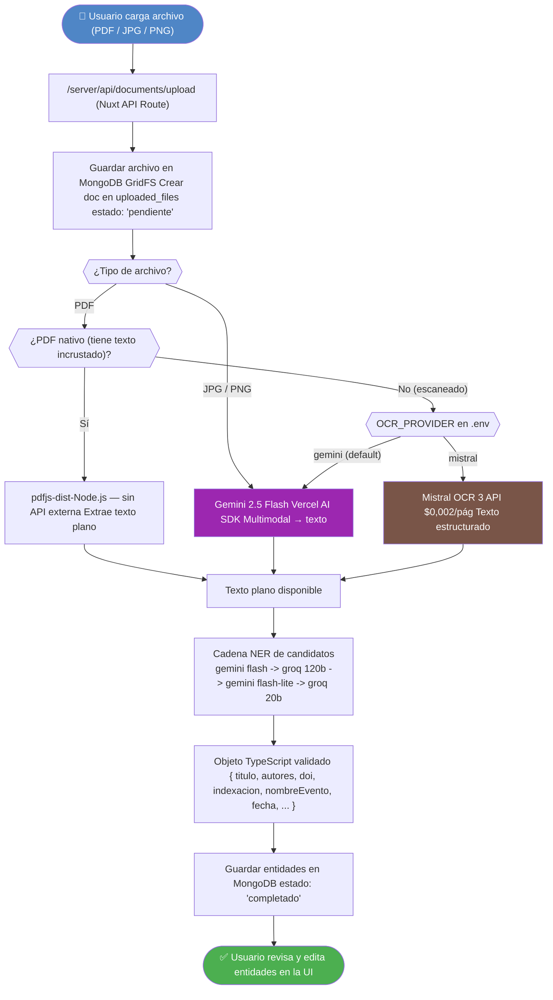

# SIPAc — Arquitectura Técnica

## Decisiones de Diseño y Stack Tecnológico

---

## Control de Versiones

| Versión | Fecha      | Autor                     | Descripción del cambio                                                                                                                                                                                                                                                                  |
| ------- | ---------- | ------------------------- | --------------------------------------------------------------------------------------------------------------------------------------------------------------------------------------------------------------------------------------------------------------------------------------- |
| 1.0     | 2026-02-09 | Carlos A. Canabal Cordero | Borrador inicial — arquitectura de dos servicios: Nuxt 4 + microservicio Python (FastAPI, spaCy, Tesseract)                                                                                                                                                                             |
| 1.1     | 2026-02-27 | Carlos A. Canabal Cordero | Reescritura completa — stack unificado TypeScript: Nuxt 4 monolito, Vercel AI SDK, Gemini 2.0 Flash, pdfjs-dist, Zod                                                                                                                                                                    |
| 1.2     | 2026-03-04 | Carlos A. Canabal Cordero | Simplificación a 2 roles (`admin`, `docente`), nuevo módulo Chat Inteligente, almacenamiento en MongoDB GridFS, eliminación del flujo de verificación, nuevos ADR-07 y ADR-08                                                                                                           |
| 1.3     | 2026-03-06 | Carlos A. Canabal Cordero | Alineación a los cambios de la arquitectura: corrección de versión Mongoose (9.x), corrección de mecanismo de autenticación (cookie httpOnly), actualización de estructura de directorios a estado real, adición de @nuxt/ui, nuxt-security y @ai-sdk/vue en stack                      |
| 1.4     | 2026-03-07 | Carlos A. Canabal Cordero | Estrategia multi-proveedor LLM: Cerebras (`gpt-oss-120b`, `qwen-3-235b-a22b-instruct-2507`) como proveedores primarios para NER y Chat con Gemini 2.0 Flash como fallback automático; adición de `@ai-sdk/openai-compatible`; nuevo ADR-09; sección 5 expandida a proveedores OCR + LLM |
| 1.5     | 2026-03-11 | Carlos A. Canabal Cordero | Mejora visual de la visión general de la arquitectura: reorganización del diagrama Mermaid por capas y adición de cuadro resumen sin cambios en el contenido técnico                                                                                                                    |
| 1.6     | 2026-03-11 | Carlos A. Canabal Cordero | Refactorización de la visión general de la arquitectura: reducción del texto introductorio, simplificación del diagrama Mermaid y corrección de sintaxis, manteniendo el mismo significado técnico                                                                                      |
| 1.7     | 2026-03-11 | Carlos A. Canabal Cordero | Alineación al estado implementado de M2/M8: NER estructurado con `generateText` + `Output.object`, selector real `LLM_PROVIDER`, y notificaciones por correo mediante Resend en modo best-effort                                                                                        |
| 1.8     | 2026-03-13 | Carlos A. Canabal Cordero | Actualización del proveedor LLM a fallback por tarea implementado: NER `qwen -> gpt-oss -> gemini -> llama3.1`; Chat `gpt-oss -> gemini -> qwen`; documentación alineada a `getStructuredModelCandidates()` y `getChatModelCandidates()`                                                |
| 1.9     | 2026-03-13 | Carlos A. Canabal Cordero | Alineación final al hardening del pipeline OCR/NER: timeouts configurables, presupuesto de intentos por candidato y observabilidad por etapas (`ocr`, `ner`, `processing`)                                                                                                              |
| 2.0     | 2026-03-13 | Carlos A. Canabal Cordero | Alineación al fallback real tras validaciones de compatibilidad: NER con Gemini + Groq (`gemini-2.5-flash` → `openai/gpt-oss-120b` → `gemini-2.5-flash-lite` → `openai/gpt-oss-20b`), Chat con Cerebras + Gemini; y ajuste documental de `GROQ_API_KEY` y esquema estructurado estricto |
| 2.1     | 2026-03-14 | Carlos A. Canabal Cordero | Alineación de arquitectura al estado funcional vigente: M5A parcial (borrador/revisión), M5B y M9 pendientes, estructura de directorios actualizada sin marcadores de "futuro"                                                                                                          |
| 2.2     | 2026-03-20 | Carlos A. Canabal Cordero | Pipeline documental: tras OCR, etapa opcional de **segmentación** (heurística + LLM acotado por env) y **NER por segmento**, persistiendo N productos por `sourceFile` con `segmentIndex`                                                                                               |

---

## 1. Visión General de la Arquitectura

SIPAc adopta una arquitectura de **servicio único** (monolito modular) construida sobre **Nuxt 4** y **TypeScript**. La UI, la API, la persistencia y el procesamiento inteligente de documentos se ejecutan dentro del mismo servicio Node.js, mientras OCR y LLM se consumen desde proveedores externos integrados en el servidor.



| Bloque                   | Elementos principales                                                  | Función                                                   |
| ------------------------ | ---------------------------------------------------------------------- | --------------------------------------------------------- |
| **Cliente**              | Browser                                                                | Consumir la interfaz y las API del sistema                |
| **Aplicación**           | UI, API Routes, OCR, NER, Chat IA, Storage, Mongoose                   | Ejecutar la lógica del sistema en un único servicio Nuxt  |
| **Proveedores externos** | `pdfjs-dist`, Gemini Vision, Mistral OCR, Cerebras, Groq, Gemini Flash | Resolver OCR y capacidades LLM sin microservicios propios |
| **Persistencia**         | MongoDB Atlas, GridFS                                                  | Guardar metadatos, documentos y archivos                  |

> **Principio guía:** Un solo lenguaje (TypeScript), un solo proceso (Node.js), un solo despliegue. El procesamiento con IA se delega a APIs externas de bajo costo (free tier en desarrollo), manteniendo la base de código simple y sin dependencias de entorno Python.

---

## 2. Stack Tecnológico

### 2.1 Capa de Interfaz de Usuario (UI)

| Tecnología          | Versión | Rol                         | Justificación                                                                                      |
| ------------------- | ------- | --------------------------- | -------------------------------------------------------------------------------------------------- |
| **Nuxt 4**          | 4.x     | Framework principal SSR/SPA | SSR mejora el tiempo de primera carga y habilita API Routes                                        |
| **Vue 3**           | 3.x     | Framework UI reactivo       | Base oficial de Nuxt 4; Composition API facilita componentes complejos y reutilizables             |
| **TypeScript**      | 5.x     | Tipado estático end-to-end  | Compartir tipos entre servidor y cliente; reducción de errores en tiempo de edición                |
| **TailwindCSS**     | 4.x     | Estilos utilitarios         | Desarrollo rápido de UI responsive profesional sin CSS personalizado extenso                       |
| **@nuxt/ui**        | 4.x     | Librería de componentes UI  | 125+ componentes accesibles con theming Tailwind CSS; base de la UI del sistema                    |
| **Pinia**           | 3.x     | Gestión de estado global    | Store oficial de Vue 3; manejo reactivo de sesión de usuario, documentos cargados y estado del NER |
| `**@ai-sdk/vue`\*\* | 3.x     | Composables de IA para Vue  | Proporciona `useChat` y `useCompletion` para streaming de respuestas del chat IA en el cliente     |

### 2.2 Capa de Backend / API

| Tecnología                             | Versión   | Rol                                   | Justificación                                                                                               |
| -------------------------------------- | --------- | ------------------------------------- | ----------------------------------------------------------------------------------------------------------- |
| **Nuxt Server Routes** (`/server/api`) | 4.x       | Endpoints REST del sistema            | Evita un servidor Express separado; compilados junto con la app en el mismo bundle Node.js                  |
| **H3 Multipart**                       | integrado | Carga de archivos multipart/form-data | Integrado en el runtime H3 de Nuxt; sin dependencias adicionales                                            |
| **Mongoose ODM**                       | 9.x       | Modelado de documentos MongoDB        | Esquemas tipados, discriminator pattern por tipo de producto, validaciones personalizadas                   |
| **JWT (`jose`)**                       | latest    | Autenticación sin estado              | Tokens JWT firmados con HS256; almacenados en cookie httpOnly `sipac_session`; `jose` opera en Edge Runtime |
| **bcrypt**                             | 6.0       | Hash seguro de contraseñas            | Estándar de industria; mínimo 10 salt rounds para resistencia a fuerza bruta                                |
| **nuxt-security**                      | 2.5.1     | Endurecimiento HTTP y rate limiting   | Headers de seguridad, CSP, rate limiting global, límites de tamaño de request                               |

### 2.3 Capa de Procesamiento Inteligente

| Tecnología                                      | Versión                          | Rol                                                 | Justificación                                                                                                                                                                    |
| ----------------------------------------------- | -------------------------------- | --------------------------------------------------- | -------------------------------------------------------------------------------------------------------------------------------------------------------------------------------- |
| **pdfjs-dist**                                  | latest                           | Extracción de texto de PDFs nativos (digitales)     | Corre en Node.js sin API externa; extrae texto estructurado sin OCR cuando el PDF contiene texto incrustado                                                                      |
| **Vercel AI SDK** (`ai`)                        | 6.x                              | Capa unificada de acceso a modelos LLM/multimodal   | Abstrae proveedores (Google vía `@ai-sdk/google`, Cerebras vía `@ai-sdk/openai-compatible`, Mistral); API uniforme `generateText` / `streamText` con structured outputs          |
| `**@ai-sdk/google`\*\*                          | latest                           | Proveedor Google Gemini para el AI SDK              | Acceso a Gemini 2.5 Flash para OCR multimodal y como candidato de fallback en NER/Chat                                                                                           |
| `**@ai-sdk/openai-compatible**`                 | latest                           | Proveedor OpenAI-compatible genérico para el AI SDK | Conecta el Vercel AI SDK a APIs con interfaz OpenAI, incluyendo Cerebras (`https://api.cerebras.ai/v1`) y Groq (`https://api.groq.com/openai/v1`); sin paquete propietario extra |
| **Gemini 2.5 Flash**                            | `gemini-2.5-flash`               | OCR multimodal para PDFs escaneados e imágenes      | Proveedor OCR visual actual; en LLM participa como candidato intermedio de fallback en NER y Chat                                                                                |
| **Gemini 2.5 Flash-Lite**                       | `gemini-2.5-flash-lite`          | 3er candidato en NER                                | Variante de menor costo/latencia para degradación controlada antes de último fallback                                                                                            |
| **Groq GPT-OSS 120B**                           | `openai/gpt-oss-120b`            | 2do candidato en NER                                | Compatible con interfaz OpenAI; validado para structured outputs con esquema estricto                                                                                            |
| **Groq GPT-OSS 20B**                            | `openai/gpt-oss-20b`             | 4to candidato en NER                                | Último recurso en NER; se prioriza al final por mayor variabilidad de cumplimiento de esquema                                                                                    |
| **Cerebras GPT-OSS 120B**                       | `gpt-oss-120b`                   | 1er candidato en Chat                               | Modelo de producción para flujo conversacional (M9) con tool calling planificado                                                                                                 |
| **Cerebras Qwen 3 235B**                        | `qwen-3-235b-a22b-instruct-2507` | 3er candidato en Chat                               | Respaldo adicional en flujo de chat                                                                                                                                              |
| **Zod**                                         | 4.x                              | Esquemas de validación y contrato NER               | Tipado en compilación y ejecución; combinado con `Output.object` permite structured outputs válidos independientemente del proveedor activo                                      |
| **Resend**                                      | latest                           | Envío de correo transaccional para M8               | Proveedor simple para notificaciones por correo cuando el procesamiento completa o falla                                                                                         |
| **Mistral OCR 3** _(opcional)_                  | `v25.12`                         | OCR de alta precisión para documentos complejos     | 99,54% de precisión en español; activable vía `OCR_PROVIDER=mistral` en `.env`; costo: $0,002/pág                                                                                |
| **pipeline-observability** _(utilidad interna)_ | local                            | Telemetría y diagnóstico por etapa                  | Estandariza eventos estructurados (`start`, `completed`, `failed`) y clasificación de errores para OCR/NER/procesamiento                                                         |

### 2.4 Capa de Base de Datos

| Tecnología       | Versión | Rol                                | Justificación                                                                                             |
| ---------------- | ------- | ---------------------------------- | --------------------------------------------------------------------------------------------------------- |
| **MongoDB**      | 8.x     | Base de datos documental principal | Esquemas heterogéneos por tipo de producto académico: cada documento puede tener campos distintos         |
| **Mongoose ODM** | 9.x     | Abstracción y validación ODM       | Discriminator pattern permite un único `ProductoAcademico` base con subtipos `Articulo`, `Ponencia`, etc. |

### 2.5 Capa de DevOps y Herramientas

| Tecnología / Herramienta | Versión | Rol                                        | Justificación                                                       |
| ------------------------ | ------- | ------------------------------------------ | ------------------------------------------------------------------- |
| **pnpm**                 | 10.x    | Gestor de paquetes                         | Más eficiente en espacio de disco que npm; requerido en el proyecto |
| **MongoDB Atlas**        | M0 Free | Base de datos en la nube                   | Cluster gratuito gestionado por MongoDB; sin instalación local      |
| **PlantUML**             | —       | Diagramas UML formales en archivos `.puml` | Generación de diagramas de clases, secuencia y componentes          |
| **Mermaid**              | —       | Diagramas inline en Markdown               | Extensión `mermaidchart.vscode-mermaid-chart` instalada en VS Code  |
| **VS Code**              | —       | IDE principal                              | Extensiones para Vue, TypeScript, Mermaid y PlantUML                |
| **Git + GitHub**         | —       | Control de versiones y colaboración        | Repositorio privado del proyecto de pasantía                        |
| **Postman / Hoppscotch** | —       | Pruebas manuales de API Routes             | Verificación de endpoints antes de integración con el frontend      |
| **MongoDB Compass**      | —       | Exploración visual de documentos           | Inspección de documentos con discriminators en desarrollo           |

---

## 3. Decisiones Arquitectónicas (ADRs simplificados)

### ADR-01 — MongoDB vs. PostgreSQL

**Decisión:** Base de datos documental MongoDB con discriminator pattern en Mongoose.

**Justificación técnica:** Los productos académicos registrados en SIPAc son estructuralmente heterogéneos. Un artículo científico requiere campos como `doi`, `issn`, `indexacion` (Scopus, WoS, Publindex) y `volumen`; una ponencia requiere `nombreEvento`, `ciudad`, `isbn`; un certificado de curso requiere `institucionEmisora` y `horas`. Un modelo relacional en PostgreSQL exigiría una tabla base con muchos campos nulos o un esquema EAV (Entity–Attribute–Value) difícil de mantener. MongoDB permite que cada documento tenga la forma exacta de su tipo, mientras que el discriminator de Mongoose mantiene un único punto de acceso y validación por tipo en el código TypeScript.

**Alternativa descartada:** PostgreSQL con JSONB. Aunque permitiría campos variables, pierde validación de esquema estricta en la capa de datos y requeriría queries SQL más complejas para filtrar por subtipo.

---

### ADR-02 — Monolito Nuxt 4 vs. microservicio Python

**Decisión:** Arquitectura de servicio único en Nuxt 4; eliminación total del microservicio Python.

**Justificación técnica:** El microservicio Python original (FastAPI + spaCy + Tesseract) introducía: (a) un segundo lenguaje y entorno de ejecución; (b) dependencias de sistema (Tesseract binario, modelos spaCy de ~600 MB); (c) comunicación HTTP interna con latencia y puntos de fallo adicionales; (d) complejidad de despliegue con múltiples servicios. Al delegar OCR y NER a APIs externas (Gemini), el procesamiento inteligente se reduce a llamadas HTTP desde el mismo proceso Node.js, eliminando todas esas fricciones.

**Alternativa descartada:** Mantener el microservicio Python como servicio separado. Se descartó por complejidad operativa, heterogeneidad de lenguajes y el incremento de esfuerzo de mantenimiento en el contexto de una pasantía.

---

### ADR-03 — `pdfjs-dist` vs. OCR para PDFs nativos

**Decisión:** PDFs que contienen texto incrustado (nativos/digitales) se procesan con `pdfjs-dist` en Node.js, sin invocar ninguna API externa.

**Justificación técnica:** La mayoría de artículos y documentos académicos de origen digital son PDFs con texto seleccionable. `pdfjs-dist` extrae ese texto con máxima fidelidad, sin costo de API, sin latencia de red y sin consumir el cupo gratuito de Gemini. El OCR se reserva únicamente para documentos realmente escaneados (imagen incrustada sin texto). Esta bifurcación reduce el costo operativo y mejora la velocidad de procesamiento para el caso común.

**Alternativa descartada:** Enviar todos los PDFs a Gemini Vision independientemente. Se descartó porque consumiría el free tier (1.500 req/día) innecesariamente y agregaría latencia para documentos que no la requieren.

---

### ADR-04 — Gemini 2.5 Flash vs. Tesseract para OCR de escaneados

**Decisión:** Gemini 2.5 Flash (vía Vercel AI SDK) como proveedor OCR primario para documentos escaneados e imágenes.

**Justificación técnica:** Tesseract requiere instalación de binarios en el servidor, modelos de idioma de ~100 MB y configuración de páginas por idioma. Su precisión en documentos académicos en español con columnas, tablas o marcas de agua es notoriamente baja. Gemini 2.5 Flash permite OCR multimodal desde el mismo stack AI SDK sin instalación local.

**Alternativa descartada:** Tesseract (open source, local). Se descartó por la dificultad de instalación en entornos sin acceso a binarios nativos, baja precisión en documentos complejos y la necesidad de configuración adicional para español.

**Proveedor opcional aprobado:** Mistral OCR 3 (ver ADR-06).

---

### ADR-05 — Structured outputs + Zod vs. spaCy NER para extracción de entidades

**Decisión:** Extracción de entidades académicas mediante structured outputs del Vercel AI SDK (`generateText` + `Output.object`) con esquema Zod, usando Cerebras o Gemini según la estrategia de proveedor activa.

**Justificación técnica:** spaCy con el modelo `es_core_news_lg` reconoce entidades genéricas (PER, ORG, DATE, LOC) pero no conoce entidades académicas específicas como `doi`, `issn`, `indexacion` (Scopus, WoS, Publindex), `nombreEvento` de una ponencia ni `acreditacion` de un certificado. Entrenar un modelo spaCy personalizado para estas entidades requeriría un corpus anotado que no existe. Los structured outputs del AI SDK, apoyados en Zod, le proveen al LLM una definición explícita de las entidades a extraer y retornan un objeto TypeScript validado en tiempo de ejecución, sin parseo manual adicional.

**Alternativa descartada:** spaCy + `es_core_news_lg` con entrenamiento personalizado. Se descartó por la ausencia de corpus de entrenamiento, la fricción de mantener un modelo Python en un proyecto TypeScript y los 600+ MB de dependencias del modelo.

---

### ADR-06 — Mistral OCR 3 como proveedor OCR opcional

**Decisión:** Mistral OCR 3 (`v25.12`) se integra como proveedor OCR alternativo, activable mediante variable de entorno, pero no se usa por defecto.

**Justificación técnica:** Mistral OCR 3 reporta 99,54% de precisión en español y maneja correctamente tablas, fórmulas matemáticas y documentos con maquetación compleja. Sin embargo, tiene un costo de $0,002 por página. El proveedor primario es Gemini (free tier). Mistral OCR se reserva para casos donde la calidad del OCR sea crítica, activado explícitamente por el operador mediante `OCR_PROVIDER=mistral` en el archivo `.env`.

**Alternativa considerada:** Usar Mistral OCR por defecto y Gemini como fallback. Se descartó para evitar costos imprevistos en desarrollo cuando se carga un gran número de documentos.

---

### ADR-07 — MongoDB GridFS vs. Filesystem local para almacenamiento de archivos

**Decisión:** Todos los archivos cargados se almacenan directamente en MongoDB mediante GridFS, independientemente de su tamaño.

**Justificación técnica:** El almacenamiento en filesystem local (`./uploads/`) presenta limitaciones significativas para el proyecto: (a) los archivos no son accesibles desde la UI sin implementar un servidor de archivos estáticos con autenticación; (b) el despliegue en plataformas serverless (ej: Vercel) no garantiza persistencia del filesystem; (c) la previsualización y descarga de documentos desde la interfaz requiere servir los archivos como streams HTTP, lo cual se integra naturalmente con GridFS. MongoDB GridFS divide los archivos en chunks de 255 KB almacenados en las colecciones `uploads.files` y `uploads.chunks`, soportando archivos de cualquier tamaño dentro del límite del cluster. En MongoDB Atlas M0 (free tier), el almacenamiento disponible es de 512 MB, suficiente para la fase de desarrollo y pruebas de la pasantía.

**Alternativa descartada:** Filesystem local con interfaz `StorageService` abstracta para migrar a S3/Cloudinary en producción. Se descartó porque agrega complejidad de abstracción sin beneficio inmediato.

---

### ADR-08 — Function Calling vs. RAG para el Chat Inteligente (M9)

**Decisión:** El módulo de chat utiliza **function calling** (tool use) del Vercel AI SDK y queda previsto para operar con fallback ordenado `gpt-oss-120b` → `gemini-2.5-flash` → `qwen-3-235b-a22b-instruct-2507` al traducir preguntas en lenguaje natural a queries MongoDB sobre metadatos estructurados.

**Justificación técnica:** Los documentos académicos de SIPAc tienen metadatos estructurados bien definidos (autores, título, fecha, tipo, institución, DOI, palabras clave) almacenados en campos tipados de MongoDB. Este escenario favorece el enfoque de function calling sobre RAG (Retrieval Augmented Generation) porque: (a) no se requiere búsqueda semántica sobre texto libre — las consultas operan sobre campos discretos y filtros combinables; (b) function calling permite al LLM invocar herramientas de búsqueda tipadas con esquemas Zod, garantizando queries válidas; (c) no se necesitan embeddings vectoriales ni infraestructura adicional de vector search; (d) el LLM puede encadenar múltiples herramientas en una sola respuesta para queries complejas. La arquitectura define un conjunto de herramientas (`searchByDateRange`, `searchByAuthor`, `searchByKeywords`, `searchByTitle`, `searchByProductType`, `searchByInstitution`, `searchCombined`) que el LLM invoca según la intención del usuario.

**Alternativa descartada:** RAG con MongoDB Atlas Vector Search. Se descartó porque requiere generar y almacenar embeddings para cada documento, un modelo de embeddings adicional, y un índice vectorial en Atlas (no disponible en M0 free tier). La complejidad y el costo no se justifican cuando la búsqueda es sobre metadatos estructurados y no sobre contenido semántico del texto completo.

---

### ADR-09 — Estrategia multi-proveedor LLM con fallback por tarea (M4 y M9)

**Decisión:** El NER implementado utiliza structured outputs del AI SDK (`generateText` + `Output.object`) con la cadena fija `gemini-2.5-flash` → `openai/gpt-oss-120b` (Groq) → `gemini-2.5-flash-lite` → `openai/gpt-oss-20b` (Groq). Para Chat IA (M9) se define la cadena `gpt-oss-120b` (Cerebras) → `gemini-2.5-flash` → `qwen-3-235b-a22b-instruct-2507` (Cerebras).

**Justificación técnica:** Un único proveedor LLM para NER y Chat representa un punto de falla en un sistema multiusuario académico. El fallback por tarea reduce ese riesgo y permite optimizar por compatibilidad de salida estructurada y disponibilidad:

- `gemini-2.5-flash`: primer intento NER y proveedor OCR multimodal actual.
- `openai/gpt-oss-120b` (Groq): segundo intento NER, validado con structured outputs bajo esquema estricto.
- `gemini-2.5-flash-lite`: tercer intento NER para degradación de costo/latencia.
- `openai/gpt-oss-20b` (Groq): último recurso NER.
- `gpt-oss-120b` y `qwen-3-235b-a22b-instruct-2507` (Cerebras): primer y tercer intento para Chat.

La integración se realiza mediante `@ai-sdk/openai-compatible` (paquete oficial del Vercel AI SDK para APIs con interfaz OpenAI), usando `https://api.groq.com/openai/v1` para Groq y `https://api.cerebras.ai/v1` para Cerebras.

**Variables de entorno:** `GROQ_API_KEY` habilita candidatos Groq para NER. `CEREBRAS_API_KEY` habilita candidatos Cerebras para Chat. `LLM_PROVIDER` se mantiene por compatibilidad de configuración, pero el orden efectivo se define explícitamente en el proveedor LLM.

**Alternativa descartada:** Mantener un único proveedor LLM. Se descartó por ausencia de resiliencia y por incompatibilidades puntuales de structured outputs según proveedor/modelo.

---

## 4. Flujo de Procesamiento de Documentos

El siguiente diagrama describe el pipeline completo desde la carga del archivo hasta el almacenamiento de entidades estructuradas.



**Ampliación (compendios, 20/03/2026):** entre el texto OCR completo y la cadena NER, el servicio `process-uploaded-file` puede **partir el texto en segmentos** (`server/services/ner/document-segmentation.ts`). Por defecto la llamada LLM de segmentación está **desactivada** (`NER_SEGMENTATION_ENABLED`); si está activa y la heurística sugiere varias obras, se usa un modelo Gemini barato con entrada acotada. Luego se ejecuta el flujo NER **una vez por segmento** y se persisten varios documentos en `academic_products` con el mismo `sourceFile` y `segmentIndex` distinto.

---

## 5. Estrategia de Proveedores OCR / LLM

El sistema gestiona dos categorías de proveedores de IA, desacoplados mediante interfaces internas y el patrón fábrica: **OCR** (extracción de texto de documentos) y **LLM** (extracción de entidades NER y chat inteligente). El fallback de LLM se define por tarea (NER y Chat) con listas ordenadas de candidatos.

---

### 5.1 Abstracción `OCRProvider` (M3 — OCR)

El módulo `server/services/ocr/` implementa una interfaz interna `OCRProvider` que desacopla el código de procesamiento del proveedor concreto. La selección del proveedor se realiza en tiempo de arranque leyendo la variable de entorno `OCR_PROVIDER`.

```typescript
// server/services/ocr/types.ts
export interface OCRProvider {
  extractText(file: Buffer, mimeType: string): Promise<string>
}
```

La fábrica de proveedores instancia la implementación correspondiente:

```typescript
// server/services/ocr/factory.ts
import { GeminiOCRProvider } from './gemini'
import { MistralOCRProvider } from './mistral'

export function createOCRProvider(): OCRProvider {
  const provider = process.env.OCR_PROVIDER ?? 'gemini'
  if (provider === 'mistral') return new MistralOCRProvider()
  return new GeminiOCRProvider()
}
```

#### Tabla de proveedores OCR

| Variable `OCR_PROVIDER` | Proveedor     | Modelo             | Costo                     | Cuándo usar                                                |
| ----------------------- | ------------- | ------------------ | ------------------------- | ---------------------------------------------------------- |
| `gemini` _(default)_    | Google Gemini | `gemini-2.5-flash` | Según cuota del proveedor | Desarrollo, producción inicial, PDFs escaneados e imágenes |
| `mistral`               | Mistral AI    | `v25.12`           | $0,002/pág                | Documentos complejos, tablas, fórmulas, máxima precisión   |

> **Nota importante:** Cerebras no ofrece capacidad multimodal/visión. Por tanto, el OCR de imágenes y PDFs escaneados siempre usa el modelo Gemini configurado para OCR.

---

### 5.2 Abstracción `LLMProvider` (M4 — NER y evolución hacia M9)

El módulo `server/services/llm/` implementa una abstracción ligera para seleccionar modelos de texto. Los modelos Groq y Cerebras se consumen vía `@ai-sdk/openai-compatible` (respectivamente `https://api.groq.com/openai/v1` y `https://api.cerebras.ai/v1`), y Google Gemini se consume vía `@ai-sdk/google`. Todos comparten la misma API del Vercel AI SDK y en el estado actual se usan para NER estructurado mediante `generateText` + `Output.object`.

```typescript
// server/services/llm/types.ts
import type { LanguageModel } from 'ai'

export interface LLMProvider {
  readonly name: string
  getModel(modelId?: string): LanguageModel // Para structured outputs (NER)
  getStreamingModel(modelId?: string): LanguageModel // Para streamText + tool calling (Chat)
}
```

La implementación actual expone dos selecciones ordenadas: una para NER estructurado y otra para Chat.

> **Estado funcional (14/03/2026):** la selección NER está en uso en el pipeline M2-M4. La selección de Chat (`getChatModelCandidates()`) está definida a nivel de proveedor, pero los endpoints de M9 (`/api/chat/*`) aún no están implementados.

```typescript
// server/services/llm/provider.ts
import { createGoogleGenerativeAI } from '@ai-sdk/google'
import { createOpenAICompatible } from '@ai-sdk/openai-compatible'

const google = createGoogleGenerativeAI({ apiKey: process.env.GOOGLE_API_KEY })

export function getStructuredModelCandidates() {
  const candidates = []

  const groq = process.env.GROQ_API_KEY
    ? createOpenAICompatible({
        name: 'groq',
        apiKey: process.env.GROQ_API_KEY,
        baseURL: 'https://api.groq.com/openai/v1',
      })
    : null

  candidates.push(google('gemini-2.5-flash'))

  if (groq) {
    candidates.push(groq('openai/gpt-oss-120b'))
  }

  candidates.push(google('gemini-2.5-flash-lite'))

  if (groq) {
    candidates.push(groq('openai/gpt-oss-20b'))
  }

  return candidates
}

export function getChatModelCandidates() {
  const candidates = []

  if (process.env.CEREBRAS_API_KEY) {
    const cerebras = createOpenAICompatible({
      name: 'cerebras',
      apiKey: process.env.CEREBRAS_API_KEY,
      baseURL: 'https://api.cerebras.ai/v1',
    })

    candidates.push(cerebras('gpt-oss-120b'))
    candidates.push(google('gemini-2.5-flash'))
    candidates.push(cerebras('qwen-3-235b-a22b-instruct-2507'))
    return candidates
  }

  candidates.push(google('gemini-2.5-flash'))
  return candidates
}

// El servicio consumidor intenta candidatos en orden hasta obtener respuesta válida.
```

#### Tabla de proveedores LLM

| Flujo    | Orden de fallback implementado                                                                            | Observación operativa                                                      |
| -------- | --------------------------------------------------------------------------------------------------------- | -------------------------------------------------------------------------- |
| **NER**  | `gemini-2.5-flash` → `openai/gpt-oss-120b` (Groq) → `gemini-2.5-flash-lite` → `openai/gpt-oss-20b` (Groq) | Si no hay `GROQ_API_KEY`, la cadena queda en candidatos Gemini disponibles |
| **Chat** | `gpt-oss-120b` (Cerebras) → `gemini-2.5-flash` → `qwen-3-235b-a22b-instruct-2507` (Cerebras)              | Definido en proveedor LLM para el módulo M9                                |

#### Estado actual de modelos LLM (2026-03)

| Proveedor | Nombre comercial      | Model ID                         | Uso en SIPAc (fallback) |
| --------- | --------------------- | -------------------------------- | ----------------------- |
| Google    | Gemini 2.5 Flash      | `gemini-2.5-flash`               | 1ro en NER, 2do en Chat |
| Google    | Gemini 2.5 Flash-Lite | `gemini-2.5-flash-lite`          | 3ro en NER              |
| Groq      | OpenAI GPT OSS 120B   | `openai/gpt-oss-120b`            | 2do en NER              |
| Groq      | OpenAI GPT OSS 20B    | `openai/gpt-oss-20b`             | 4to en NER              |
| Cerebras  | OpenAI GPT OSS 120B   | `gpt-oss-120b`                   | 1ro en Chat             |
| Cerebras  | Qwen 3 235B Instruct  | `qwen-3-235b-a22b-instruct-2507` | 3ro en Chat             |

---

### 5.3 Plan de costos y variables de entorno

| Fase                      | OCR (`OCR_PROVIDER`)   | NER estructurado (orden actual)                                                             | Chat (`M9`, orden previsto)                                                       |
| ------------------------- | ---------------------- | ------------------------------------------------------------------------------------------- | --------------------------------------------------------------------------------- |
| **Desarrollo / Pasantía** | `gemini` (default)     | `gemini-2.5-flash` → `openai/gpt-oss-120b` → `gemini-2.5-flash-lite` → `openai/gpt-oss-20b` | `gpt-oss-120b` (Cerebras) → `gemini-2.5-flash` → `qwen-3-235b-a22b-instruct-2507` |
| **Producción inicial**    | `gemini` (default)     | Misma cadena; degradación automática al siguiente candidato ante error de proveedor         | Misma cadena; definida para implementación del endpoint `/api/chat`               |
| **Documentos complejos**  | `mistral` ($0,002/pág) | Sin cambio                                                                                  | Sin cambio                                                                        |

**Lógica de fallback:** El servicio recorre candidatos en orden y usa el primer modelo que responda correctamente. Ante error del candidato activo (rate limit, disponibilidad u otro error de proveedor), reintenta automáticamente con el siguiente.

**Observabilidad del pipeline:** El procesamiento registra eventos estructurados por etapa (`ocr`, `ner`, `processing`) con `traceId`, `documentId`, intento, proveedor/modelo, duración y tipo de error. Esto permite identificar con precisión por qué un documento cayó a fallback y en qué punto ocurrió la degradación.

**Variables de entorno del pipeline (`.env`):**

```
# Proveedores IA — obligatorias
GOOGLE_API_KEY=...           # Google AI Studio — OCR siempre + LLM fallback
GROQ_API_KEY=...             # Groq Cloud — candidatos NER openai/gpt-oss-120b y openai/gpt-oss-20b
CEREBRAS_API_KEY=...         # Cerebras Cloud — candidatos del flujo Chat

# Selección de proveedores — valores por defecto indicados
OCR_PROVIDER=gemini          # gemini | mistral
LLM_PROVIDER=cerebras        # Compatibilidad de config; el orden real se define en provider.ts

# Hardening OCR/NER (control operativo)
OCR_REQUEST_TIMEOUT_MS=45000      # Timeout OCR visual por solicitud
NER_REQUEST_TIMEOUT_MS=35000      # Timeout por intento de candidato NER
NER_MAX_CANDIDATE_ATTEMPTS=4      # Presupuesto máximo de candidatos por extracción
NER_CONFIDENCE_THRESHOLD=0.7      # Umbral para activar segunda pasada NER

# Compendios (varias obras por PDF) — segmentación opcional
NER_SEGMENTATION_ENABLED=false
NER_SEGMENTATION_MAX_SEGMENTS=6
NER_SEGMENTATION_INPUT_MAX_CHARS=28000
NER_SEGMENTATION_MIN_SEGMENT_CHARS=400
NER_SEGMENTATION_MODEL_ID=gemini-2.5-flash-lite

# Solo si OCR_PROVIDER=mistral
MISTRAL_API_KEY=...

# Notificaciones por correo (M8)
RESEND_API_KEY=...
RESEND_FROM_EMAIL=notificaciones@sipac.example
```

---

## 6. Seguridad

| Aspecto                   | Implementación                                                                                                                                               |
| ------------------------- | ------------------------------------------------------------------------------------------------------------------------------------------------------------ |
| **Autenticación**         | JWT firmado con `jose` (HS256), almacenado en cookie httpOnly `sipac_session` con `sameSite: 'strict'` y `secure: true` en producción; expiración de 8 horas |
| **Autorización**          | Middleware de servidor Nuxt por rol — `admin` y `docente`; utilidades `requireAuth` y `requireRole` en `server/utils/authorize.ts`                           |
| **Contraseñas**           | bcrypt con mínimo 10 salt rounds; nunca se almacena la contraseña en texto plano                                                                             |
| **Archivos cargados**     | Validación de MIME type + extensión antes de procesar; archivos almacenados en MongoDB GridFS, accesibles solo mediante autenticación                        |
| **API keys (Gemini)**     | `GOOGLE_API_KEY` definida en `.env`; nunca expuesta al cliente; solo accesible en `server/` de Nuxt                                                          |
| **API keys (Mistral)**    | `MISTRAL_API_KEY` definida en `.env`; idem anterior; solo se lee si `OCR_PROVIDER=mistral`                                                                   |
| **JWT secret**            | `JWT_SECRET` en `.env`; cadena de al menos 32 caracteres aleatorios; excluida de Git con `.gitignore`                                                        |
| **Secretos en cliente**   | Nuxt 4 garantiza que las variables sin prefijo `NUXT_PUBLIC_` no se incluyen en el bundle del cliente                                                        |
| **Cadena de conexión BD** | `MONGODB_URI` en `.env`; nunca hardcodeada; incluye usuario y contraseña de MongoDB en producción                                                            |

---

## 7. Estructura de Directorios del Proyecto

```
sipac/
├── app/
│   ├── pages/                      ← login, register, profile, workspace-documents, admin/users, index
│   ├── stores/                     ← auth, users, documents, notifications
│   ├── components/dashboard/       ← workspace documental, inbox de notificaciones, preview con highlights
│   ├── middleware/                 ← auth.global, admin
│   └── types/                      ← contratos compartidos (productos, archivos, notificaciones, API)
├── server/
│   ├── api/
│   │   ├── auth/                   ← login, register, me, logout
│   │   ├── users/                  ← CRUD administrativo
│   │   ├── profile/                ← perfil y cambio de contraseña
│   │   ├── upload/                 ← carga, estado, archivo autenticado, eliminación
│   │   ├── products/               ← draft actual + lectura/edición por id
│   │   └── notifications/          ← listado y marcado como leído
│   ├── services/
│   │   ├── upload/process-uploaded-file.ts  ← orquestación OCR + NER + persistencia + notificación
│   │   ├── ocr/extract-document-text.ts     ← pdfjs nativo + Gemini Vision
│   │   ├── ner/extract-academic-entities.ts ← extracción estructurada con fallback
│   │   ├── llm/provider.ts                 ← candidatos de modelos para NER/Chat
│   │   ├── storage/gridfs.ts               ← acceso a GridFS
│   │   └── notifications/notify-document-processing.ts
│   ├── models/                    ← User, UploadedFile, AcademicProduct, Notification, AuditLog
│   ├── middleware/auth.ts
│   ├── plugins/                   ← 01.mongodb, 02.admin-seed
│   └── utils/                     ← authz, jwt, env, audit, response, errors, schemas, observability
├── tests/
│   ├── unit/server/               ← OCR, NER, provider, observabilidad y esquema de productos
│   └── integration/               ← pipeline de procesamiento de archivo
└── docs/
  ├── analisis-diseno/documentacion/
  ├── analisis-diseno/diagramas/
  └── evidencias/
```

---

## 8. Herramientas de Desarrollo

| Herramienta                   | Propósito                                                                               |
| ----------------------------- | --------------------------------------------------------------------------------------- |
| **pnpm**                      | Gestor de paquetes — más eficiente que npm; usado en todo el proyecto                   |
| **VS Code**                   | IDE principal con extensiones Vue, TypeScript, Mermaid y PlantUML                       |
| **Git + GitHub**              | Control de versiones y repositorio del proyecto de pasantía                             |
| **MongoDB Atlas**             | Cluster cloud gratuito (M0); sin instalación local de MongoDB                           |
| **Vercel AI SDK**             | Integración con Gemini, Cerebras y Mistral; structured outputs y `streamText` con Zod   |
| **@ai-sdk/openai-compatible** | Conecta el Vercel AI SDK a Cerebras y Groq (APIs OpenAI-compatible) sin SDK propietario |
| **Groq API**                  | Modelos NER: `openai/gpt-oss-120b`, `openai/gpt-oss-20b`                                |
| **Cerebras Inference API**    | Modelos chat: `gpt-oss-120b`, `qwen-3-235b-a22b-instruct-2507`                          |
| **Zod**                       | Validación de esquemas en tiempo de ejecución y tipado TypeScript                       |
| **PlantUML**                  | Diagramas UML formales en archivos `.puml` de la carpeta `docs/`                        |
| **Mermaid**                   | Diagramas inline en Markdown (extensión VS Code instalada)                              |
| **Postman / Hoppscotch**      | Pruebas manuales de Nuxt API Routes                                                     |
| **MongoDB Compass**           | Exploración visual de documentos con discriminators en desarrollo                       |

---

## 9. Decisiones Resueltas (Temporales)

| Decisión                                               | Resolución                                                                                                                                                                                                                                                    |
| ------------------------------------------------------ | ------------------------------------------------------------------------------------------------------------------------------------------------------------------------------------------------------------------------------------------------------------- |
| **Almacenamiento de archivos cargados**                | MongoDB GridFS para todos los archivos (ver ADR-07). Los archivos se almacenan en las colecciones `uploads.files` y `uploads.chunks`, accesibles mediante streaming a través de `GridFSBucket`                                                                |
| **Estrategia de despliegue en producción**             | Vercel como plataforma principal (capa gratuita, CI/CD integrado con GitHub). Al usar GridFS en vez de filesystem local, no se requiere persistencia de disco en el servidor                                                                                  |
| **Umbral de score para retry NER**                     | Configurable vía `runtimeConfig.nerConfidenceThreshold` (default 0.70). Se ajustará durante pruebas con documentos reales sin necesidad de redespliegue                                                                                                       |
| **Gestión de rate limit — estrategia multi-proveedor** | NER usa fallback encadenado `gemini flash -> groq 120b -> gemini flash-lite -> groq 20b`. Chat define `gpt-oss (cerebras) -> gemini -> qwen (cerebras)`. Rate limit por usuario: 15 docs/hora. OCR de imágenes sigue usando Gemini como proveedor multimodal. |
