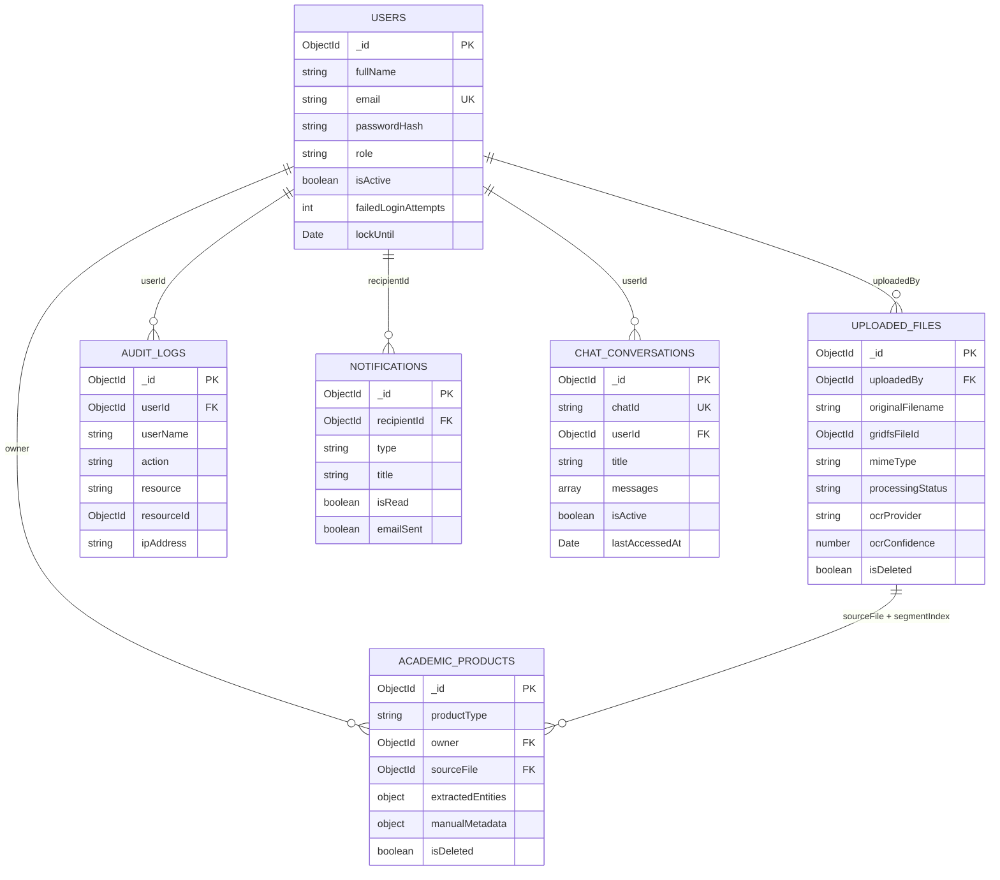

# SIPAc — Modelo de Datos

## Diseño de Colecciones MongoDB con Mongoose ODM

---

## Control de Versiones

| Versión | Fecha      | Autor                     | Descripción del cambio                                                                                                                                                                                                                                                 |
| ------- | ---------- | ------------------------- | ---------------------------------------------------------------------------------------------------------------------------------------------------------------------------------------------------------------------------------------------------------------------- |
| 1.0     | 2026-02-09 | Carlos A. Canabal Cordero | Borrador inicial — esquemas pseudocódigo con stack Python (spaCy, Tesseract)                                                                                                                                                                                           |
| 1.1     | 2026-02-27 | Carlos A. Canabal Cordero | Reescritura completa — esquemas TypeScript con Mongoose ODM, validaciones, índices compuestos, middlewares, colecciones de auditoría y notificaciones, alineación con stack unificado (Vercel AI SDK, Gemini, Zod)                                                     |
| 1.2     | 2026-03-04 | Carlos A. Canabal Cordero | Simplificación a 2 roles (`admin`, `docente`), almacenamiento en MongoDB GridFS (eliminar `storagePath`), eliminación de campos de verificación en `academic_products`, nueva colección `chat_conversations`, actualización de enums en `audit_logs` y `notifications` |
| 1.3     | 2026-03-06 | Carlos A. Canabal Cordero | Alineación a los cambios de la arquitectura: `gridfsFileId` en `uploaded_files`, eliminación del flujo obsoleto de verificación/rechazo y su notificación asociada, implementación del hook pre-save de hash de contraseña                                             |
| 1.4     | 2026-03-11 | Carlos A. Canabal Cordero | Alineación al pipeline implementado M2/M8: `productType` obligatorio en `uploaded_files`, índice único por `sourceFile` en `academic_products` y persistencia de notificaciones con referencia opcional al producto o archivo                                          |
| 1.5     | 2026-03-14 | Carlos A. Canabal Cordero | Alineación al estado real del modelo: `productType` opcional en `uploaded_files`, discriminadores extendidos a 10 tipos en `academic_products`, evidencia por entidad (`anchors`) y trazabilidad de intentos NER (`nerAttemptTrace`)                                   |
| 1.6     | 2026-03-20 | Carlos A. Canabal Cordero | Compendios multi-obra: `segmentIndex`, `segmentLabel`, `segmentBounds` en `academic_products`; índice único parcial `ux_source_file_segment` `{ sourceFile, segmentIndex }`; `nerForceSingleDocument` y `sourceWorkCount` en `uploaded_files`                          |
| 1.7     | 2026-03-23 | Carlos A. Canabal Cordero | Alineación a consultas operativas vigentes: repositorio global sobre productos `confirmed`, agregados de dashboard excluyendo borradores y nota de `unreadCount` derivado en notificaciones                                                                            |
| 1.8     | 2026-03-23 | Carlos A. Canabal Cordero | Alineación al estado implementado de M9: colección `chat_conversations` operativa, índices de actividad/TTL y persistencia de mensajes tipados del chat grounded                                                                                                                  |

---

## 1. Principios de Diseño

| Principio                   | Descripción                                                                                                                                                                                                  |
| --------------------------- | ------------------------------------------------------------------------------------------------------------------------------------------------------------------------------------------------------------ |
| **Discriminator pattern**   | Una sola colección `academic_products` con un campo `productType` y sub-esquemas Mongoose por tipo; evita múltiples colecciones con estructura duplicada                                                     |
| **Embedding inteligente**   | Datos que se leen siempre junto a su padre y no crecen de forma ilimitada se embeben (e.g., entidades extraídas). Entidades compartidas o con ciclo de vida propio se referencian (e.g., usuarios, archivos) |
| **Soft delete**             | Los productos académicos y archivos no se borran físicamente; se marcan con `isDeleted: true` y `deletedAt` para preservar trazabilidad                                                                      |
| **Auditoría transversal**   | Toda colección principal incluye `createdAt` y `updatedAt` vía `timestamps: true`. Las operaciones críticas se registran en `audit_logs`                                                                     |
| **Validación en dos capas** | Mongoose valida en la capa ODM (esquema, required, enum, minlength). Las API Routes validan adicionalmente con Zod antes de llegar al ODM                                                                    |
| **Tipado end-to-end**       | Cada esquema Mongoose tiene una interfaz TypeScript correspondiente (`IUser`, `IUploadedFile`, etc.) que se comparte entre servidor y cliente mediante exports comunes                                       |

---

## 2. Decisiones de Modelado

### 2.1 Embedding vs. Referencing

| Dato                                       | Estrategia                       | Justificación                                                                                                                                                                       |
| ------------------------------------------ | -------------------------------- | ----------------------------------------------------------------------------------------------------------------------------------------------------------------------------------- |
| `extractedEntities` en `academic_products` | **Embed**                        | Son propiedad exclusiva del producto, se leen siempre junto a él, no se consultan independientemente y tienen tamaño acotado (~1 KB)                                                |
| `manualMetadata` en `academic_products`    | **Embed**                        | Mismo ciclo de vida que el producto; son la versión corregida por el usuario de las entidades extraídas                                                                             |
| `owner` en `academic_products`             | **Reference** → `users`          | Los usuarios existen independientemente y se actualizan sin afectar los productos                                                                                                   |
| `sourceFile` en `academic_products`        | **Reference** → `uploaded_files` | El archivo tiene su propio ciclo de vida y metadatos de procesamiento; **varios** productos activos pueden compartir el mismo archivo diferenciados por `segmentIndex` (compendios) |
| `uploadedBy` en `uploaded_files`           | **Reference** → `users`          | Un usuario puede tener muchos archivos; el dato del usuario cambia independientemente                                                                                               |
| `userId` en `audit_logs`                   | **Reference** → `users`          | Los logs deben sobrevivir incluso si el usuario se desactiva                                                                                                                        |

### 2.2 Normalización y Desnormalización

| Caso                                           | Decisión                                        | Justificación                                                                                                          |
| ---------------------------------------------- | ----------------------------------------------- | ---------------------------------------------------------------------------------------------------------------------- |
| Nombre del usuario en `audit_logs`             | **Desnormalizar** (`userName` copia del nombre) | Los logs son inmutables; si el usuario cambia su nombre, el log histórico debe reflejar el valor al momento del evento |
| Tipo de producto en `academic_products`        | **Normalizado** vía `productType` discriminador | Un enum es suficiente; no se necesita una colección separada de "tipos"                                                |
| Indexación de artículos (`indexing: [String]`) | **Normalizado como array embebido**             | Son valores simples de catálogo (Scopus, WoS, SciELO); no requieren colección propia ni crecimiento ilimitado          |
| Texto crudo OCR en `uploaded_files`            | **Embed** (`rawExtractedText`)                  | Se lee junto al archivo en el flujo de revisión; no se consulta de forma independiente; tamaño típico < 100 KB         |

---

## 3. Colecciones

### 3.1 `users` — Usuarios del sistema

#### Interfaz TypeScript

```typescript
import { Document, Types } from 'mongoose'

export interface IUser extends Document {
  _id: Types.ObjectId
  fullName: string
  email: string
  passwordHash: string
  role: 'admin' | 'docente'
  isActive: boolean
  program?: string

  // Seguridad de login (RF-012)
  failedLoginAttempts: number
  lockUntil?: Date

  // Recuperación de contraseña (RF-013)
  passwordResetToken?: string
  passwordResetExpires?: Date

  createdAt: Date
  updatedAt: Date
}
```

#### Esquema Mongoose

```typescript
import { Schema, model } from 'mongoose'
import type { IUser } from './types'

const userSchema = new Schema<IUser>(
  {
    fullName: {
      type: String,
      required: [true, 'El nombre completo es obligatorio'],
      trim: true,
      minlength: [3, 'El nombre debe tener al menos 3 caracteres'],
      maxlength: [120, 'El nombre no puede superar los 120 caracteres'],
    },
    email: {
      type: String,
      required: [true, 'El correo electrónico es obligatorio'],
      unique: true,
      lowercase: true,
      trim: true,
      match: [/^\S+@\S+\.\S+$/, 'Formato de correo electrónico inválido'],
    },
    passwordHash: {
      type: String,
      required: true,
      select: false, // Nunca se retorna por defecto en consultas
    },
    role: {
      type: String,
      enum: {
        values: ['admin', 'docente'],
        message: 'El rol {VALUE} no es válido',
      },
      default: 'docente',
    },
    isActive: {
      type: Boolean,
      default: true,
    },
    program: {
      type: String,
      trim: true,
    },

    // Seguridad de login
    failedLoginAttempts: {
      type: Number,
      default: 0,
    },
    lockUntil: {
      type: Date,
      default: null,
    },

    // Recuperación de contraseña
    passwordResetToken: {
      type: String,
      select: false,
    },
    passwordResetExpires: {
      type: Date,
      select: false,
    },
  },
  {
    timestamps: true,
    toJSON: {
      transform(_doc, ret) {
        delete ret.passwordHash
        delete ret.__v
        delete ret.failedLoginAttempts
        delete ret.lockUntil
        delete ret.passwordResetToken
        delete ret.passwordResetExpires
        return ret
      },
    },
  },
)
```

#### Índices

```typescript
userSchema.index({ email: 1 }, { unique: true })
userSchema.index({ role: 1, isActive: 1 }, { name: 'idx_role_active' })
userSchema.index(
  { passwordResetToken: 1 },
  {
    sparse: true,
    name: 'idx_password_reset',
  },
)
```

| Índice                      | Tipo      | Soporta (RF)                                               |
| --------------------------- | --------- | ---------------------------------------------------------- |
| `{ email: 1 }`              | Único     | RF-003: unicidad de correo; RF-004: login por correo       |
| `{ role: 1, isActive: 1 }`  | Compuesto | RF-005: consultas por rol en dashboard, excluir inactivos  |
| `{ passwordResetToken: 1 }` | Sparse    | RF-013: búsqueda rápida del token temporal de recuperación |

---

### 3.2 `uploaded_files` — Archivos cargados al sistema

#### Interfaz TypeScript

```typescript
export interface NerAttemptTraceEntry {
  scope: 'extraction_first_pass' | 'extraction_second_pass'
  attempt: number
  provider: 'cerebras' | 'gemini' | 'groq'
  modelId: string
  status: 'succeeded' | 'failed'
  durationMs: number
  errorType?: string
  errorMessage?: string
}

export interface IUploadedFile extends Document {
  _id: Types.ObjectId
  uploadedBy: Types.ObjectId // ref: User
  originalFilename: string
  gridfsFileId: Types.ObjectId
  productType?:
    | 'article'
    | 'conference_paper'
    | 'thesis'
    | 'certificate'
    | 'research_project'
    | 'book'
    | 'book_chapter'
    | 'technical_report'
    | 'software'
    | 'patent'
  mimeType: 'application/pdf' | 'image/jpeg' | 'image/png'
  fileSizeBytes: number
  processingStatus: 'pending' | 'processing' | 'completed' | 'error'
  processingError?: string
  rawExtractedText?: string
  ocrProvider?: 'pdfjs_native' | 'gemini_vision' | 'mistral_ocr_3'
  ocrModel?: string
  ocrConfidence?: number
  nerProvider?: 'cerebras' | 'gemini' | 'groq'
  nerModel?: string
  nerAttemptTrace?: NerAttemptTraceEntry[]
  documentClassification?: 'academic' | 'non_academic' | 'uncertain'
  classificationConfidence?: number
  classificationRationale?: string
  processingAttempt?: number
  processingStartedAt?: Date
  ocrCompletedAt?: Date
  nerStartedAt?: Date
  processingCompletedAt?: Date
  nerForceSingleDocument?: boolean
  sourceWorkCount?: number | null
  isDeleted: boolean
  deletedAt?: Date
  createdAt: Date
  updatedAt: Date
}
```

#### Esquema Mongoose

```typescript
const uploadedFileSchema = new Schema<IUploadedFile>(
  {
    uploadedBy: {
      type: Schema.Types.ObjectId,
      ref: 'User',
      required: [true, 'El archivo debe estar asociado a un usuario'],
      index: true,
    },
    originalFilename: {
      type: String,
      required: true,
      trim: true,
      maxlength: 255,
    },
    gridfsFileId: {
      type: Schema.Types.ObjectId,
      required: [true, 'El archivo debe tener una referencia GridFS'],
    },
    productType: {
      type: String,
      default: null,
      enum: {
        values: [
          'article',
          'conference_paper',
          'thesis',
          'certificate',
          'research_project',
          'book',
          'book_chapter',
          'technical_report',
          'software',
          'patent',
        ],
        message: 'El tipo de producto {VALUE} no es válido',
      },
    },
    nerForceSingleDocument: { type: Boolean, default: false },
    sourceWorkCount: { type: Number, min: 0, default: null },
    mimeType: {
      type: String,
      required: true,
      enum: {
        values: ['application/pdf', 'image/jpeg', 'image/png'],
        message: 'Tipo MIME {VALUE} no permitido',
      },
    },
    fileSizeBytes: {
      type: Number,
      required: true,
      max: [20_971_520, 'El archivo no puede superar los 20 MB'], // 20 MB (RF-023)
    },
    processingStatus: {
      type: String,
      enum: ['pending', 'processing', 'completed', 'error'],
      default: 'pending',
    },
    processingError: {
      type: String,
      default: null,
    },
    rawExtractedText: {
      type: String,
      default: null,
    },
    ocrProvider: {
      type: String,
      enum: ['pdfjs_native', 'gemini_vision', 'mistral_ocr_3'],
      default: null,
    },
    ocrModel: {
      type: String,
      trim: true,
      maxlength: 120,
      default: null,
    },
    ocrConfidence: {
      type: Number,
      min: 0,
      max: 1,
      default: null,
    },
    nerProvider: {
      type: String,
      enum: ['cerebras', 'gemini', 'groq'],
      default: null,
    },
    nerModel: {
      type: String,
      trim: true,
      maxlength: 120,
      default: null,
    },
    nerAttemptTrace: {
      type: [
        {
          _id: false,
          scope: {
            type: String,
            enum: ['extraction_first_pass', 'extraction_second_pass'],
            required: true,
          },
          attempt: { type: Number, min: 1, required: true },
          provider: { type: String, enum: ['cerebras', 'gemini', 'groq'], required: true },
          modelId: { type: String, trim: true, maxlength: 120, required: true },
          status: { type: String, enum: ['succeeded', 'failed'], required: true },
          durationMs: { type: Number, min: 0, required: true },
          errorType: { type: String, trim: true, maxlength: 80, default: null },
          errorMessage: { type: String, trim: true, maxlength: 280, default: null },
        },
      ],
      default: [],
    },
    documentClassification: {
      type: String,
      enum: ['academic', 'non_academic', 'uncertain'],
      default: 'uncertain',
    },
    classificationConfidence: {
      type: Number,
      min: 0,
      max: 1,
      default: null,
    },
    classificationRationale: {
      type: String,
      trim: true,
      maxlength: 240,
      default: null,
    },
    processingAttempt: {
      type: Number,
      min: 0,
      default: 0,
    },
    processingStartedAt: {
      type: Date,
      default: null,
    },
    ocrCompletedAt: {
      type: Date,
      default: null,
    },
    nerStartedAt: {
      type: Date,
      default: null,
    },
    processingCompletedAt: {
      type: Date,
      default: null,
    },
    isDeleted: {
      type: Boolean,
      default: false,
    },
    deletedAt: {
      type: Date,
      default: null,
    },
  },
  { timestamps: true },
)
```

#### Índices

```typescript
uploadedFileSchema.index({ uploadedBy: 1, isDeleted: 1, createdAt: -1 }, { name: 'idx_user_files' })
uploadedFileSchema.index(
  { processingStatus: 1 },
  {
    partialFilterExpression: { processingStatus: { $in: ['pending', 'processing'] } },
    name: 'idx_processing_queue',
  },
)
```

| Índice                                           | Tipo      | Soporta (RF)                                                                      |
| ------------------------------------------------ | --------- | --------------------------------------------------------------------------------- |
| `{ uploadedBy: 1, isDeleted: 1, createdAt: -1 }` | Compuesto | RF-024, RF-029: listar archivos propios, excluyendo borrados, ordenados por fecha |
| `{ processingStatus: 1 }`                        | Parcial   | RF-028: obtener archivos pendientes o en procesamiento para la cola               |

---

### 3.3 `academic_products` — Producción académica (colección con discriminadores)

#### 3.3.1 Interfaz TypeScript — Esquema base

```typescript
export interface DocumentAnchor {
  page: number
  x: number
  y: number
  width: number
  height: number
  confidence: number
  sourceText?: string
  provider: 'pdfjs_native' | 'gemini_vision' | 'mistral_ocr_3'
}

export interface ExtractedEntityWithEvidence<T> {
  value: T
  confidence: number
  anchors: DocumentAnchor[]
}

export interface IExtractedEntities {
  authors: ExtractedEntityWithEvidence<string>[]
  title?: ExtractedEntityWithEvidence<string>
  institution?: ExtractedEntityWithEvidence<string>
  date?: ExtractedEntityWithEvidence<Date>
  keywords: ExtractedEntityWithEvidence<string>[]
  doi?: ExtractedEntityWithEvidence<string>
  eventOrJournal?: ExtractedEntityWithEvidence<string>
  extractionSource: 'pdfjs_native' | 'gemini_vision' | 'mistral_ocr_3'
  extractionConfidence: number // 0–1 (RF-047)
  extractedAt: Date // timestamp de la extracción
}

export interface IManualMetadata {
  title?: string
  authors: string[]
  institution?: string
  date?: Date
  doi?: string
  keywords: string[]
  notes?: string
}

export interface IAcademicProduct extends Document {
  _id: Types.ObjectId
  productType:
    | 'article'
    | 'conference_paper'
    | 'thesis'
    | 'certificate'
    | 'research_project'
    | 'book'
    | 'book_chapter'
    | 'technical_report'
    | 'software'
    | 'patent'
  owner: Types.ObjectId // ref: User
  sourceFile: Types.ObjectId // ref: UploadedFile
  segmentIndex: number
  segmentLabel?: string | null
  segmentBounds?: {
    pageFrom?: number | null
    pageTo?: number | null
    textStart?: number | null
    textEnd?: number | null
  } | null
  reviewStatus: 'draft' | 'confirmed'
  reviewConfirmedAt?: Date

  extractedEntities: IExtractedEntities
  manualMetadata: IManualMetadata

  isDeleted: boolean
  deletedAt?: Date

  createdAt: Date
  updatedAt: Date
}
```

#### 3.3.2 Esquema Mongoose — Base

```typescript
const documentAnchorSchema = new Schema(
  {
    page: { type: Number, required: true },
    x: { type: Number, required: true },
    y: { type: Number, required: true },
    width: { type: Number, required: true },
    height: { type: Number, required: true },
    confidence: { type: Number, required: true },
    sourceText: { type: String },
    provider: {
      type: String,
      enum: ['pdfjs_native', 'gemini_vision', 'mistral_ocr_3'],
      required: true,
    },
  },
  { _id: false },
)

const stringEvidenceSchema = new Schema(
  {
    value: { type: String, trim: true },
    confidence: { type: Number, default: 0 },
    anchors: { type: [documentAnchorSchema], default: [] },
  },
  { _id: false },
)

const dateEvidenceSchema = new Schema(
  {
    value: { type: Date },
    confidence: { type: Number, default: 0 },
    anchors: { type: [documentAnchorSchema], default: [] },
  },
  { _id: false },
)

const extractedEntitiesSchema = new Schema<IExtractedEntities>(
  {
    authors: { type: [stringEvidenceSchema], default: [] },
    title: { type: stringEvidenceSchema },
    institution: { type: stringEvidenceSchema },
    date: { type: dateEvidenceSchema },
    keywords: { type: [stringEvidenceSchema], default: [] },
    doi: { type: stringEvidenceSchema },
    eventOrJournal: { type: stringEvidenceSchema },
    extractionSource: {
      type: String,
      required: true,
      enum: ['pdfjs_native', 'gemini_vision', 'mistral_ocr_3'],
    },
    extractionConfidence: {
      type: Number,
      required: true,
      min: 0,
      max: 1,
    },
    extractedAt: {
      type: Date,
      default: Date.now,
    },
  },
  { _id: false },
)

const manualMetadataSchema = new Schema<IManualMetadata>(
  {
    title: { type: String, trim: true },
    authors: { type: [String], default: [] },
    institution: { type: String, trim: true },
    date: { type: Date },
    doi: { type: String, trim: true },
    keywords: { type: [String], default: [] },
    notes: { type: String, maxlength: 2000 },
  },
  { _id: false },
)

const academicProductSchema = new Schema<IAcademicProduct>(
  {
    productType: {
      type: String,
      required: true,
      enum: [
        'article',
        'conference_paper',
        'thesis',
        'certificate',
        'research_project',
        'book',
        'book_chapter',
        'technical_report',
        'software',
        'patent',
      ],
    },
    owner: {
      type: Schema.Types.ObjectId,
      ref: 'User',
      required: [true, 'El producto debe estar asociado a un usuario'],
    },
    sourceFile: {
      type: Schema.Types.ObjectId,
      ref: 'UploadedFile',
      required: [true, 'El producto debe tener un archivo fuente'],
    },
    segmentIndex: { type: Number, required: true, min: 0, default: 0 },
    segmentLabel: { type: String, trim: true, maxlength: 500, default: null },
    segmentBounds: {
      type: {
        pageFrom: { type: Number, min: 1, default: null },
        pageTo: { type: Number, min: 1, default: null },
        textStart: { type: Number, min: 0, default: null },
        textEnd: { type: Number, min: 0, default: null },
      },
      _id: false,
      default: null,
    },
    reviewStatus: {
      type: String,
      enum: ['draft', 'confirmed'],
      default: 'draft',
      required: true,
    },
    reviewConfirmedAt: {
      type: Date,
      default: null,
    },

    extractedEntities: {
      type: extractedEntitiesSchema,
      required: true,
    },
    manualMetadata: {
      type: manualMetadataSchema,
      default: () => ({ authors: [], keywords: [] }),
    },

    isDeleted: { type: Boolean, default: false },
    deletedAt: { type: Date, default: null },
  },
  {
    timestamps: true,
    discriminatorKey: 'productType',
    toJSON: {
      transform(_doc, ret) {
        delete ret.__v
        return ret
      },
    },
  },
)
```

#### 3.3.3 Discriminadores — Sub-esquemas por tipo

##### `article` — Artículo científico

```typescript
export interface IArticle extends IAcademicProduct {
  journalName?: string
  volume?: string
  issue?: string
  pages?: string
  issn?: string
  indexing: string[]
  openAccess: boolean
}

const articleSchema = new Schema<IArticle>({
  journalName: { type: String, trim: true },
  volume: { type: String, trim: true },
  issue: { type: String, trim: true },
  pages: {
    type: String,
    trim: true,
    match: [/^\d+(-\d+)?$/, 'Formato de páginas inválido (e.g., "45-67")'],
  },
  issn: { type: String, trim: true },
  indexing: {
    type: [String],
    default: [],
    validate: {
      validator: (v: string[]) => v.length <= 10,
      message: 'Máximo 10 indexaciones por artículo',
    },
  },
  openAccess: { type: Boolean, default: false },
})

const Article = AcademicProduct.discriminator('article', articleSchema)
```

##### `conference_paper` — Ponencia en evento

```typescript
export interface IConferencePaper extends IAcademicProduct {
  eventName?: string
  eventCity?: string
  eventCountry?: string
  eventDate?: Date
  presentationType?: 'oral' | 'poster' | 'workshop' | 'keynote'
  isbn?: string
}

const conferencePaperSchema = new Schema<IConferencePaper>({
  eventName: { type: String, trim: true },
  eventCity: { type: String, trim: true },
  eventCountry: { type: String, trim: true },
  eventDate: { type: Date },
  presentationType: {
    type: String,
    enum: ['oral', 'poster', 'workshop', 'keynote'],
  },
  isbn: { type: String, trim: true },
})

const ConferencePaper = AcademicProduct.discriminator('conference_paper', conferencePaperSchema)
```

##### `thesis` — Trabajo de grado / Tesis

```typescript
export interface IThesis extends IAcademicProduct {
  thesisLevel?: 'maestria' | 'especializacion' | 'doctorado'
  director?: string
  university?: string
  faculty?: string
  approvalDate?: Date
  repositoryUrl?: string
}

const thesisSchema = new Schema<IThesis>({
  thesisLevel: {
    type: String,
    enum: ['maestria', 'especializacion', 'doctorado'],
  },
  director: { type: String, trim: true },
  university: { type: String, trim: true },
  faculty: { type: String, trim: true },
  approvalDate: { type: Date },
  repositoryUrl: {
    type: String,
    trim: true,
    match: [/^https?:\/\//, 'La URL del repositorio debe iniciar con http(s)://'],
  },
})

const Thesis = AcademicProduct.discriminator('thesis', thesisSchema)
```

##### `certificate` — Certificado / Constancia

```typescript
export interface ICertificate extends IAcademicProduct {
  issuingEntity?: string
  certificateType?: 'participacion' | 'ponente' | 'asistencia' | 'instructor' | 'otro'
  relatedEvent?: string
  issueDate?: Date
  expirationDate?: Date
  hours?: number
}

const certificateSchema = new Schema<ICertificate>({
  issuingEntity: { type: String, trim: true },
  certificateType: {
    type: String,
    enum: ['participacion', 'ponente', 'asistencia', 'instructor', 'otro'],
  },
  relatedEvent: { type: String, trim: true },
  issueDate: { type: Date },
  expirationDate: { type: Date, default: null },
  hours: { type: Number, min: 0 },
})

const Certificate = AcademicProduct.discriminator('certificate', certificateSchema)
```

##### `research_project` — Proyecto de investigación

```typescript
export interface IResearchProject extends IAcademicProduct {
  projectCode?: string
  fundingSource?: string
  startDate?: Date
  endDate?: Date
  projectStatus?: 'active' | 'completed' | 'suspended'
  coResearchers: string[]
}

const researchProjectSchema = new Schema<IResearchProject>({
  projectCode: { type: String, trim: true },
  fundingSource: { type: String, trim: true },
  startDate: { type: Date },
  endDate: { type: Date },
  projectStatus: {
    type: String,
    enum: ['active', 'completed', 'suspended'],
  },
  coResearchers: { type: [String], default: [] },
})

const ResearchProject = AcademicProduct.discriminator('research_project', researchProjectSchema)
```

#### 3.3.4 Índices de `academic_products`

```typescript
// Consultas principales del repositorio (M5A)
academicProductSchema.index(
  { owner: 1, productType: 1, isDeleted: 1, createdAt: -1 },
  { name: 'idx_owner_type' },
)

academicProductSchema.index(
  { owner: 1, reviewStatus: 1, isDeleted: 1, createdAt: -1 },
  { name: 'idx_owner_review_status' },
)

// Consultas temporales para dashboard (RF-065)
academicProductSchema.index(
  { 'manualMetadata.date': -1, productType: 1 },
  { name: 'idx_date_type' },
)

// Búsqueda de texto completo (RF-058)
academicProductSchema.index(
  {
    'manualMetadata.title': 'text',
    'manualMetadata.keywords': 'text',
    'manualMetadata.authors': 'text',
  },
  {
    name: 'idx_fulltext_search',
    default_language: 'spanish',
    weights: {
      'manualMetadata.title': 10,
      'manualMetadata.authors': 5,
      'manualMetadata.keywords': 3,
    },
  },
)

// Un archivo puede originar varios productos activos; unicidad por (sourceFile, segmentIndex)
academicProductSchema.index(
  { sourceFile: 1, segmentIndex: 1 },
  {
    unique: true,
    name: 'ux_source_file_segment',
    partialFilterExpression: { isDeleted: false },
  },
)
```

| Índice                                                            | Tipo                     | Soporta (RF)                                                                    |
| ----------------------------------------------------------------- | ------------------------ | ------------------------------------------------------------------------------- |
| `{ owner, productType, isDeleted, createdAt }`                    | Compuesto                | RF-052/054: listar productos por tipo y usuario                                 |
| `{ owner, reviewStatus, isDeleted, createdAt }`                   | Compuesto                | Flujo de borrador/revisión: consulta rápida de borradores por usuario           |
| `{ manualMetadata.date, productType }`                            | Compuesto                | RF-065/066: distribución temporal y filtro por rango                            |
| Text index con pesos                                              | Texto completo (español) | RF-058: búsqueda full-text priorizada por título > autores > keywords           |
| `{ sourceFile: 1, segmentIndex: 1 }` (parcial `isDeleted: false`) | Único parcial            | Compendios: un segmento activo por índice; permite varios productos por archivo |

> **Migración:** índice anterior `ux_source_file` sustituido por `ux_source_file_segment`. Script: `scripts/migrate-academic-product-segments.mjs`.

---

### 3.4 `audit_logs` — Log de auditoría (M7)

Colección de **solo inserción** (append-only). Los documentos nunca se actualizan ni eliminan.

#### Interfaz TypeScript

```typescript
export interface IAuditLog extends Document {
  _id: Types.ObjectId
  userId: Types.ObjectId // ref: User — quien ejecutó la acción
  userName: string // desnormalizado: nombre al momento del evento
  action: 'create' | 'update' | 'delete' | 'login' | 'login_failed'
  resource: 'academic_product' | 'uploaded_file' | 'user' | 'session'
  resourceId?: Types.ObjectId // _id del recurso afectado
  details?: string // descripción breve del cambio
  ipAddress: string
  userAgent?: string
  createdAt: Date
}
```

#### Esquema Mongoose

```typescript
const auditLogSchema = new Schema<IAuditLog>(
  {
    userId: {
      type: Schema.Types.ObjectId,
      ref: 'User',
      required: true,
      index: true,
    },
    userName: {
      type: String,
      required: true,
    },
    action: {
      type: String,
      required: true,
      enum: ['create', 'update', 'delete', 'login', 'login_failed'],
    },
    resource: {
      type: String,
      required: true,
      enum: ['academic_product', 'uploaded_file', 'user', 'session'],
    },
    resourceId: {
      type: Schema.Types.ObjectId,
      default: null,
    },
    details: {
      type: String,
      maxlength: 500,
    },
    ipAddress: {
      type: String,
      required: true,
    },
    userAgent: {
      type: String,
    },
  },
  {
    timestamps: { createdAt: true, updatedAt: false }, // Solo createdAt
  },
)
```

#### Índices

```typescript
auditLogSchema.index({ resource: 1, action: 1, createdAt: -1 }, { name: 'idx_resource_action' })
auditLogSchema.index({ userId: 1, createdAt: -1 }, { name: 'idx_user_timeline' })
```

| Índice                            | Tipo      | Soporta (RF)                                             |
| --------------------------------- | --------- | -------------------------------------------------------- |
| `{ resource, action, createdAt }` | Compuesto | RF-081: admin consulta logs por tipo de recurso y acción |
| `{ userId, createdAt }`           | Compuesto | RF-080: timeline de acciones de un usuario específico    |

> **Nota:** Los audit logs son inmutables. El esquema no define `updatedAt` y no debe implementar operaciones `update` ni `delete`. Solo el rol `admin` puede ejecutar queries de lectura sobre esta colección (RF-081).

---

### 3.5 `notifications` — Notificaciones (M8)

#### Interfaz TypeScript

```typescript
export interface INotification extends Document {
  _id: Types.ObjectId
  recipientId: Types.ObjectId // ref: User
  type: 'processing_complete' | 'processing_error' | 'system'
  title: string
  message: string
  relatedResource?: {
    kind: 'uploaded_file' | 'academic_product'
    id: Types.ObjectId
  }
  isRead: boolean
  emailSent: boolean
  createdAt: Date
}
```

#### Esquema Mongoose

```typescript
const notificationSchema = new Schema<INotification>(
  {
    recipientId: {
      type: Schema.Types.ObjectId,
      ref: 'User',
      required: true,
    },
    type: {
      type: String,
      required: true,
      enum: ['processing_complete', 'processing_error', 'system'],
    },
    title: {
      type: String,
      required: true,
      maxlength: 200,
    },
    message: {
      type: String,
      required: true,
      maxlength: 1000,
    },
    relatedResource: {
      kind: {
        type: String,
        enum: ['uploaded_file', 'academic_product'],
      },
      id: {
        type: Schema.Types.ObjectId,
      },
    },
    isRead: {
      type: Boolean,
      default: false,
    },
    emailSent: {
      type: Boolean,
      default: false,
    },
  },
  {
    timestamps: { createdAt: true, updatedAt: false },
  },
)
```

#### Índices

```typescript
notificationSchema.index(
  { recipientId: 1, isRead: 1, createdAt: -1 },
  { name: 'idx_user_notifications' },
)
notificationSchema.index(
  { createdAt: 1 },
  {
    expireAfterSeconds: 7_776_000, // TTL: 90 días
    name: 'idx_ttl_cleanup',
  },
)
```

| Índice                               | Tipo      | Soporta (RF)                                                                     |
| ------------------------------------ | --------- | -------------------------------------------------------------------------------- |
| `{ recipientId, isRead, createdAt }` | Compuesto | RF-086: listar notificaciones no leídas del usuario, ordenadas por fecha         |
| `{ createdAt }` TTL 90 días          | TTL       | Limpieza automática: notificaciones antiguas se eliminan sin intervención manual |

> **Nota operativa:** El endpoint `GET /api/notifications` calcula `unreadCount` con `countDocuments()` en tiempo de consulta. Ese valor no se persiste dentro del documento `notifications`.

---

### 3.6 `chat_conversations` — Historial de conversaciones del chat (M9)

#### Interfaz TypeScript

```typescript
export interface IChatConversation {
  _id: Types.ObjectId
  chatId: string
  userId: Types.ObjectId
  title: string
  messages: ChatUiMessage[]
  isActive: boolean
  lastAccessedAt: Date
  createdAt: Date
  updatedAt: Date
}
```

#### Esquema Mongoose

```typescript
const chatConversationSchema = new Schema<IChatConversation>(
  {
    chatId: {
      type: String,
      required: true,
      unique: true,
      trim: true,
      maxlength: 120,
    },
    userId: {
      type: Schema.Types.ObjectId,
      ref: 'User',
      required: true,
      index: true,
    },
    title: {
      type: String,
      required: true,
      trim: true,
      maxlength: 120,
    },
    messages: {
      type: [Schema.Types.Mixed],
      default: [],
    },
    isActive: {
      type: Boolean,
      default: true,
    },
    lastAccessedAt: {
      type: Date,
      default: Date.now,
    },
  },
  {
    timestamps: true,
  },
)
```

#### Índices

```typescript
chatConversationSchema.index({ userId: 1, updatedAt: -1 }, { name: 'idx_user_updated' })
chatConversationSchema.index(
  { lastAccessedAt: 1 },
  {
    expireAfterSeconds: 15_552_000,
    partialFilterExpression: { isActive: true },
    name: 'idx_chat_ttl',
  },
)
```

| Índice                            | Tipo                  | Soporta (RF)                                                                  |
| --------------------------------- | --------------------- | ----------------------------------------------------------------------------- |
| `{ chatId: 1 }`                   | Único                 | Recuperación estable de la conversación por id lógico compartido con la UI    |
| `{ userId: 1, updatedAt: -1 }`    | Compuesto             | RF-100: listado de conversaciones del usuario ordenadas por actividad          |
| `{ lastAccessedAt: 1 }` + parcial | TTL (180 días aprox.) | Limpieza automática de conversaciones activas inactivas sin intervención manual |

> **Nota operativa:** `messages` persiste mensajes UI del chat, incluyendo metadata del modelo seleccionado, tool outputs grounded y trazabilidad de estrategia de recuperación. Antes de guardar y antes de procesar, el servicio sanea mensajes vacíos o inválidos para evitar historiales corruptos.

---

## 4. Diagrama de Relaciones (ER)



---

## 5. Middlewares y Hooks de Mongoose

### 5.1 Hash de contraseña (pre-save)

```typescript
import bcrypt from 'bcrypt'

userSchema.pre('save', async function (this: IUserDocument) {
  if (!this.isModified('passwordHash')) return
  this.passwordHash = await bcrypt.hash(this.passwordHash, 10)
})
```

### 5.2 Soft delete — excluir borrados automáticamente (pre-find)

```typescript
// Aplicar a todas las operaciones find* del modelo
function excludeDeleted(this: any, next: () => void) {
  if (this.getFilter().isDeleted === undefined) {
    this.where({ isDeleted: { $ne: true } })
  }
  next()
}

academicProductSchema.pre(/^find/, excludeDeleted)
uploadedFileSchema.pre(/^find/, excludeDeleted)
```

### 5.3 Soft delete — método de instancia

```typescript
academicProductSchema.methods.softDelete = async function () {
  this.isDeleted = true
  this.deletedAt = new Date()
  await this.save()
}
```

### 5.4 Método de cuenta bloqueada (users)

```typescript
userSchema.methods.isLocked = function (): boolean {
  return !!(this.lockUntil && this.lockUntil > new Date())
}

userSchema.methods.incrementLoginAttempts = async function () {
  // Si el bloqueo expiró, reiniciar contador
  if (this.lockUntil && this.lockUntil < new Date()) {
    this.failedLoginAttempts = 1
    this.lockUntil = undefined
    return this.save()
  }

  this.failedLoginAttempts += 1

  // Bloquear tras 5 intentos fallidos (RF-012: 15 minutos)
  if (this.failedLoginAttempts >= 5) {
    this.lockUntil = new Date(Date.now() + 15 * 60 * 1000)
  }

  return this.save()
}

userSchema.methods.resetLoginAttempts = async function () {
  this.failedLoginAttempts = 0
  this.lockUntil = undefined
  return this.save()
}
```

---

## 6. Patrones de Consulta Principales

### 6.1 Repositorio — Listar productos confirmados con paginación (RF-052 a RF-061)

```typescript
// El repositorio global visible para usuarios autenticados expone solo productos confirmados.
async function getRepositoryProducts(
  productType?: string,
  owner?: string,
  page: number = 1,
  limit: number = 20,
) {
  const filter: Record<string, unknown> = {
    isDeleted: { $ne: true },
    reviewStatus: 'confirmed',
  }
  if (productType) filter.productType = productType
  if (owner) filter.owner = owner
  const skip = (page - 1) * limit

  return AcademicProduct.find(filter)
    .sort({ 'manualMetadata.date': -1, createdAt: -1 })
    .skip(skip)
    .limit(limit)
    .populate('sourceFile', 'originalFilename mimeType processingStatus')
    .lean()
}
```

### 6.2 Búsqueda de texto completo (RF-058)

```typescript
async function searchProducts(query: string, userId?: string) {
  const filter: Record<string, unknown> = {
    $text: { $search: query },
    isDeleted: { $ne: true },
    reviewStatus: 'confirmed',
  }
  if (userId) filter.owner = userId

  return AcademicProduct.find(filter, { score: { $meta: 'textScore' } })
    .sort({ score: { $meta: 'textScore' } })
    .limit(50)
    .lean()
}
```

### 6.3 Dashboard — Conteo por tipo de producto (RF-063)

```typescript
async function countByProductType() {
  return AcademicProduct.aggregate([
    { $match: { isDeleted: { $ne: true }, reviewStatus: 'confirmed' } },
    {
      $group: {
        _id: '$productType',
        count: { $sum: 1 },
      },
    },
    { $sort: { count: -1 } },
  ])
}
// Resultado: [{ _id: "article", count: 42 }, { _id: "thesis", count: 15 }, ...]
```

### 6.4 Dashboard — Distribución temporal por año (RF-065)

```typescript
async function productsByYear(dateFrom?: Date, dateTo?: Date) {
  const matchStage: Record<string, unknown> = {
    isDeleted: { $ne: true },
    reviewStatus: 'confirmed',
  }

  if (dateFrom || dateTo) {
    matchStage.$expr = {
      $and: [
        ...(dateFrom
          ? [
              {
                $gte: [
                  { $ifNull: ['$manualMetadata.date', '$extractedEntities.date.value'] },
                  dateFrom,
                ],
              },
            ]
          : []),
        ...(dateTo
          ? [
              {
                $lte: [
                  { $ifNull: ['$manualMetadata.date', '$extractedEntities.date.value'] },
                  dateTo,
                ],
              },
            ]
          : []),
      ],
    }
  }

  return AcademicProduct.aggregate([
    { $match: matchStage },
    {
      $addFields: {
        effectiveDate: { $ifNull: ['$manualMetadata.date', '$extractedEntities.date.value'] },
      },
    },
    { $match: { effectiveDate: { $type: 'date' } } },
    {
      $group: {
        _id: { $year: '$effectiveDate' },
        total: { $sum: 1 },
      },
    },
    { $sort: { _id: -1 } },
  ])
}
```

### 6.5 Dashboard — Productividad por usuario (RF-064)

```typescript
async function productivityByUser() {
  return AcademicProduct.aggregate([
    { $match: { isDeleted: { $ne: true }, reviewStatus: 'confirmed' } },
    {
      $group: {
        _id: '$owner',
        totalProducts: { $sum: 1 },
        types: { $addToSet: '$productType' },
      },
    },
    {
      $lookup: {
        from: 'users',
        localField: '_id',
        foreignField: '_id',
        as: 'user',
      },
    },
    { $unwind: '$user' },
    {
      $project: {
        fullName: '$user.fullName',
        email: '$user.email',
        totalProducts: 1,
        types: 1,
      },
    },
    { $sort: { totalProducts: -1 } },
  ])
}
```

---

## 7. Estrategia de Paginación

SIPAc implementa dos estrategias de paginación según el contexto:

| Estrategia                           | Cuándo usar                                                         | Justificación                                                                                                        |
| ------------------------------------ | ------------------------------------------------------------------- | -------------------------------------------------------------------------------------------------------------------- |
| **Cursor-based** (`_id` como cursor) | Listados de archivos y flujos internos de procesamiento             | Rendimiento constante independientemente de la profundidad de página; no sufre el problema de `skip(N)` con N grande |
| **Offset-based** (`skip/limit`)      | Repositorio implementado actualmente, dashboard y búsqueda de texto | Permite saltar a una página específica; coincide con los endpoints `page/limit` vigentes                             |

Ambas estrategias respetan RF-059: mínimo 10, máximo 50 registros por página.

```typescript
// Constantes de paginación
export const PAGINATION = {
  MIN_LIMIT: 10,
  DEFAULT_LIMIT: 20,
  MAX_LIMIT: 50,
} as const
```

---

## 8. Evolución de Esquemas y Mantenibilidad

### 8.1 Agregar nuevos tipos de producto

El discriminator pattern permite agregar nuevos tipos de producto sin modificar la colección base ni alterar documentos existentes:

```typescript
// Ejemplo futuro: agregar un tipo "book_chapter"
const bookChapterSchema = new Schema({
  bookTitle: { type: String, trim: true },
  editors: { type: [String], default: [] },
  publisher: { type: String, trim: true },
  chapter: { type: Number, min: 1 },
  isbn: { type: String, trim: true },
})

const BookChapter = AcademicProduct.discriminator('book_chapter', bookChapterSchema)
```

No se requiere migración: los documentos existentes no se ven afectados.

### 8.2 Versionado de esquema

Para cambios que alteren la estructura de documentos existentes, se usa un campo `schemaVersion` que permite migraciones graduales:

```typescript
// Ejemplo: si en el futuro se reestructurara extractedEntities
academicProductSchema.add({
  schemaVersion: { type: Number, default: 1 },
})

// Middleware de lectura que migra on-the-fly
academicProductSchema.post('init', function (doc) {
  if (doc.schemaVersion < 2) {
    // Transformar datos del formato v1 al v2
  }
})
```

### 8.3 Soft delete y preservación de datos

Los productos académicos y archivos nunca se eliminan físicamente de la base de datos. Esto garantiza:

- Trazabilidad completa para auditoría y acreditación CNA
- Reversibilidad ante errores del usuario
- Integridad referencial: los `audit_logs` y `notifications` que referencien el recurso siguen siendo válidos

Para consultar registros incluyendo los borrados (uso administrativo):

```typescript
// Forzar inclusión de borrados pasando isDeleted explícitamente
await AcademicProduct.find({ isDeleted: true })
```

---

## 9. Datos de Ejemplo

### 9.1 Usuario docente

```json
{
  "_id": "67bf3a1e2c8f4e001a234567",
  "fullName": "Martha Cecilia Pacheco Lora",
  "email": "mpacheco@correo.unicordoba.edu.co",
  "role": "docente",
  "isActive": true,
  "program": "Maestría en Innovación Educativa con Tecnología e IA",
  "failedLoginAttempts": 0,
  "lockUntil": null,
  "createdAt": "2026-02-09T08:00:00.000Z",
  "updatedAt": "2026-02-09T08:00:00.000Z"
}
```

### 9.2 Archivo cargado — PDF procesado con Gemini Vision

```json
{
  "_id": "67bf3b4a2c8f4e001a234568",
  "uploadedBy": "67bf3a1e2c8f4e001a234567",
  "originalFilename": "articulo-innovacion-IA-2025.pdf",
  "gridfsFileId": "67bf3b4a2c8f4e001a234570",
  "mimeType": "application/pdf",
  "fileSizeBytes": 2458624,
  "processingStatus": "completed",
  "ocrProvider": "gemini_vision",
  "ocrConfidence": 0.94,
  "rawExtractedText": "Innovación pedagógica mediada por IA en posgrados colombianos...",
  "isDeleted": false,
  "createdAt": "2026-02-15T10:30:00.000Z",
  "updatedAt": "2026-02-15T10:31:12.000Z"
}
```

### 9.3 Producto académico — Artículo con entidades extraídas

```json
{
  "_id": "67bf3c7e2c8f4e001a234569",
  "productType": "article",
  "owner": "67bf3a1e2c8f4e001a234567",
  "sourceFile": "67bf3b4a2c8f4e001a234568",
  "extractedEntities": {
    "authors": ["Martha C. Pacheco Lora", "Daniel J. Salas Álvarez"],
    "title": "Innovación pedagógica mediada por IA en posgrados colombianos",
    "institution": "Universidad de Córdoba",
    "date": "2025-06-15T00:00:00.000Z",
    "doi": "10.1234/ejemplo.2025.001",
    "keywords": ["inteligencia artificial", "educación superior", "innovación"],
    "eventOrJournal": "Revista Colombiana de Educación",
    "extractionSource": "gemini_vision",
    "extractionConfidence": 0.91,
    "extractedAt": "2026-02-15T10:31:12.000Z"
  },
  "manualMetadata": {
    "title": "Innovación pedagógica mediada por IA en posgrados colombianos",
    "authors": ["Martha Cecilia Pacheco Lora", "Daniel José Salas Álvarez"],
    "institution": "Universidad de Córdoba",
    "date": "2025-06-15T00:00:00.000Z",
    "doi": "10.1234/ejemplo.2025.001",
    "keywords": ["inteligencia artificial", "educación superior", "innovación pedagógica"]
  },
  "journalName": "Revista Colombiana de Educación",
  "indexing": ["SciELO", "Dialnet"],
  "openAccess": true,
  "isDeleted": false,
  "createdAt": "2026-02-15T10:31:15.000Z",
  "updatedAt": "2026-02-16T14:20:00.000Z"
}
```

### 9.4 Entrada de auditoría

```json
{
  "_id": "67bf3d002c8f4e001a23456a",
  "userId": "67bf3a1e2c8f4e001a234567",
  "userName": "Martha Cecilia Pacheco Lora",
  "action": "create",
  "resource": "academic_product",
  "resourceId": "67bf3c7e2c8f4e001a234569",
  "details": "Producto académico creado: article — Innovación pedagógica mediada por IA",
  "ipAddress": "190.25.144.12",
  "userAgent": "Mozilla/5.0 (Windows NT 10.0; Win64; x64)",
  "createdAt": "2026-02-15T10:31:15.000Z"
}
```

---

## 10. Resumen de Colecciones e Índices

| Colección            | Documentos esperados          | Índices                    | Patrón de acceso primario                                              |
| -------------------- | ----------------------------- | -------------------------- | ---------------------------------------------------------------------- |
| `users`              | Decenas (~50-100)             | 3                          | Login por email, listado por rol                                       |
| `uploaded_files`     | Centenas (~500-2000)          | 2                          | Listado por usuario, cola de procesamiento                             |
| `academic_products`  | Centenas (~500-2000)          | 3 (incluye texto completo) | Listado por owner+tipo, búsqueda full-text, aggregation para dashboard |
| `audit_logs`         | Miles (crecimiento ilimitado) | 2                          | Consulta por recurso/acción, timeline por usuario                      |
| `notifications`      | Centenas (TTL auto-limpia)    | 2 (incluye TTL)            | No leídas por usuario, limpieza automática a 90 días                   |
| `chat_conversations` | Decenas a centenas (TTL)      | 3 (incluye TTL parcial)    | Historial por usuario, recuperación por `chatId`, limpieza por inactividad |

---

## 11. Consideraciones de Escalabilidad

- **Discriminator pattern extensible:** Agregar nuevos tipos de productos (`book_chapter`, `patent`, `software`) requiere solo crear un nuevo discriminador, sin migración de datos.
- **Índice de texto completo en español:** Configurado con `default_language: 'spanish'` y pesos diferenciados, permite búsqueda semántica básica sin motores externos.
- **TTL en notificaciones:** La limpieza automática evita crecimiento descontrolado de la colección de notificaciones.
- **TTL en conversaciones del chat:** Implementado con índice parcial sobre `lastAccessedAt`; elimina conversaciones activas inactivas después de ~180 días para controlar crecimiento.
- **Paginación del repositorio:** En diseño se consideran estrategias de paginación para escalar consultas; en endpoints actualmente implementados predomina `page/limit`.
- **Soft delete + pre-find hooks:** Los documentos eliminados lógicamente no aparecen en consultas normales pero se preservan para auditoría y recuperación.
- **Lean queries en lecturas:** Todas las consultas de lectura usan `.lean()` para evitar la hidratación completa de Mongoose y reducir la huella de memoria.
