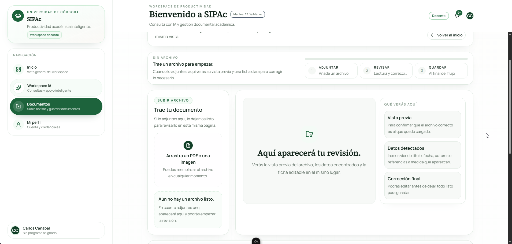
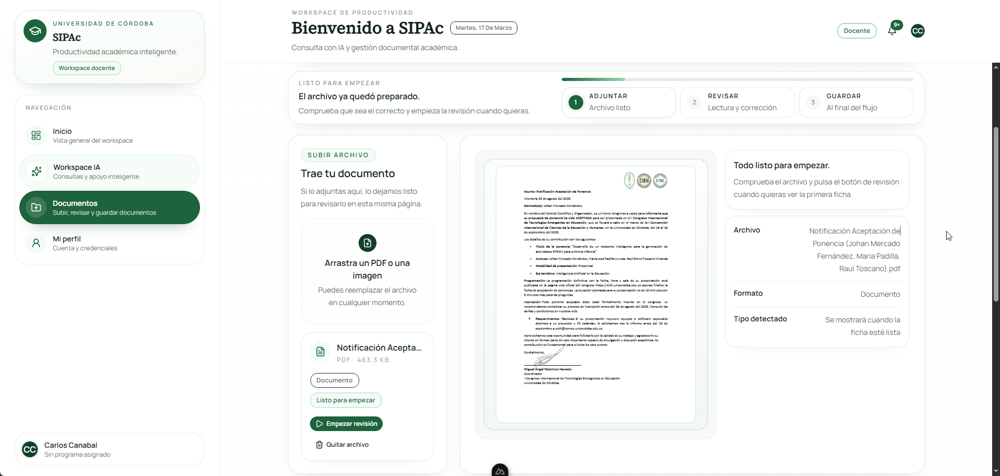
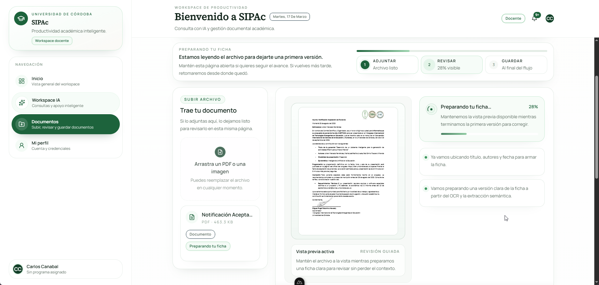
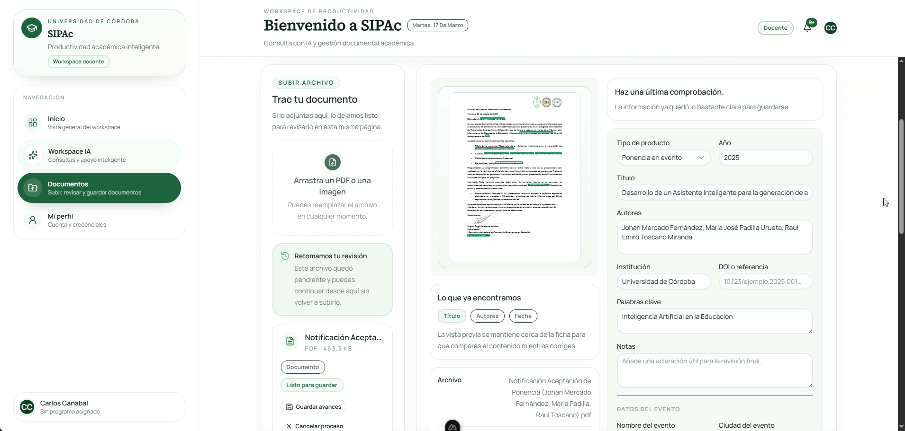
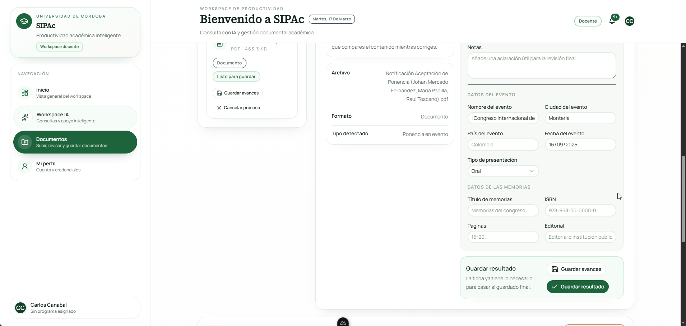

# Resumen de Avances del Proyecto SIPAc (2026-03-17)

Este documento presenta un informe detallado sobre las implementaciones y avances técnicos más recientes en el Sistema Inteligente de Productividad Académica (SIPAc). El desarrollo ha contemplado desde la arquitectura de carga segura hasta la extracción semántica refinada, sentando una base sólida y auditable para la gestión documental.

A continuación, se describen de manera pormenorizada los módulos trabajados:

## 1. Módulo M2: Carga de Documentos (Puerta de Entrada)

El Módulo 2 representa el punto de entrada al sistema, diseñado bajo principios de robustez y trazabilidad para asegurar que los módulos siguientes operen sobre datos confiables.

- **Validación Binaria y Restricciones:** El endpoint `POST /api/upload` recibe archivos vía formularios multipart, realizando una detección del "MIME type" real del archivo para asegurar que solo ingresen formatos permitidos (`PDF`, `JPG`, `PNG`) y no sobrepasen el tamaño máximo de 20 MB.
- **Estrategia de Almacenamiento:** Para evitar depender del sistema de archivos local (filesystem) y mantener consistencia, se estructuró la persistencia mediante **MongoDB GridFS** para los binarios y una colección `uploaded_files` para los metadatos iniciales de carga.
- **Procesamiento Asíncrono:** La ruta de carga responde rápidamente con un estatus `202 Accepted`, enviando al documento a procesarse de manera no bloqueante (`event.waitUntil`). Esto proporciona una UX (experiencia de usuario) fluida, liberando la interfaz mientras el sistema pesado ocurre en segundo plano.
- **Seguridad y Auditoría:** Los accesos de lectura, descarga o eliminación son validados por propiedad o por rol (`admin`). Además, se maneja la consistencia de datos: la eliminación de un archivo borra no solo su binario, sino que aplica una eliminación recursiva de los "productos académicos" ligados a aquel.

## 2. Módulo M3: OCR Textual y Pipeline Híbrido

Este componente transforma archivos y escaneos heterogéneos en texto limpio y útil, paso crítico para que la Inteligencia Artificial obtenga las entidades.

- **Extracción Nativa-First:** Para reducir latencia y abaratar costos, si el documento es un PDF con capa de texto, se emplea primero `pdfjs-dist` para extracción nativa.
- **Verificación de Calidad y Fallback Visual IA:** El texto extraído nativamente no se confía a ciegas. Se somete a heurísticas de longitud e índice de palabras. Si el documento carece de texto (ej. una imagen o papel escaneado) el sistema ejecuta un "Fallback Visual" delegando a modelos visuales de IA (como Gemini) la lectura.
- **Mecanismos de Protección:** El proceso incluye un mecanismo de "Timeout" asegurado que evita que el sistema se quede esperando de por vida si el proveedor de Inteligencia Artificial presenta caídas.
- **Telemetría y Normalización:** Se guarda el historial de por qué modelo pasó, cuál fue su proveedor (`pdfjs_native` o `gemini_vision`) y se unifican formatos de texto (limpiando espacios) como antesala al módulo semántico.

## 3. Módulo M4: Extracción de Entidades (NER - Reconocimiento de Entidades Nombradas)

El propósito de este desarrollo es leer todo el bloque de texto crudo de los documentos y obtener un JSON altamente tipado con metadatos como autores o años de publicación.

- **Esfuerzo Multi-Candidato:** Para proteger al sistema contra alucinaciones o errores del modelo, el motor prueba primero con Gemini 2.5 Flash. Si falla un esquema de salida, tiene estrategias de reintento, y puede caer automáticamente en una degradación a modelos locales o alternativos a través del proveedor Groq (como Llama). Se implementan segundos pases en caso de que la puntuación de confianza arroje promedios muy bajos.
- **Identificación y Bloqueo Contextual:** La IA tiene la capacidad de determinar inicialmente la categoría del texto. Así, etiqueta documentos como evidencia "No Académica" impidiendo que material inapropiado contamine la base de datos de producción.
- **Anclaje Espacial (Anchors):** Cada campo recuperado (ej. el nombre de un autor o el título) no es solo un valor en base de datos. Se guarda junto a sus metadatos de "Coordenadas Visuales" e "Indización de página" (Page, X, Y, Width, Height) facilitando que el usuario verifique de qué recuadro visual del PDF vino esa afirmación particular.

## 4. Módulo M5A: Repositorio Estructurado y Pantalla de Borradores

Una vez extraídos los campos por la IA, estos no se declaran automáticamente "Verídicos", se estructuran como un producto que pasa por un flujo humano de conformidad.

- **Estructura Ágil bajo el Patrón "Discriminators":** Todos los registros son de tipo `AcademicProduct` pero se sub-dividen (`article`, `thesis`, `conference_paper`) compartiendo una misma colección para búsquedas eficientes pero guardando atributos propios.
- **Campos Separados (Inteligencia vs. Humanos):** El esquema separa metadatos sugeridos por el modelo (`extractedEntities`) de las correcciones del digitador (`manualMetadata`), asegurando trazabilidad entre el "sugerido" y el "confirmado".
- **Gestión Intuitiva del "Borrador":** A través de un punto de entrada de la API (`GET /api/products/drafts/current`), un docente puede retomar su publicación sin finalizar, cambiarle su naturaleza de producto (lo que limpia campos no consistentes con la nueva categoría) y, cuando todo está en verde de acuerdo a condiciones estrictas, sentenciar el `reviewStatus` a `confirmed`.

## 5. Módulo M8: Motor de Notificaciones (Base Operativa)

Es crucial para un proceso asíncrono que el portal le informe al participante sobre los resolutivos sin que se vea obligado a estar recargando.

- **Almacén Principal Base de Datos:** Todas las alertas o caídas quedan persistidas en MongoDB por un "Time-to-Live" de 90 días, asegurando autolimpieza a futuro.
- **Flujo In-App Instantáneo:** El panel en frontend posee un mecanismo "Polling" (consultas en lapsos de 15s) actualizando íconos en la misma cabecera, junto con herramientas de control ("marcar como leído").
- **Respaldos Transversales Best-Effort:** Además de un log in-app, hay una bifurcación diseñada que intentará acoplar los proveedores de envíos de Emails si las credenciales SMTP/Resend configuran satisfactoriamente.

## 6. Endurecimiento General del Pipeline (Hardening)

Se llevó a cabo una refactorización de seguridad general elevando un proceso funcional a uno altamente gobernable y resiliente.

- **Esquemas Estrictos de Salida (Strict schemas):** Se eliminó la permisividad para los JSON recibidos del LLM empleando validadores Zod estrictos que declinan cualquier estructura inventada por el modelo iterando un reintento específico enfocado en corregir formato antes de rendirse.
- **Validaciones de Dominio (Quality Gates):** Se anexó una capa que somete las inferencias del modelo a lógicas humanas simples pero obligatorias: imposibilitando la persistencia de fechas ilógicas y asignando penalidades semánticas al umbral de confianza. Así, si la calidad visual detectada del OCR es terrible o incoherente, existe una interrupción automática del flujo decidiendo hacer un intento controlado o un bloqueo, previniendo basura en la capa estructural de datos.

---

## 7. Evidencias Visuales del Circuito Completado (Pruebas en UI)

A continuación, se disponen algunas capturas logradas luego de inyectar en nuestro aplicativo de pruebas (_localhost:3000_) un archivo correspondiente a una Ponencia Real, evidenciando el funcionamiento correcto de todos los módulos acoplados.

**1. Workspace documental**

**2. Archivo PDF (Ponencia) preseleccionado en la Zona de Carga**  

**3. Transición y Procesamiento de la IA asíncrona visible al usuario**  

**4. Extracción de Metadatos Confirmada y Ficha Técnica de Borrador para Edición Humana parte 1**  

**5. Extracción de Metadatos Confirmada y Ficha Técnica de Borrador para Edición Humana parte 2**  

> **Grabación Total de la Demostración:**  
> 
