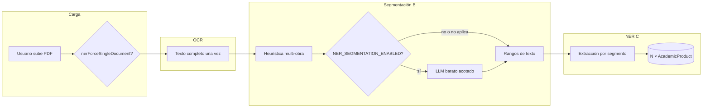

# Evidencia de Desarrollo — Compendios: segmentación multi-obra y N productos por archivo

| Campo                   | Valor                                                                                                                                           |
| ----------------------- | ----------------------------------------------------------------------------------------------------------------------------------------------- |
| **Proyecto**            | SIPAc — Sistema Inteligente de Productividad Académica                                                                                          |
| **Institución**         | Universidad de Córdoba, Montería, Colombia                                                                                                      |
| **Módulo / componente** | Extensión transversal M2 (carga) · M3 (OCR) · M4 (NER) · M5A (borradores) — compendios PDF                                                      |
| **Autor**               | Carlos A. Canabal Cordero                                                                                                                       |
| **Fecha**               | 2026-03-20                                                                                                                                      |
| **Versión**             | 1.1                                                                                                                                             |
| **Estado**              | Implementado en código y documentación de análisis; migración de índices pendiente por entorno                                                  |
| **Objetivo del avance** | Permitir que un PDF compendio origine varios borradores (una obra = un registro), con segmentación barata, UX clara y presupuesto de IA acotado |

---

## 1. Propósito de la evidencia

Esta evidencia cumple dos funciones:

1. **Registrar el plan de implementación** que orientó el trabajo — en conversación de diseño no quedó plasmado antes en la carpeta de evidencias; aquí se consolida de forma explícita para trazabilidad académica y revisión por tutores.
2. **Demostrar la correspondencia** entre ese plan, el código entregado, las pruebas y la documentación actualizada (`docs/analisis-diseno/documentacion/`), de modo coherente con el resto de evidencias del proyecto (estructura por alcance, artefactos, flujo, validación y limitaciones).

---

## 2. Plan de implementación acordado

El plan separa dos ideas:

- **Segmentación:** decidir _dónde_ cortar el texto OCR en uno o varios fragmentos que correspondan a obras distintas, sin gastar más IA que una pasada barata cuando haga falta.
- **N productos por archivo:** persistir **un** `AcademicProduct` por fragmento (mismo `sourceFile`, distinto `segmentIndex`), manteniendo el shape actual del borrador (`extractedEntities`, `manualMetadata`, tipo, etc.).

### 2.1 Objetivo de producto

- Un **PDF compendio** puede generar **varios borradores** (varias obras).
- El usuario entiende **qué archivo** originó **qué borradores** y puede revisarlos uno a uno (modelo mental: **una obra = un registro**).
- **Presupuesto IA:** no multiplicar llamadas cuando el documento es claramente unitario; segmentación barata y acotada; NER completo solo sobre trozos relevantes.
- Enfoque **user-first:** agrupación por archivo, controles explícitos (“tratar como un solo documento”) y mensajes cuando el texto sugiere varias obras pero la segmentación LLM está desactivada.

### 2.2 Punto de partida (estado previo relevante)

- Existía un índice único por `sourceFile` que **impedía** más de un producto activo por archivo.
- `process-uploaded-file` resolvía un único producto con `findOne({ sourceFile })` y un solo create/update.
- Varias rutas asumían **un** producto por archivo (`findOne` en cleanup, delete, etc.).

### 2.3 Fase 1 — Modelo de datos e invariantes

| Elemento del plan                                                                                    | Intención                                                                                           |
| ---------------------------------------------------------------------------------------------------- | --------------------------------------------------------------------------------------------------- |
| Campo **`segmentIndex`** (0-based, obligatorio; migración: default 0)                                | Identificar la obra dentro del mismo PDF.                                                           |
| Opcionales **`segmentLabel`**, **`segmentBounds`** (`pageFrom` / `pageTo` / `textStart` / `textEnd`) | Trazabilidad y apoyo a UX; la v1 puede rellenar solo parte de ellos.                                |
| Sustituir único `{ sourceFile }` por único compuesto **`{ sourceFile, segmentIndex }`**              | Permitir N documentos por archivo sin colisiones lógicas.                                           |
| **Índice parcial** `isDeleted: false` (si la versión de Mongo lo admite)                             | Un solo producto _activo_ por par; soft deletes no bloquean recreación.                             |
| **Migración** one-shot                                                                               | Backfill `segmentIndex`, orden: índice nuevo / datos / retirar índice viejo según script operativo. |

### 2.4 Fase 2 — Segmentación con coste controlado

| Elemento del plan                       | Intención                                                                                                                                                                                               |
| --------------------------------------- | ------------------------------------------------------------------------------------------------------------------------------------------------------------------------------------------------------- |
| **Heurística sin LLM primero**          | Señales baratas: longitud, líneas tipo título, patrones de actas/congreso, saltos de página. Si “casi seguro” documento único → **no** llamar al modelo de segmentación; un solo segmento.              |
| **Una sola llamada LLM** cuando proceda | Modelo **barato** (p. ej. Flash Lite); entrada **acotada** (muestra, primeros/últimos caracteres, límite duro de caracteres); salida mínima: lista de rangos (`pageFrom/pageTo` o `startChar/endChar`). |
| **`maxSegments` por entorno**           | Acotar coste y errores (p. ej. 5–8 o configurable).                                                                                                                                                     |
| **Post-proceso**                        | Validar rangos, fusionar solapes, descartar segmentos demasiado cortos.                                                                                                                                 |
| **Reintentos / fallback**               | Si la segmentación falla o devuelve datos inválidos → **un solo segmento** + aviso en trazas / `processingWarnings` según implementación.                                                               |
| **Variables de entorno**                | `NER_SEGMENTATION_ENABLED`, `NER_SEGMENTATION_MAX_SEGMENTS`, `NER_SEGMENTATION_INPUT_MAX_CHARS`, `NER_SEGMENTATION_MIN_SEGMENT_CHARS`, `NER_SEGMENTATION_MODEL_ID`.                                     |

**Principio rector:** la segmentación debe ser **más barata** que repetir NER completo sobre todo el documento muchas veces sin necesidad.

### 2.5 Fase 3 — Pipeline de procesamiento

| Elemento del plan            | Intención                                                                                                                        |
| ---------------------------- | -------------------------------------------------------------------------------------------------------------------------------- |
| **OCR una vez**              | Texto completo reutilizable para todos los segmentos.                                                                            |
| **Clasificación de tipo**    | Preferencia v1: **una vez por archivo** (compendios homogéneos); clasificación por segmento como evolución opcional (más coste). |
| **Bucle por segmento**       | Recortar texto; llamar extracción NER existente **solo** con el trozo; upsert por `{ sourceFile, segmentIndex }`.                |
| **Estado en `UploadedFile`** | Completado cuando el procesamiento previsto terminó; contador / `sourceWorkCount` para UI.                                       |
| **Errores parciales**        | Política user-first: donde aplique, “los que pudieron” + mensaje claro.                                                          |
| **Idempotencia**             | Mismo `(sourceFile, segmentIndex)` no duplica activos; reproceso puede **reducir** segmentos y marcar sobrantes como eliminados. |

### 2.6 Fase 4 — UX user-first

| Elemento del plan                           | Intención                                                                                                          |
| ------------------------------------------- | ------------------------------------------------------------------------------------------------------------------ |
| Lista / detección de borradores por archivo | Endpoint o store: varios IDs por `sourceFile`.                                                                     |
| Acciones claras                             | Abrir borrador por `segmentIndex` o por id de producto.                                                            |
| Badge **“Compendio (N obras)”**             | Cuando N > 1.                                                                                                      |
| Toggle **“Tratar como un solo documento”**  | Evita segmentación multi-obra (ahorra IA y reduce confusión cuando el usuario sabe que es una sola pieza).         |
| Opcional evolutivo                          | Pista “número aproximado de ponencias” para mejorar segmentación (no requisito de la v1 descrita en el plan base). |

### 2.7 Fase 5 — API, limpieza y consistencia

| Elemento del plan                     | Intención                                                                                                             |
| ------------------------------------- | --------------------------------------------------------------------------------------------------------------------- |
| **DELETE upload**                     | Afectar **todos** los `AcademicProduct` con ese `sourceFile`.                                                         |
| **cleanup-drafts** (sistema)          | Dejar de asumir un solo documento: búsquedas múltiples, `deleteMany` / `exists` según reglas de negocio actualizadas. |
| **drafts/current** y **GET producto** | Contrato claro con varios borradores (p. ej. “reciente” + hermanos para la UI).                                       |
| **Auditoría con ripgrep**             | Toda `findOne({ sourceFile })` revisada y adaptada a multi-documento donde corresponda.                               |

### 2.8 Fase 6 — Pruebas

| Elemento del plan | Intención                                                                                                 |
| ----------------- | --------------------------------------------------------------------------------------------------------- |
| Unitarias         | Utilidades de recorte, validación de rangos, merge de solapes.                                            |
| Integración       | Pipeline con OCR mockeado y **2 segmentos → 2 productos** mismo `sourceFile`.                             |
| Regresión         | Documento único → **1** producto; heurística unitaria → sin llamada LLM de segmentación cuando no aplica. |

### 2.9 Riesgos previstos y mitigación (tabla del plan)

| Riesgo                                 | Mitigación acordada                                                                                                           |
| -------------------------------------- | ----------------------------------------------------------------------------------------------------------------------------- |
| Multiplicación de llamadas NER         | Heurística “single doc”; `maxSegments`; segmentación con modelo barato y entrada acotada; opción usuario “un solo documento”. |
| Malos límites de segmento              | Límites conservadores; fallback a 1 segmento; reproceso; evolución: edición manual de rangos.                                 |
| Evidencias / anclas al recortar        | v1: evidencia dentro del fragmento o reglas relajadas; v2: mapeo de offsets globales.                                         |
| Tipo de producto distinto por ponencia | v1: misma clasificación global; v2: por segmento (más llamadas).                                                              |
| UX abrumadora                          | Agrupación por archivo, colapsar lista, progreso “2/5”.                                                                       |
| Concurrencia / doble procesamiento     | Idempotencia por `(sourceFile, segmentIndex)`; estado `processing` en archivo durante el job.                                 |
| Migración de índices                   | Script en entorno controlado; verificar duplicados activos `(sourceFile, segmentIndex)`.                                      |

### 2.10 Orden sugerido de entrega (incremental)

1. Modelo + migración + índice compuesto (comportamiento inicial: siempre `segmentIndex: 0` donde aplique).
2. Heurística “single vs revisar” + flag env (segmentación LLM apagada por defecto si se desea rollout gradual).
3. LLM segmentación acotada + recorte + bucle NER + persistencia N productos.
4. API delete / cleanup / drafts + UI agrupada.
5. Endurecer métricas / observabilidad (llamadas por etapa, tokens estimados si aplica).

---

## 3. Alcance implementado (cierre del plan)

La implementación en código cubre las fases anteriores de forma sustancial:

| Fase plan        | Estado en código                                                                                                                                                                                                                            |
| ---------------- | ------------------------------------------------------------------------------------------------------------------------------------------------------------------------------------------------------------------------------------------- |
| 1 — Modelo       | `segmentIndex`, `segmentLabel`, `segmentBounds` en `AcademicProduct`; `nerForceSingleDocument`, `sourceWorkCount` en `UploadedFile`; índice único parcial `ux_source_file_segment`; script `scripts/migrate-academic-product-segments.mjs`. |
| 2 — Segmentación | `server/services/ner/document-segmentation.ts` (heurística, LLM opcional Gemini por `NER_SEGMENTATION_MODEL_ID`, límites env, fallback a un segmento).                                                                                      |
| 3 — Pipeline     | `process-uploaded-file.ts`: OCR una vez; `classifyDocumentForNer` reutilizable por segmento; bucle NER; soft-delete de segmentos sobrantes al reducir N.                                                                                    |
| 4 — UX           | `workspace-documents.vue` + `documents.ts`: checkbox “un solo trabajo”, badge compendio, navegación entre obras.                                                                                                                            |
| 5 — API          | Status enriquecido; delete upload multi-producto; `cleanup-drafts` y productos/drafts alineados a hermanos por archivo.                                                                                                                     |
| 6 — Pruebas      | `document-segmentation.test.ts`, `process-uploaded-file.integration.test.ts`, `cleanup-drafts.integration.test.ts` (mocks de entorno donde aplica).                                                                                         |

---

## 4. Trazabilidad con requisitos funcionales y no funcionales

| RF / área              | Relación con este avance                                                                                             | Estado       |
| ---------------------- | -------------------------------------------------------------------------------------------------------------------- | ------------ |
| RF-020 a RF-026        | Carga extendida con `nerForceSingleDocument` en multipart                                                            | Implementado |
| RF-028                 | Estado de procesamiento con `academicProductIds`, `sourceWorkCount`, compatibilidad con `academicProductId` primario | Implementado |
| RF-029                 | Eliminación de archivo y productos asociados (todos los segmentos)                                                   | Implementado |
| RF-040 a RF-050 (M4)   | NER sigue siendo por trozo de texto; el coste puede escalar con N segmentos                                          | Vigente      |
| RNF — cuota / coste IA | Segmentación LLM desactivada por defecto; topes de segmentos y de caracteres de entrada                              | Implementado |

---

## 5. Decisiones técnicas relevantes

### 5.1 Índice único parcial

Se eligió unicidad `{ sourceFile, segmentIndex }` solo para documentos con `isDeleted: false`, de modo que el historial soft-deleted no impida crear un nuevo activo con el mismo índice tras reprocesos o limpiezas.

### 5.2 Segmentación apagada por defecto

`NER_SEGMENTATION_ENABLED` distinto de `true` mantiene el sistema en heurística + un segmento si no se fuerza multi-obra, reduciendo consumo de API hasta validar calidad en producción.

### 5.3 Clasificación global en v1

Se priorizó **una** clasificación por archivo para el flujo NER y se evitó multiplicar llamadas de clasificación por cada segmento; evolución futura explícita en el plan (riesgo “tipo distinto por ponencia”).

### 5.4 Coste NER proporcional a segmentos

Cada segmento ejecuta el extractor NER sobre un subtexto; flags como `NER_ALWAYS_SECOND_PASS` o pasadas específicas por tipo **se aplican por segmento**, por lo que el operador debe dimensionar `NER_SEGMENTATION_MAX_SEGMENTS` junto con la política NER global.

---

## 6. Artefactos desarrollados

### 6.1 Backend y servicios

| Archivo                                                                   | Responsabilidad                                                                   |
| ------------------------------------------------------------------------- | --------------------------------------------------------------------------------- |
| `server/models/AcademicProduct.ts`                                        | Campos de segmento; índice `ux_source_file_segment`                               |
| `server/models/UploadedFile.ts`                                           | `nerForceSingleDocument`, `sourceWorkCount`                                       |
| `server/services/ner/document-segmentation.ts`                            | Heurística + LLM acotado + normalización de rangos                                |
| `server/services/upload/process-uploaded-file.ts`                         | Orquestación OCR → segmentos → NER → persistencia                                 |
| `server/services/ner/extract-academic-entities.ts`                        | Soporte de `classificationProfile` / `segmentMeta` para evitar trabajo redundante |
| `server/utils/env.ts`, `nuxt.config.ts`                                   | Variables `NER_SEGMENTATION_*` validadas                                          |
| `server/api/upload/index.post.ts`, `[id]/status.get.ts`, `[id].delete.ts` | Multipart, respuesta multi-obra, borrado múltiple                                 |
| `server/api/products/drafts/current.get.ts`, `[id].get.ts`                | Contexto de hermanos para workspace                                               |
| `server/api/system/cleanup-drafts.ts`                                     | Limpieza coherente con múltiples productos por archivo                            |

### 6.2 Frontend y cliente

| Archivo                             | Responsabilidad                                                        |
| ----------------------------------- | ---------------------------------------------------------------------- |
| `app/pages/workspace-documents.vue` | Badge compendio, navegación entre borradores, checkbox un solo trabajo |
| `app/stores/documents.ts`           | `uploadDocument(..., { nerForceSingleDocument })`, estado enriquecido  |

### 6.3 Migración, documentación y pruebas

| Archivo                                                       | Responsabilidad                                 |
| ------------------------------------------------------------- | ----------------------------------------------- |
| `scripts/migrate-academic-product-segments.mjs`               | Migración de índices y backfill `segmentIndex`  |
| `tests/unit/server/document-segmentation.test.ts`             | Pruebas de segmentación                         |
| `tests/integration/process-uploaded-file.integration.test.ts` | Pipeline con mocks                              |
| `tests/integration/cleanup-drafts.integration.test.ts`        | Cleanup multi-producto                          |
| `.env.example`                                                | Documentación de variables `NER_SEGMENTATION_*` |

---

## 7. Flujo funcional implementado

1. El usuario sube un PDF (opcionalmente con “un solo trabajo” → `nerForceSingleDocument`).
2. El servidor ejecuta **OCR una vez** y obtiene texto (y bloques cuando aplica).
3. **Segmentación:** heurística decide si el documento parece multi-obra; si el usuario forzó un solo documento, se usa un solo segmento.
4. Si la heurística sugiere varias obras y `NER_SEGMENTATION_ENABLED` es falso, se mantiene **un** segmento y puede registrarse aviso orientativo al operador.
5. Si la segmentación LLM está habilitada y corresponde, **una** llamada barata propone rangos acotados por `maxSegments` y tamaño de entrada; post-proceso valida y filtra trozos cortos.
6. Se ejecuta **clasificación** para NER de forma reutilizable en el bucle de segmentos.
7. Por cada segmento se ejecuta **NER** y metadatos específicos; se hace upsert por `{ sourceFile, segmentIndex }`.
8. Si el nuevo número de segmentos es menor que antes, los productos con índice mayor o igual se marcan soft-deleted según la lógica del pipeline.
9. Se actualiza `sourceWorkCount` (y trazas) en el archivo para la UI.
10. En workspace, el usuario ve el compendio y puede abrir cada obra.

---

## 8. Evidencia técnica verificable

En el repositorio se verificó (entorno de desarrollo):

- `pnpm run lint` — ESLint sin errores reportados.
- `pnpm exec vitest run` — pruebas unitarias e integración, incluyendo segmentación, `process-uploaded-file` y `cleanup-drafts`.
- `pnpm exec nuxt typecheck` — comprobación de tipos del proyecto Nuxt.

---

## 9. Limitaciones y trabajo pendiente

| Ítem                                          | Descripción                                                                                                                                                                                                      |
| --------------------------------------------- | ---------------------------------------------------------------------------------------------------------------------------------------------------------------------------------------------------------------- |
| **Migración en cada entorno**                 | Ejecutar `scripts/migrate-academic-product-segments.mjs` con `MONGODB_URI` antes de depender del índice nuevo en producción.                                                                                     |
| **Varios títulos/autores en un mismo bloque** | Si no hay frontera clara, el esquema NER sigue privilegiando **un** título principal por producto; el plan ya identifica riesgo; mejora futura: contribuciones múltiples o segmentación más fina + input humano. |
| **Métricas agregadas**                        | El plan pide contar llamadas/tokens por etapa; los logs existen; dashboards o agregados globales pueden ampliarse.                                                                                               |
| **Clasificación por segmento**                | Dejada como evolución opcional por coste.                                                                                                                                                                        |
| **Evidencia visual**                          | Capturas de UI (badge, checkbox, lista de obras) recomendadas como complemento manual en carpeta de evidencias gráficas.                                                                                         |

---

## 10. Conclusión técnica

El **plan** quedó **documentado en esta evidencia** (objetivo, fases, riesgos y orden de entrega) y **materializado en el código** con invariantes claros en base de datos, pipeline acotado en IA y UX alineada al usuario. La relación formal diseño ↔ implementación ↔ pruebas queda explícita en las secciones 2 y 3, cumpliendo el criterio de calidad definido en `docs/evidencias/README.md` (trazabilidad, justificación y verificación técnica).
